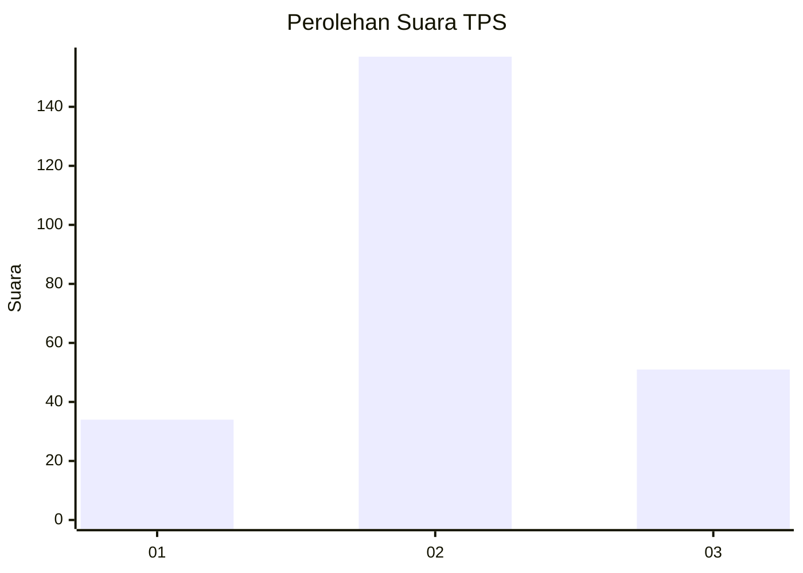
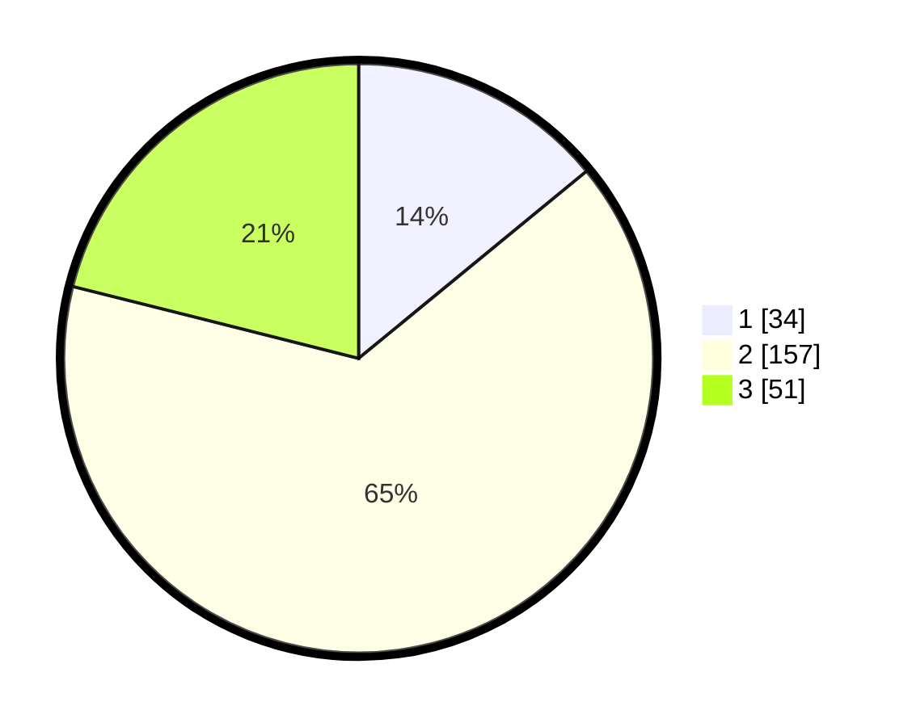

# Hasil

## Grafik

## Tabel

| No. | Nama Paslon    | Suara | Suara (raw) | Persentase |
|:--- |:-------------- | -----:| -----------:| ----------:|
| 1   | ANIES MUHAIMIN | 34    | [34][p-1]   | 14,05      |
| 2   | PRABOWO GIBRAN | 157   | [157][p-2]  | 64,88      |
| 3   | GANJAR MAHFUD  | 51    | [51][p-3]   | 21,07      |

[p-1]: https://github.com/gigit-pemilu/pemilu-2024/blob/main/pilpres/hitung-suara/sub/35-jawa-timur/sub/20-magetan/sub/16-ngariboyo/sub/2001-selotinatah/sub/008-tps/sub/paslon-1.txt
[p-2]: https://github.com/gigit-pemilu/pemilu-2024/blob/main/pilpres/hitung-suara/sub/35-jawa-timur/sub/20-magetan/sub/16-ngariboyo/sub/2001-selotinatah/sub/008-tps/sub/paslon-2.txt
[p-3]: https://github.com/gigit-pemilu/pemilu-2024/blob/main/pilpres/hitung-suara/sub/35-jawa-timur/sub/20-magetan/sub/16-ngariboyo/sub/2001-selotinatah/sub/008-tps/sub/paslon-3.txt

## Foto C Plano

https://sirekap-obj-formc.kpu.go.id/3e63/pemilu/ppwp/35/20/16/20/01/3520162001008-20240214-155447--75559dad-6169-4536-ba48-25d15d29336f.jpg

https://sirekap-obj-formc.kpu.go.id/3e63/pemilu/ppwp/35/20/16/20/01/3520162001008-20240214-155512--f33f4883-e941-47dd-81d8-3092b0804d82.jpg

https://sirekap-obj-formc.kpu.go.id/3e63/pemilu/ppwp/35/20/16/20/01/3520162001008-20240214-155529--647e77cb-7fa2-4a58-8dba-186e52079571.jpg

## Metadata

| Key        | Value               |
| ---------- | ------------------- |
| Time Stamp | 2024-02-22 20:00:00 |

