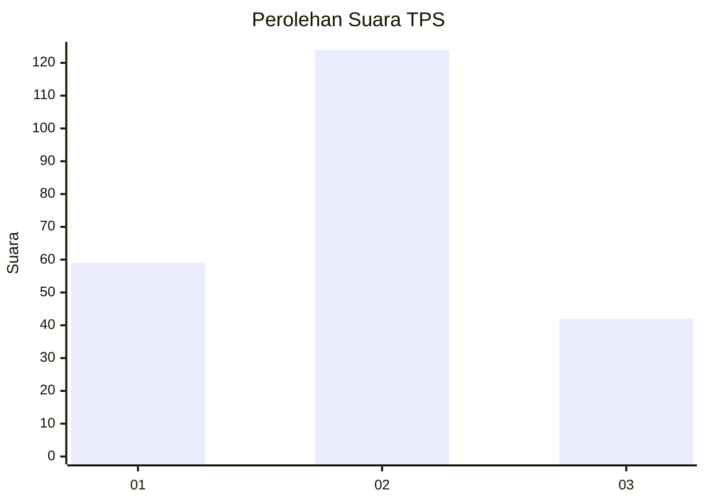
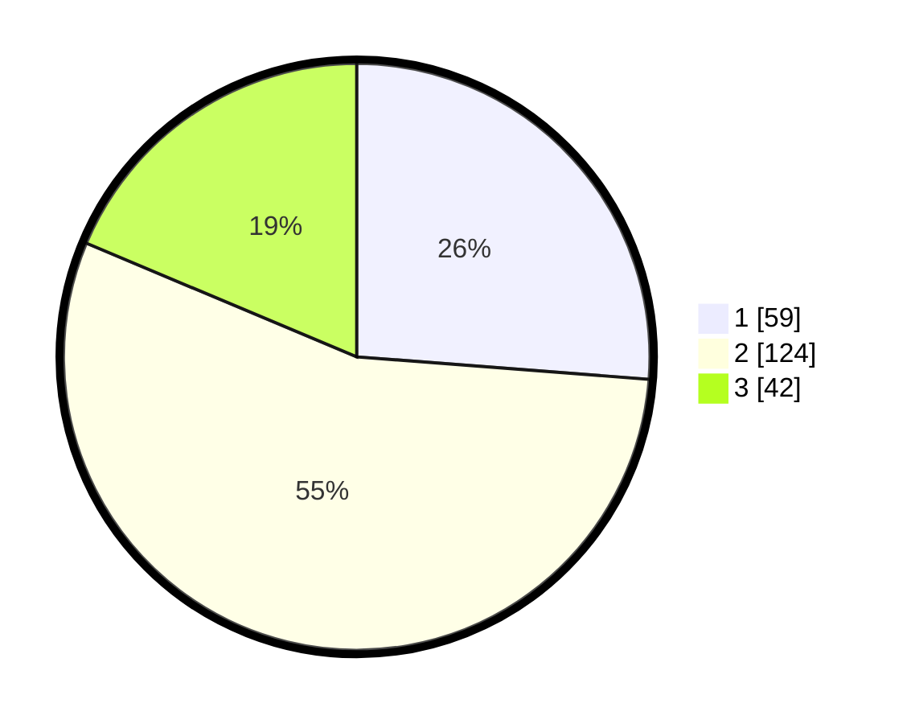

# Hasil

## Grafik

## Tabel

| No. | Nama Paslon    | Suara | Suara (raw) | Persentase |
|:--- |:-------------- | -----:| -----------:| ----------:|
| 1   | ANIES MUHAIMIN | 59    | [59][p-1]   | 26,22      |
| 2   | PRABOWO GIBRAN | 124   | [124][p-2]  | 55,11      |
| 3   | GANJAR MAHFUD  | 42    | [42][p-3]   | 18,67      |

[p-1]: https://github.com/gigit-pemilu/pemilu-2024/blob/main/pilpres/hitung-suara/sub/35-jawa-timur/sub/20-magetan/sub/16-ngariboyo/sub/2005-sumberdukun/sub/002-tps/sub/paslon-1.txt
[p-2]: https://github.com/gigit-pemilu/pemilu-2024/blob/main/pilpres/hitung-suara/sub/35-jawa-timur/sub/20-magetan/sub/16-ngariboyo/sub/2005-sumberdukun/sub/002-tps/sub/paslon-2.txt
[p-3]: https://github.com/gigit-pemilu/pemilu-2024/blob/main/pilpres/hitung-suara/sub/35-jawa-timur/sub/20-magetan/sub/16-ngariboyo/sub/2005-sumberdukun/sub/002-tps/sub/paslon-3.txt

## Foto C Plano

https://sirekap-obj-formc.kpu.go.id/9ffc/pemilu/ppwp/35/20/16/20/05/3520162005002-20240215-002214--3d3df09b-caa5-40a7-96d8-b67ec182674e.jpg

https://sirekap-obj-formc.kpu.go.id/9ffc/pemilu/ppwp/35/20/16/20/05/3520162005002-20240216-160517--e800a53d-0562-4c5b-ada0-b5a8f7e247c4.jpg

https://sirekap-obj-formc.kpu.go.id/9ffc/pemilu/ppwp/35/20/16/20/05/3520162005002-20240216-160626--4d4e3d3e-4f55-4d6a-9d20-ecbb9318eb0b.jpg

## Metadata

| Key        | Value               |
| ---------- | ------------------- |
| Time Stamp | 2024-02-22 13:00:00 |

