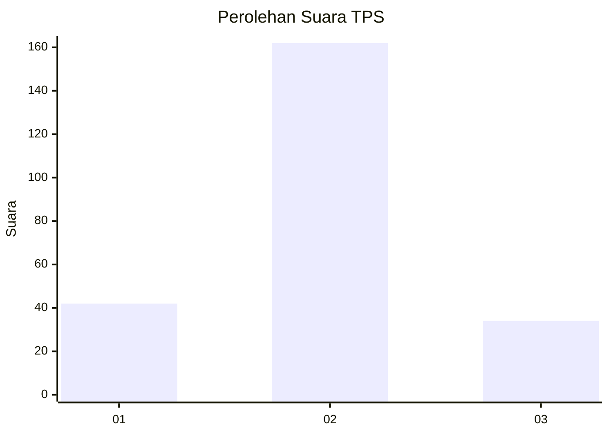
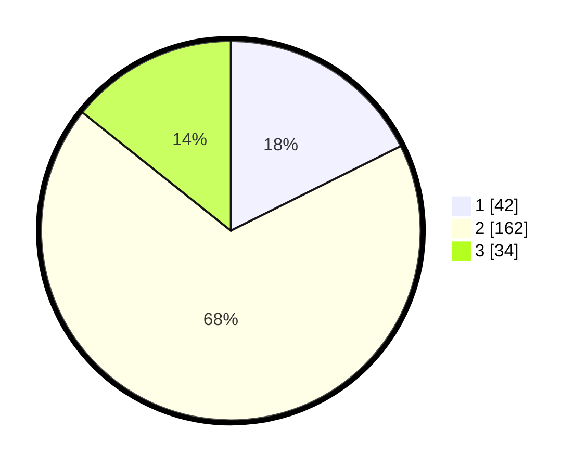

# Hasil

## Grafik

## Tabel

| No. | Nama Paslon    | Suara | Suara (raw) | Persentase |
|:--- |:-------------- | -----:| -----------:| ----------:|
| 1   | ANIES MUHAIMIN | 42    | [42][p-1]   | 17,65      |
| 2   | PRABOWO GIBRAN | 162   | [162][p-2]  | 68,07      |
| 3   | GANJAR MAHFUD  | 34    | [34][p-3]   | 14,29      |

[p-1]: https://github.com/gigit-pemilu/pemilu-2024/blob/main/pilpres/hitung-suara/sub/35-jawa-timur/sub/20-magetan/sub/16-ngariboyo/sub/2010-banyudono/sub/007-tps/sub/paslon-1.txt
[p-2]: https://github.com/gigit-pemilu/pemilu-2024/blob/main/pilpres/hitung-suara/sub/35-jawa-timur/sub/20-magetan/sub/16-ngariboyo/sub/2010-banyudono/sub/007-tps/sub/paslon-2.txt
[p-3]: https://github.com/gigit-pemilu/pemilu-2024/blob/main/pilpres/hitung-suara/sub/35-jawa-timur/sub/20-magetan/sub/16-ngariboyo/sub/2010-banyudono/sub/007-tps/sub/paslon-3.txt

## Foto C Plano

https://sirekap-obj-formc.kpu.go.id/7ddc/pemilu/ppwp/35/20/16/20/10/3520162010007-20240226-224700--724fb56c-a846-46ac-a16d-0f60983e76ec.jpg

https://sirekap-obj-formc.kpu.go.id/7ddc/pemilu/ppwp/35/20/16/20/10/3520162010007-20240226-224732--0c060d66-7f2f-4c84-ba44-b8b78b1099ad.jpg

https://sirekap-obj-formc.kpu.go.id/7ddc/pemilu/ppwp/35/20/16/20/10/3520162010007-20240226-224611--b77c5dd9-569d-4e10-ad0c-8ed3244861a5.jpg

## Metadata

| Key        | Value               |
| ---------- | ------------------- |
| Time Stamp | 2024-03-01 17:00:00 |

