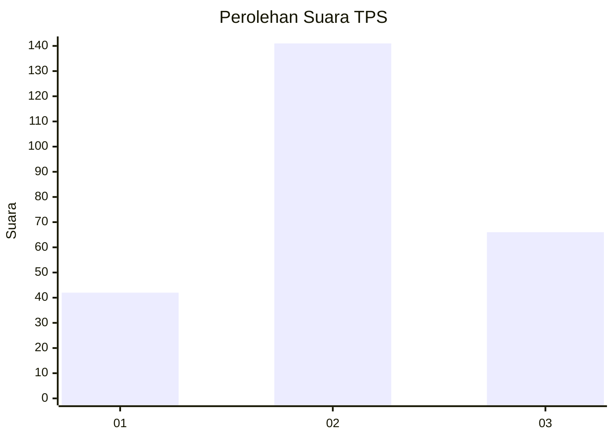
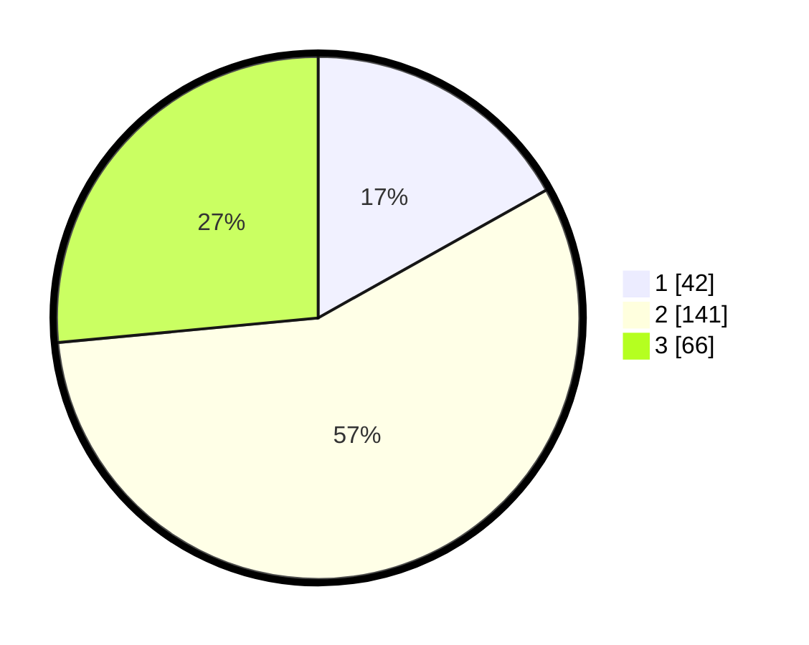

# Hasil

## Grafik

## Tabel

| No. | Nama Paslon    | Suara | Suara (raw) | Persentase |
|:--- |:-------------- | -----:| -----------:| ----------:|
| 1   | ANIES MUHAIMIN | 42    | [42][p-1]   | 16,87      |
| 2   | PRABOWO GIBRAN | 141   | [141][p-2]  | 56,63      |
| 3   | GANJAR MAHFUD  | 66    | [66][p-3]   | 26,51      |

[p-1]: https://github.com/gigit-pemilu/pemilu-2024/blob/main/pilpres/hitung-suara/sub/35-jawa-timur/sub/20-magetan/sub/17-nguntoronadi/sub/2008-kenongomulyo/sub/002-tps/sub/paslon-1.txt
[p-2]: https://github.com/gigit-pemilu/pemilu-2024/blob/main/pilpres/hitung-suara/sub/35-jawa-timur/sub/20-magetan/sub/17-nguntoronadi/sub/2008-kenongomulyo/sub/002-tps/sub/paslon-2.txt
[p-3]: https://github.com/gigit-pemilu/pemilu-2024/blob/main/pilpres/hitung-suara/sub/35-jawa-timur/sub/20-magetan/sub/17-nguntoronadi/sub/2008-kenongomulyo/sub/002-tps/sub/paslon-3.txt

## Foto C Plano

https://sirekap-obj-formc.kpu.go.id/da15/pemilu/ppwp/35/20/17/20/08/3520172008002-20240214-155717--45c1026d-f939-4514-9205-1776a3c34bc8.jpg

https://sirekap-obj-formc.kpu.go.id/da15/pemilu/ppwp/35/20/17/20/08/3520172008002-20240214-190042--957b0fe3-c3c9-420e-b968-4ce8887832e1.jpg

https://sirekap-obj-formc.kpu.go.id/da15/pemilu/ppwp/35/20/17/20/08/3520172008002-20240214-190057--c917493a-ae48-4310-bb50-c3a6177807fd.jpg

## Metadata

| Key        | Value               |
| ---------- | ------------------- |
| Time Stamp | 2024-02-22 13:00:00 |

