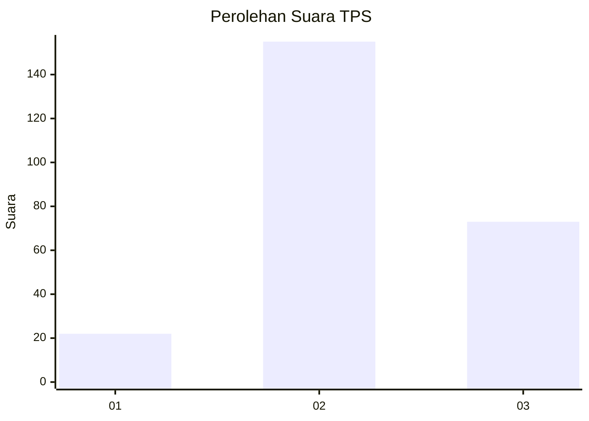
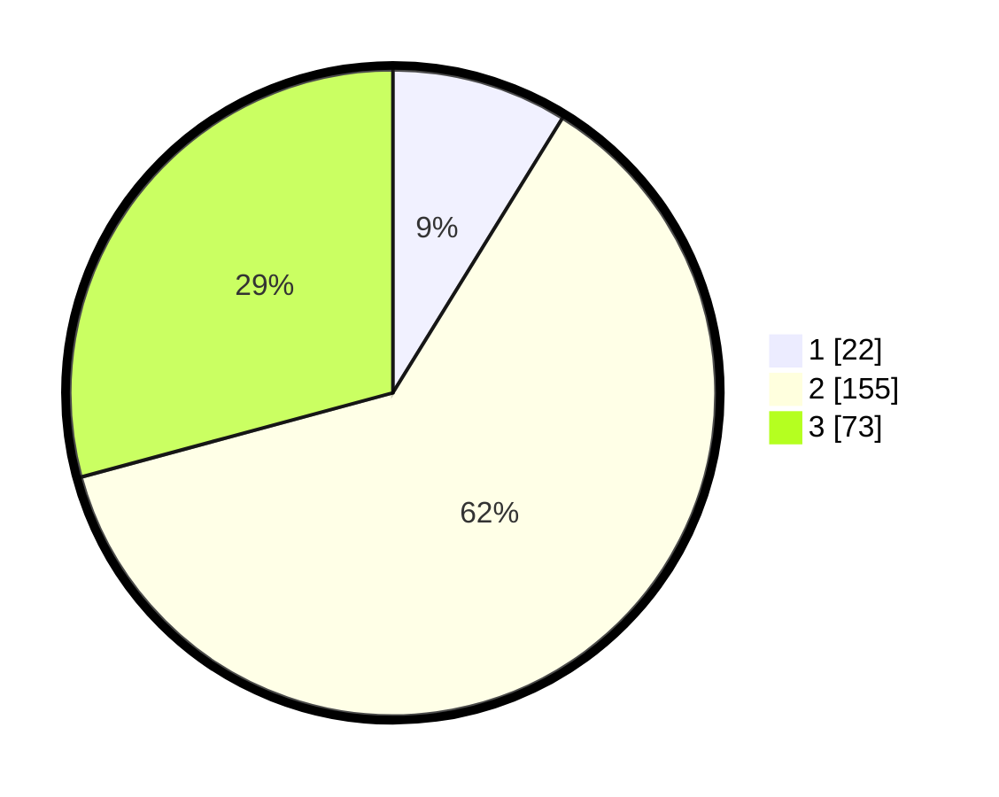

# Hasil

## Grafik

## Tabel

| No. | Nama Paslon    | Suara | Suara (raw) | Persentase |
|:--- |:-------------- | -----:| -----------:| ----------:|
| 1   | ANIES MUHAIMIN | 22    | [22][p-1]   | 8,80       |
| 2   | PRABOWO GIBRAN | 155   | [155][p-2]  | 62,00      |
| 3   | GANJAR MAHFUD  | 73    | [73][p-3]   | 29,20      |

[p-1]: https://github.com/gigit-pemilu/pemilu-2024/blob/main/pilpres/hitung-suara/sub/35-jawa-timur/sub/20-magetan/sub/18-sidorejo/sub/2002-campursari/sub/002-tps/sub/paslon-1.txt
[p-2]: https://github.com/gigit-pemilu/pemilu-2024/blob/main/pilpres/hitung-suara/sub/35-jawa-timur/sub/20-magetan/sub/18-sidorejo/sub/2002-campursari/sub/002-tps/sub/paslon-2.txt
[p-3]: https://github.com/gigit-pemilu/pemilu-2024/blob/main/pilpres/hitung-suara/sub/35-jawa-timur/sub/20-magetan/sub/18-sidorejo/sub/2002-campursari/sub/002-tps/sub/paslon-3.txt

## Foto C Plano

https://sirekap-obj-formc.kpu.go.id/92fc/pemilu/ppwp/35/20/18/20/02/3520182002002-20240217-205408--3f025dc4-ff1c-443a-8dfc-28f0cd87dfdc.jpg

https://sirekap-obj-formc.kpu.go.id/92fc/pemilu/ppwp/35/20/18/20/02/3520182002002-20240217-205541--7bba8790-35ec-476d-8510-b3c550d5ce10.jpg

https://sirekap-obj-formc.kpu.go.id/92fc/pemilu/ppwp/35/20/18/20/02/3520182002002-20240217-205632--0cfecbd3-8ac3-47f6-a7cf-fa6e10d99749.jpg

## Metadata

| Key        | Value               |
| ---------- | ------------------- |
| Time Stamp | 2024-02-22 13:00:00 |

