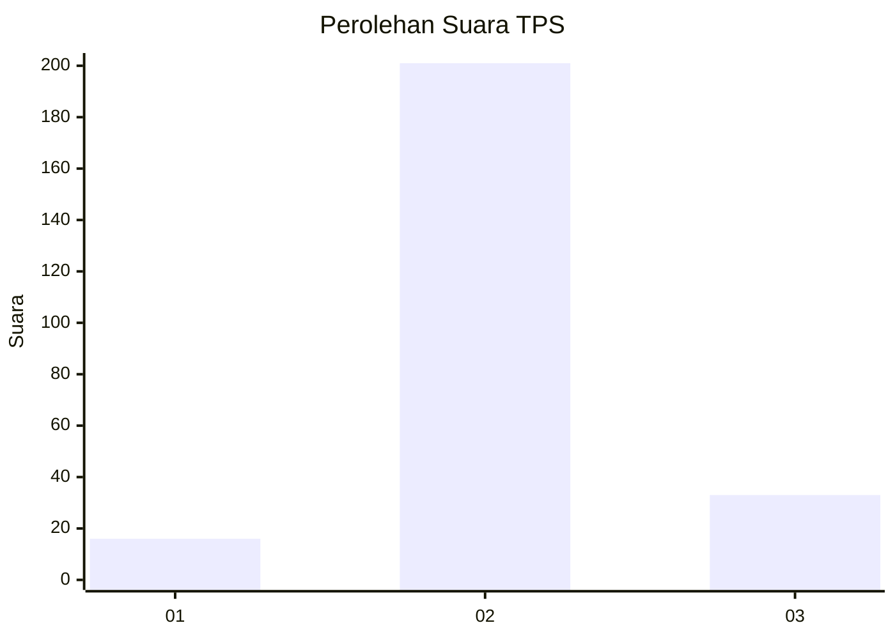
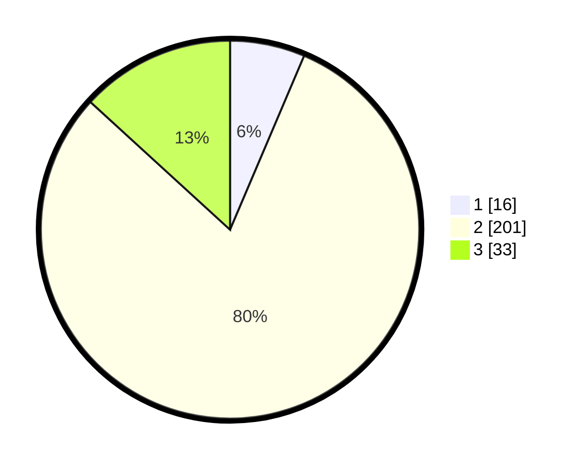

# Hasil

## Grafik

## Tabel

| No. | Nama Paslon    | Suara | Suara (raw) | Persentase |
|:--- |:-------------- | -----:| -----------:| ----------:|
| 1   | ANIES MUHAIMIN | 16    | [16][p-1]   | 6,40       |
| 2   | PRABOWO GIBRAN | 201   | [201][p-2]  | 80,40      |
| 3   | GANJAR MAHFUD  | 33    | [33][p-3]   | 13,20      |

[p-1]: https://github.com/gigit-pemilu/pemilu-2024-35-jawa-timur/blob/main/pilpres/hitung-suara/sub/35-jawa-timur/sub/20-magetan/sub/18-sidorejo/sub/2007-sidomulyo/sub/007-tps/sub/paslon-1.txt
[p-2]: https://github.com/gigit-pemilu/pemilu-2024-35-jawa-timur/blob/main/pilpres/hitung-suara/sub/35-jawa-timur/sub/20-magetan/sub/18-sidorejo/sub/2007-sidomulyo/sub/007-tps/sub/paslon-2.txt
[p-3]: https://github.com/gigit-pemilu/pemilu-2024-35-jawa-timur/blob/main/pilpres/hitung-suara/sub/35-jawa-timur/sub/20-magetan/sub/18-sidorejo/sub/2007-sidomulyo/sub/007-tps/sub/paslon-3.txt

## Foto C Plano

https://sirekap-obj-formc.kpu.go.id/d073/pemilu/ppwp/35/20/18/20/07/3520182007007-20240217-092256--bae7e962-79be-47da-98c0-6ae511c009e3.jpg

https://sirekap-obj-formc.kpu.go.id/d073/pemilu/ppwp/35/20/18/20/07/3520182007007-20240217-092043--8c8648f0-f8a6-4359-98a3-093c7069344a.jpg

https://sirekap-obj-formc.kpu.go.id/d073/pemilu/ppwp/35/20/18/20/07/3520182007007-20240217-092119--013a8388-d929-439f-bba4-71fe534eb197.jpg

## Metadata

| Key        | Value               |
| ---------- | ------------------- |
| Time Stamp | 2024-02-22 13:00:00 |

