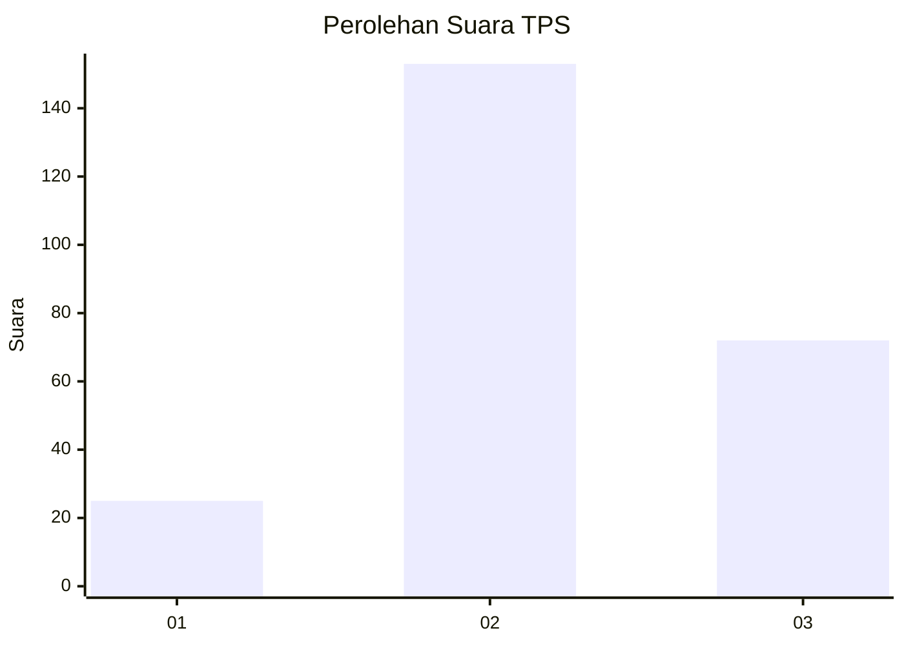
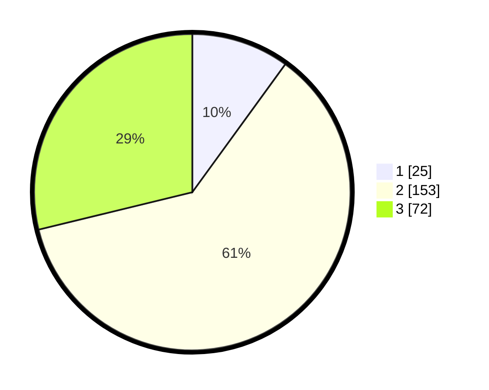

# Hasil

## Grafik

## Tabel

| No. | Nama Paslon    | Suara | Suara (raw) | Persentase |
|:--- |:-------------- | -----:| -----------:| ----------:|
| 1   | ANIES MUHAIMIN | 25    | [25][p-1]   | 10,00      |
| 2   | PRABOWO GIBRAN | 153   | [153][p-2]  | 61,20      |
| 3   | GANJAR MAHFUD  | 72    | [72][p-3]   | 28,80      |

[p-1]: https://github.com/gigit-pemilu/pemilu-2024-35-jawa-timur/blob/main/pilpres/hitung-suara/sub/35-jawa-timur/sub/20-magetan/sub/18-sidorejo/sub/2008-sumbersawit/sub/001-tps/sub/paslon-1.txt
[p-2]: https://github.com/gigit-pemilu/pemilu-2024-35-jawa-timur/blob/main/pilpres/hitung-suara/sub/35-jawa-timur/sub/20-magetan/sub/18-sidorejo/sub/2008-sumbersawit/sub/001-tps/sub/paslon-2.txt
[p-3]: https://github.com/gigit-pemilu/pemilu-2024-35-jawa-timur/blob/main/pilpres/hitung-suara/sub/35-jawa-timur/sub/20-magetan/sub/18-sidorejo/sub/2008-sumbersawit/sub/001-tps/sub/paslon-3.txt

## Foto C Plano

https://sirekap-obj-formc.kpu.go.id/632f/pemilu/ppwp/35/20/18/20/08/3520182008001-20240215-132104--dd49b19c-d193-4c79-8dd2-184d8ee200b5.jpg

https://sirekap-obj-formc.kpu.go.id/632f/pemilu/ppwp/35/20/18/20/08/3520182008001-20240215-132111--578c5a88-ca7f-498f-b257-03ddaad0f48a.jpg

https://sirekap-obj-formc.kpu.go.id/632f/pemilu/ppwp/35/20/18/20/08/3520182008001-20240215-132209--089068df-ba12-44c4-b31a-727ec8c0a327.jpg

## Metadata

| Key        | Value               |
| ---------- | ------------------- |
| Time Stamp | 2024-02-22 13:00:00 |

