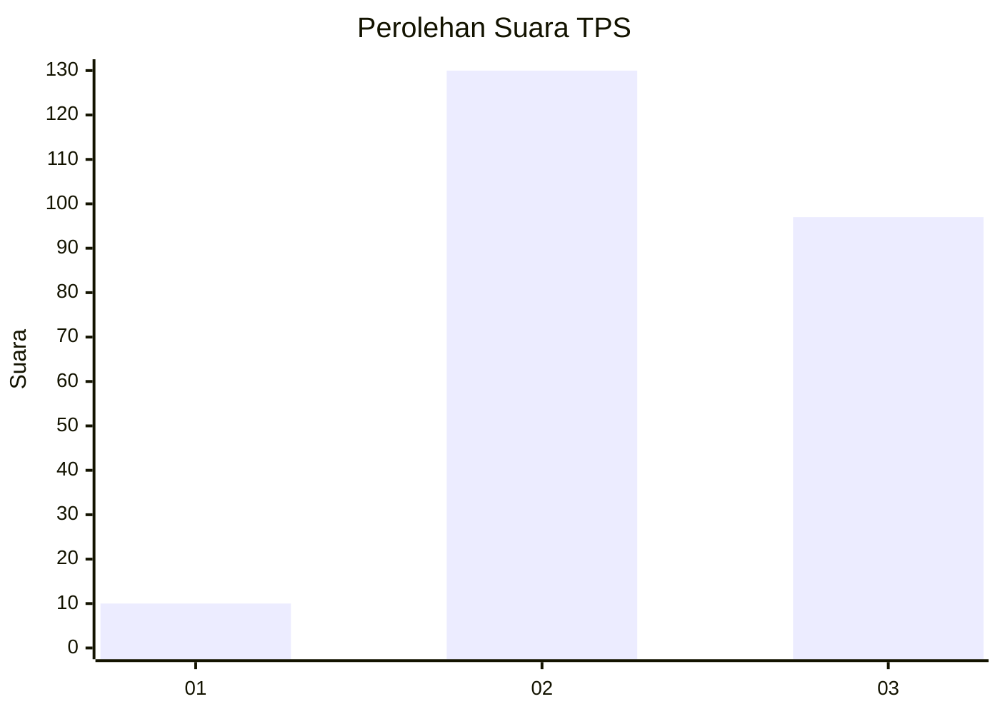
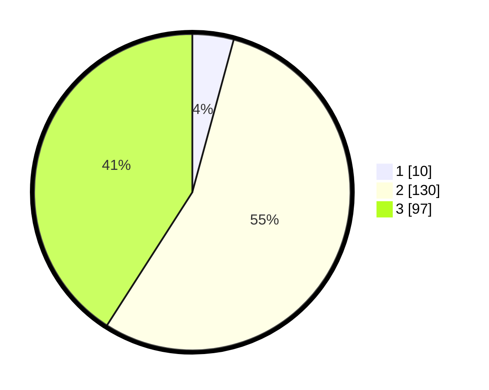

# Hasil

## Grafik

## Tabel

| No. | Nama Paslon    | Suara | Suara (raw) | Persentase |
|:--- |:-------------- | -----:| -----------:| ----------:|
| 1   | ANIES MUHAIMIN | 10    | [10][p-1]   | 4,22       |
| 2   | PRABOWO GIBRAN | 130   | [130][p-2]  | 54,85      |
| 3   | GANJAR MAHFUD  | 97    | [97][p-3]   | 40,93      |

[p-1]: https://github.com/gigit-pemilu/pemilu-2024/blob/main/pilpres/hitung-suara/sub/35-jawa-timur/sub/20-magetan/sub/18-sidorejo/sub/2009-sidokerto/sub/004-tps/sub/paslon-1.txt
[p-2]: https://github.com/gigit-pemilu/pemilu-2024/blob/main/pilpres/hitung-suara/sub/35-jawa-timur/sub/20-magetan/sub/18-sidorejo/sub/2009-sidokerto/sub/004-tps/sub/paslon-2.txt
[p-3]: https://github.com/gigit-pemilu/pemilu-2024/blob/main/pilpres/hitung-suara/sub/35-jawa-timur/sub/20-magetan/sub/18-sidorejo/sub/2009-sidokerto/sub/004-tps/sub/paslon-3.txt

## Foto C Plano

https://sirekap-obj-formc.kpu.go.id/8842/pemilu/ppwp/35/20/18/20/09/3520182009004-20240216-170317--24469a6e-3b07-4090-a893-7a4504c2fcde.jpg

https://sirekap-obj-formc.kpu.go.id/8842/pemilu/ppwp/35/20/18/20/09/3520182009004-20240216-185828--cc3c2fe0-eadd-4305-bbfd-829df683bf57.jpg

https://sirekap-obj-formc.kpu.go.id/8842/pemilu/ppwp/35/20/18/20/09/3520182009004-20240216-152035--73b4586b-96be-46de-849b-3be3c9bbe2cc.jpg

## Metadata

| Key        | Value               |
| ---------- | ------------------- |
| Time Stamp | 2024-02-21 18:00:00 |

