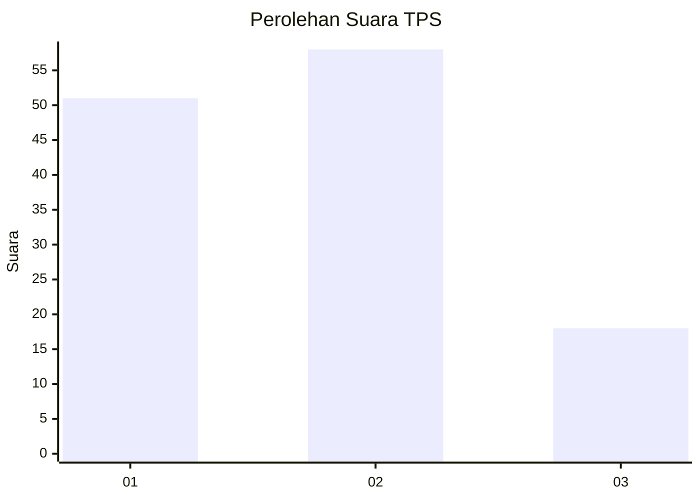
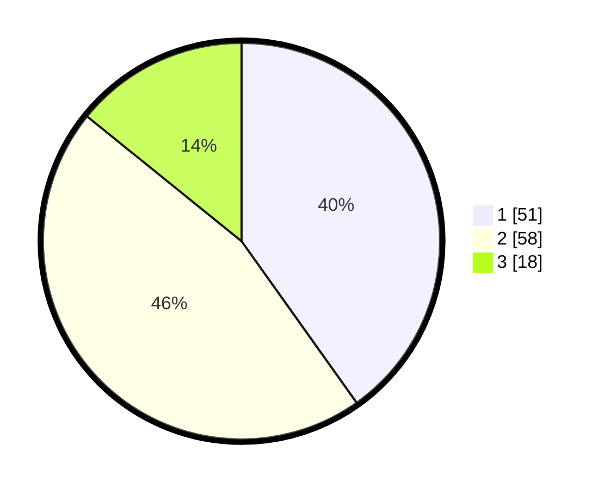

# Hasil

## Grafik

## Tabel

| No. | Nama Paslon    | Suara | Suara (raw) | Persentase |
|:--- |:-------------- | -----:| -----------:| ----------:|
| 1   | ANIES MUHAIMIN | 51    | [51][p-1]   | 40,16      |
| 2   | PRABOWO GIBRAN | 58    | [58][p-2]   | 45,67      |
| 3   | GANJAR MAHFUD  | 18    | [18][p-3]   | 14,17      |

[p-1]: https://github.com/gigit-pemilu/pemilu-2024/blob/main/pilpres/hitung-suara/sub/35-jawa-timur/sub/21-ngawi/sub/01-sine/sub/2008-sine/sub/007-tps/sub/paslon-1.txt
[p-2]: https://github.com/gigit-pemilu/pemilu-2024/blob/main/pilpres/hitung-suara/sub/35-jawa-timur/sub/21-ngawi/sub/01-sine/sub/2008-sine/sub/007-tps/sub/paslon-2.txt
[p-3]: https://github.com/gigit-pemilu/pemilu-2024/blob/main/pilpres/hitung-suara/sub/35-jawa-timur/sub/21-ngawi/sub/01-sine/sub/2008-sine/sub/007-tps/sub/paslon-3.txt

## Foto C Plano

https://sirekap-obj-formc.kpu.go.id/2392/pemilu/ppwp/35/21/01/20/08/3521012008007-20240214-141809--c49645fb-56d3-48df-8323-87347cc09d61.jpg

https://sirekap-obj-formc.kpu.go.id/2392/pemilu/ppwp/35/21/01/20/08/3521012008007-20240217-130253--8cc4d23e-a08b-475d-9108-99ea643e4539.jpg

https://sirekap-obj-formc.kpu.go.id/2392/pemilu/ppwp/35/21/01/20/08/3521012008007-20240214-141650--43584c3b-7d32-4650-b0cf-dc7e998ac1f8.jpg

## Metadata

| Key        | Value               |
| ---------- | ------------------- |
| Time Stamp | 2024-02-17 13:37:34 |

