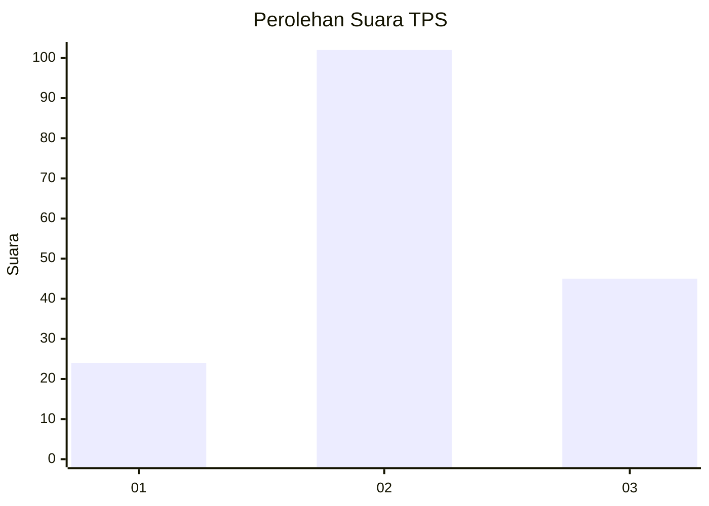
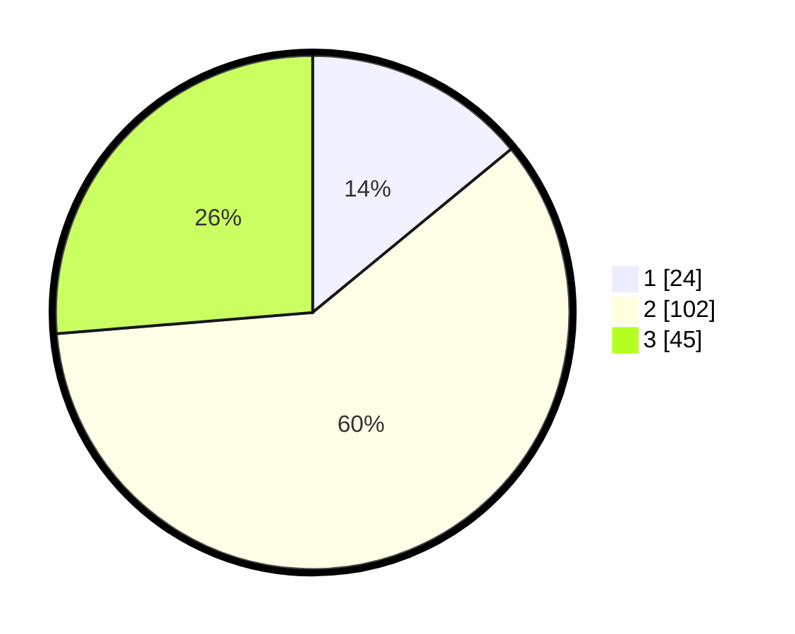

# Hasil

## Grafik

## Tabel

| No. | Nama Paslon    | Suara | Suara (raw) | Persentase |
|:--- |:-------------- | -----:| -----------:| ----------:|
| 1   | ANIES MUHAIMIN | 24    | [24][p-1]   | 14,04      |
| 2   | PRABOWO GIBRAN | 102   | [102][p-2]  | 59,65      |
| 3   | GANJAR MAHFUD  | 45    | [45][p-3]   | 26,32      |

[p-1]: https://github.com/gigit-pemilu/pemilu-2024/blob/main/pilpres/hitung-suara/sub/35-jawa-timur/sub/21-ngawi/sub/01-sine/sub/2012-tulakan/sub/020-tps/sub/paslon-1.txt
[p-2]: https://github.com/gigit-pemilu/pemilu-2024/blob/main/pilpres/hitung-suara/sub/35-jawa-timur/sub/21-ngawi/sub/01-sine/sub/2012-tulakan/sub/020-tps/sub/paslon-2.txt
[p-3]: https://github.com/gigit-pemilu/pemilu-2024/blob/main/pilpres/hitung-suara/sub/35-jawa-timur/sub/21-ngawi/sub/01-sine/sub/2012-tulakan/sub/020-tps/sub/paslon-3.txt

## Foto C Plano

https://sirekap-obj-formc.kpu.go.id/3295/pemilu/ppwp/35/21/01/20/12/3521012012020-20240215-125024--cdedcc95-69dc-4aef-899e-102fd648f647.jpg

https://sirekap-obj-formc.kpu.go.id/3295/pemilu/ppwp/35/21/01/20/12/3521012012020-20240216-125550--e080ce3f-c1f4-4864-9cef-2b9bf209100d.jpg

https://sirekap-obj-formc.kpu.go.id/3295/pemilu/ppwp/35/21/01/20/12/3521012012020-20240215-152417--4a52a66f-e7e0-4425-a71a-4dde8bed3a1e.jpg

## Metadata

| Key        | Value               |
| ---------- | ------------------- |
| Time Stamp | 2024-02-17 14:45:18 |

