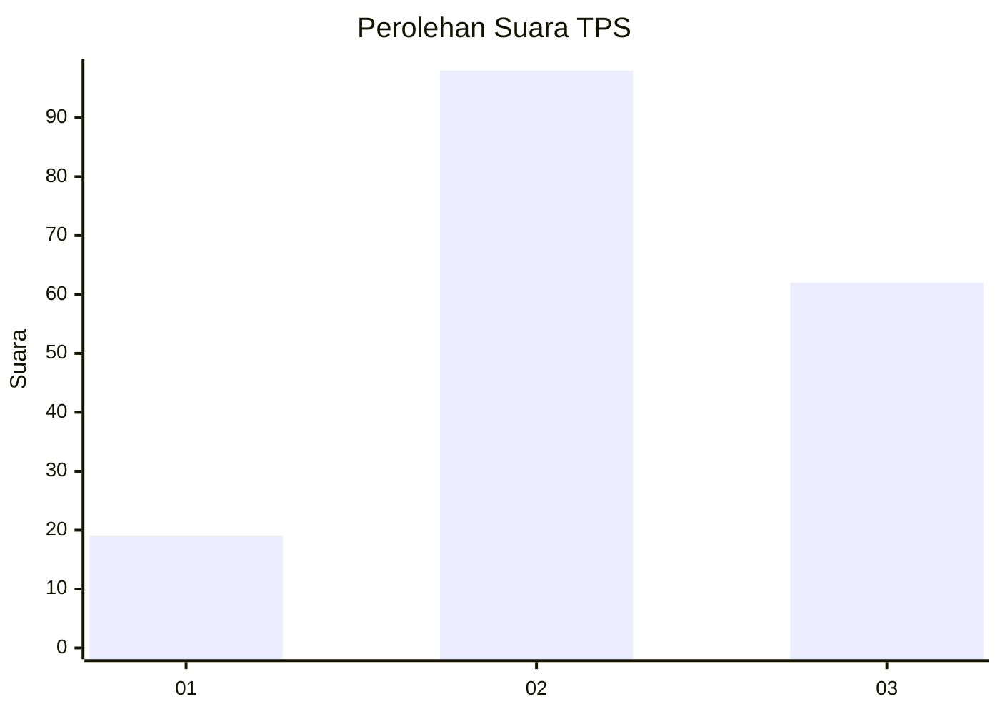
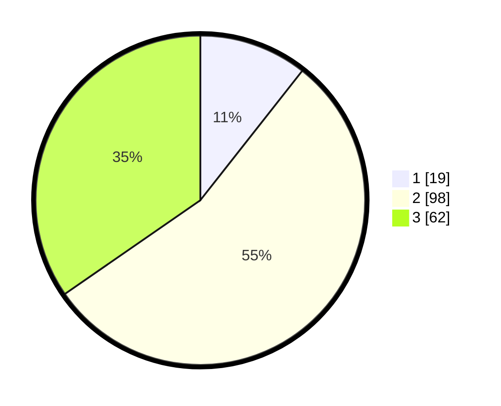

# Hasil

## Grafik

## Tabel

| No. | Nama Paslon    | Suara | Suara (raw) | Persentase |
|:--- |:-------------- | -----:| -----------:| ----------:|
| 1   | ANIES MUHAIMIN | 19    | [19][p-1]   | 10,61      |
| 2   | PRABOWO GIBRAN | 98    | [98][p-2]   | 54,75      |
| 3   | GANJAR MAHFUD  | 62    | [62][p-3]   | 34,64      |

[p-1]: https://github.com/gigit-pemilu/pemilu-2024-35-jawa-timur/blob/main/pilpres/hitung-suara/sub/35-jawa-timur/sub/21-ngawi/sub/01-sine/sub/2012-tulakan/sub/023-tps/sub/paslon-1.txt
[p-2]: https://github.com/gigit-pemilu/pemilu-2024-35-jawa-timur/blob/main/pilpres/hitung-suara/sub/35-jawa-timur/sub/21-ngawi/sub/01-sine/sub/2012-tulakan/sub/023-tps/sub/paslon-2.txt
[p-3]: https://github.com/gigit-pemilu/pemilu-2024-35-jawa-timur/blob/main/pilpres/hitung-suara/sub/35-jawa-timur/sub/21-ngawi/sub/01-sine/sub/2012-tulakan/sub/023-tps/sub/paslon-3.txt

## Foto C Plano

https://sirekap-obj-formc.kpu.go.id/3276/pemilu/ppwp/35/21/01/20/12/3521012012023-20240214-141248--004b44cc-3d70-44f9-bc22-c9e6ee255293.jpg

https://sirekap-obj-formc.kpu.go.id/3276/pemilu/ppwp/35/21/01/20/12/3521012012023-20240214-141237--e8758baa-9ad9-40ad-9461-aa180e7e0630.jpg

https://sirekap-obj-formc.kpu.go.id/3276/pemilu/ppwp/35/21/01/20/12/3521012012023-20240214-141243--ff3e6c69-7899-4920-b0e2-a193c7d2d478.jpg

## Metadata

| Key        | Value               |
| ---------- | ------------------- |
| Time Stamp | 2024-02-24 22:31:28 |

