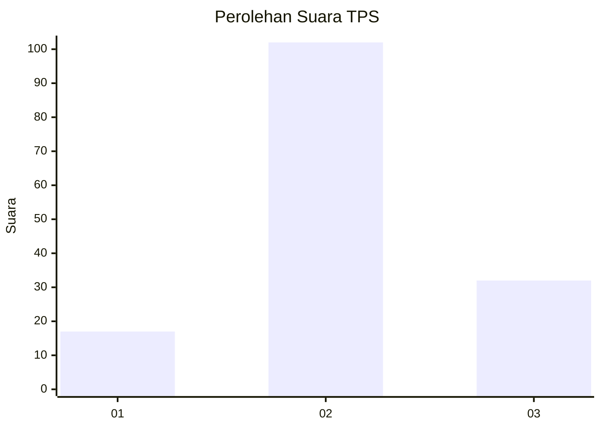
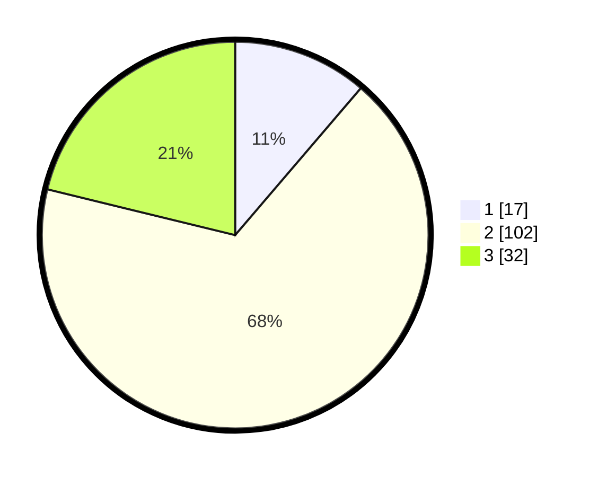

# Hasil

## Grafik

## Tabel

| No. | Nama Paslon    | Suara | Suara (raw) | Persentase |
|:--- |:-------------- | -----:| -----------:| ----------:|
| 1   | ANIES MUHAIMIN | 17    | [17][p-1]   | 11,26      |
| 2   | PRABOWO GIBRAN | 102   | [102][p-2]  | 67,55      |
| 3   | GANJAR MAHFUD  | 32    | [32][p-3]   | 21,19      |

[p-1]: https://github.com/gigit-pemilu/pemilu-2024/blob/main/pilpres/hitung-suara/sub/35-jawa-timur/sub/21-ngawi/sub/03-jogorogo/sub/2001-umbulrejo/sub/001-tps/sub/paslon-1.txt
[p-2]: https://github.com/gigit-pemilu/pemilu-2024/blob/main/pilpres/hitung-suara/sub/35-jawa-timur/sub/21-ngawi/sub/03-jogorogo/sub/2001-umbulrejo/sub/001-tps/sub/paslon-2.txt
[p-3]: https://github.com/gigit-pemilu/pemilu-2024/blob/main/pilpres/hitung-suara/sub/35-jawa-timur/sub/21-ngawi/sub/03-jogorogo/sub/2001-umbulrejo/sub/001-tps/sub/paslon-3.txt

## Foto C Plano

https://sirekap-obj-formc.kpu.go.id/5bd8/pemilu/ppwp/35/21/03/20/01/3521032001001-20240215-001212--79a8f0f8-9d5f-40e2-99da-1ff507b4be3d.jpg

https://sirekap-obj-formc.kpu.go.id/5bd8/pemilu/ppwp/35/21/03/20/01/3521032001001-20240216-032301--d8d1f68e-1fa6-4374-8066-8b7cac7cfe6e.jpg

https://sirekap-obj-formc.kpu.go.id/5bd8/pemilu/ppwp/35/21/03/20/01/3521032001001-20240216-032256--7f8068b5-3b16-4d1b-9ecd-f787cb5f2eeb.jpg

## Metadata

| Key        | Value               |
| ---------- | ------------------- |
| Time Stamp | 2024-02-21 21:00:04 |

## DATA PEMILIH TETAP

Jumlah pemilih dalam DPT: **198**.
 * L: **96**.
 * P: **102**.

## DATA PENGGUNA HAK PILIH

Jumlah pengguna hak pilih dalam DPT: **163**.
 * L: **78**.
 * P: **85**.

Jumlah pengguna hak pilih dalam DPTb: **0**.
 * L: **0**.
 * P: **0**.

Jumlah pengguna hak pilih dalam DPK: **0**.
 * L: **0**.
 * P: **0**.

Jumlah pengguna hak pilih: **163**.
 * L: **78**.
 * P: **85**.

## JUMLAH SUARA SAH DAN TIDAK SAH

JUMLAH SELURUH SUARA SAH: **151**.

JUMLAH SUARA TIDAK SAH: **12**.

JUMLAH SELURUH SUARA SAH DAN SUARA TIDAK SAH: **163**.

