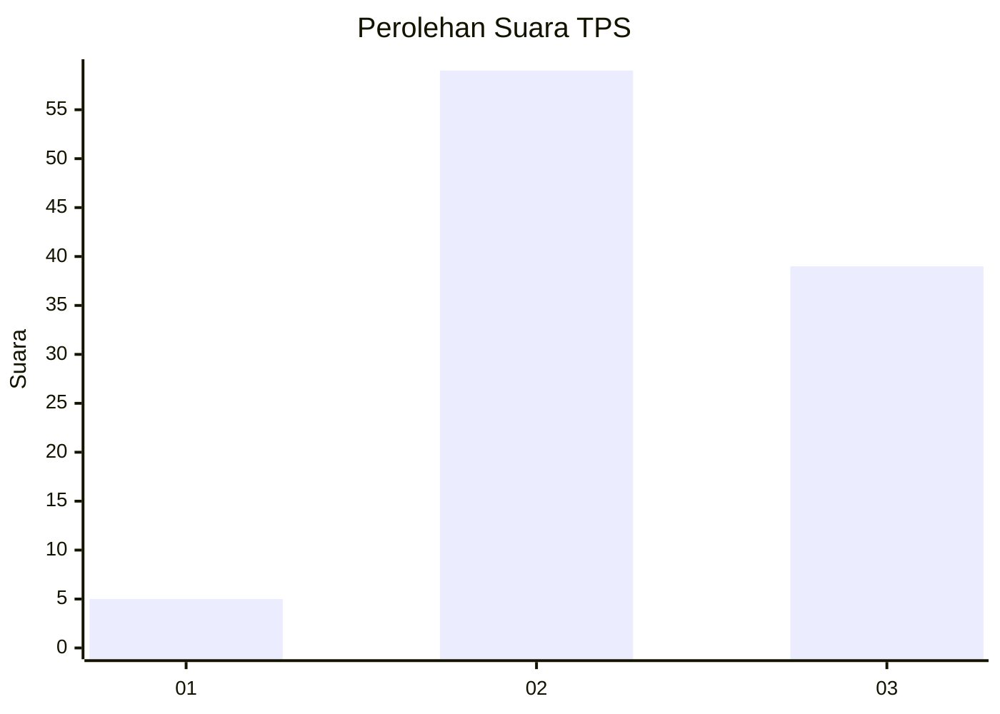
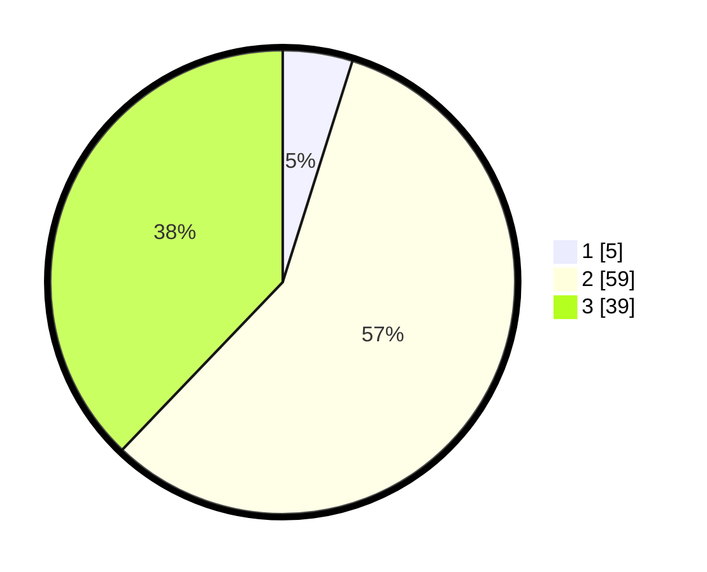

# Hasil

## Grafik

## Tabel

| No. | Nama Paslon    | Suara | Suara (raw) | Persentase |
|:--- |:-------------- | -----:| -----------:| ----------:|
| 1   | ANIES MUHAIMIN | 5     | [5][p-1]    | 4,85       |
| 2   | PRABOWO GIBRAN | 59    | [59][p-2]   | 57,28      |
| 3   | GANJAR MAHFUD  | 39    | [39][p-3]   | 37,86      |

[p-1]: https://github.com/gigit-pemilu/pemilu-2024-35-jawa-timur/blob/main/pilpres/hitung-suara/sub/35-jawa-timur/sub/21-ngawi/sub/03-jogorogo/sub/2005-ngrayudan/sub/001-tps/sub/paslon-1.txt
[p-2]: https://github.com/gigit-pemilu/pemilu-2024-35-jawa-timur/blob/main/pilpres/hitung-suara/sub/35-jawa-timur/sub/21-ngawi/sub/03-jogorogo/sub/2005-ngrayudan/sub/001-tps/sub/paslon-2.txt
[p-3]: https://github.com/gigit-pemilu/pemilu-2024-35-jawa-timur/blob/main/pilpres/hitung-suara/sub/35-jawa-timur/sub/21-ngawi/sub/03-jogorogo/sub/2005-ngrayudan/sub/001-tps/sub/paslon-3.txt

## Foto C Plano

https://sirekap-obj-formc.kpu.go.id/1cd3/pemilu/ppwp/35/21/03/20/05/3521032005001-20240215-000716--a695161b-9d05-4ca8-b9af-277f1192ac18.jpg

https://sirekap-obj-formc.kpu.go.id/1cd3/pemilu/ppwp/35/21/03/20/05/3521032005001-20240215-001359--40e63acf-9412-4103-9f89-1aaafe0e8b6b.jpg

https://sirekap-obj-formc.kpu.go.id/1cd3/pemilu/ppwp/35/21/03/20/05/3521032005001-20240215-005158--42722d24-b431-48f3-928a-2419828836e2.jpg

## Metadata

| Key        | Value               |
| ---------- | ------------------- |
| Time Stamp | 2024-02-22 20:00:00 |

