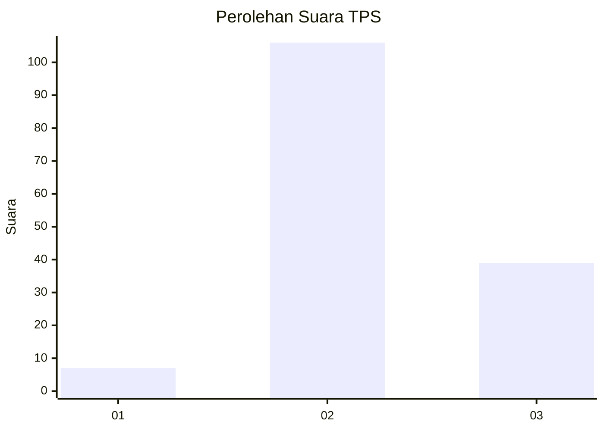
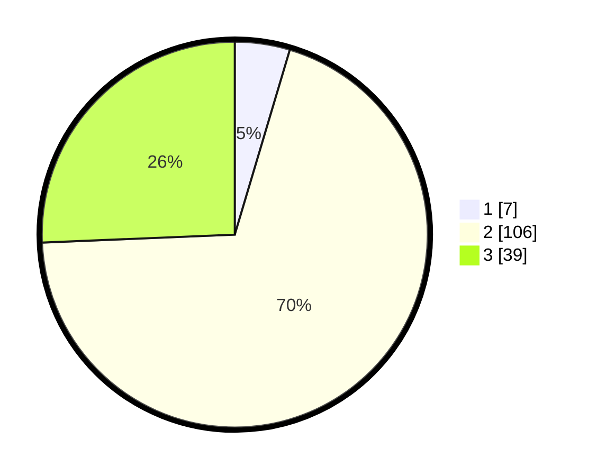

# Hasil

## Grafik

## Tabel

| No. | Nama Paslon    | Suara | Suara (raw) | Persentase |
|:--- |:-------------- | -----:| -----------:| ----------:|
| 1   | ANIES MUHAIMIN | 7     | [7][p-1]    | 4,61       |
| 2   | PRABOWO GIBRAN | 106   | [106][p-2]  | 69,74      |
| 3   | GANJAR MAHFUD  | 39    | [39][p-3]   | 25,66      |

[p-1]: https://github.com/gigit-pemilu/pemilu-2024/blob/main/pilpres/hitung-suara/sub/35-jawa-timur/sub/21-ngawi/sub/04-kendal/sub/2007-sidorejo/sub/020-tps/sub/paslon-1.txt
[p-2]: https://github.com/gigit-pemilu/pemilu-2024/blob/main/pilpres/hitung-suara/sub/35-jawa-timur/sub/21-ngawi/sub/04-kendal/sub/2007-sidorejo/sub/020-tps/sub/paslon-2.txt
[p-3]: https://github.com/gigit-pemilu/pemilu-2024/blob/main/pilpres/hitung-suara/sub/35-jawa-timur/sub/21-ngawi/sub/04-kendal/sub/2007-sidorejo/sub/020-tps/sub/paslon-3.txt

## Foto C Plano

https://sirekap-obj-formc.kpu.go.id/a8df/pemilu/ppwp/35/21/04/20/07/3521042007020-20240215-024255--521d5464-264a-48c1-9235-467cd0246e91.jpg

https://sirekap-obj-formc.kpu.go.id/a8df/pemilu/ppwp/35/21/04/20/07/3521042007020-20240216-150229--51e5d5ab-6d1d-4f96-bbbf-8162b280b5d4.jpg

https://sirekap-obj-formc.kpu.go.id/a8df/pemilu/ppwp/35/21/04/20/07/3521042007020-20240216-150228--3a34dd35-bb74-489e-a7f5-722d240f51e7.jpg

## Metadata

| Key        | Value               |
| ---------- | ------------------- |
| Time Stamp | 2024-02-21 20:00:00 |

