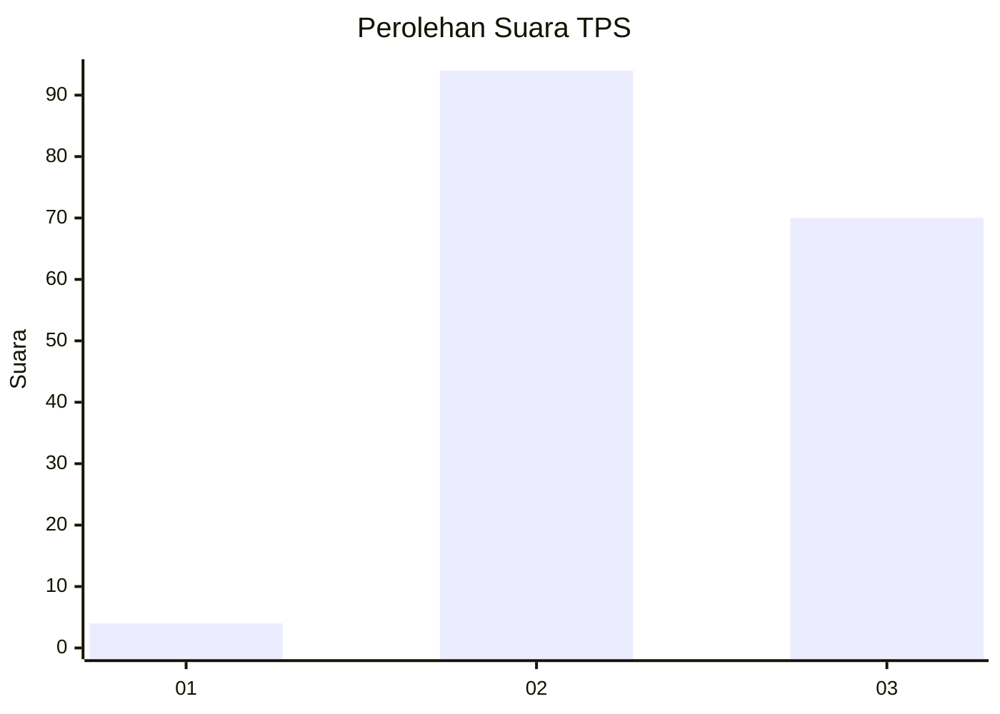
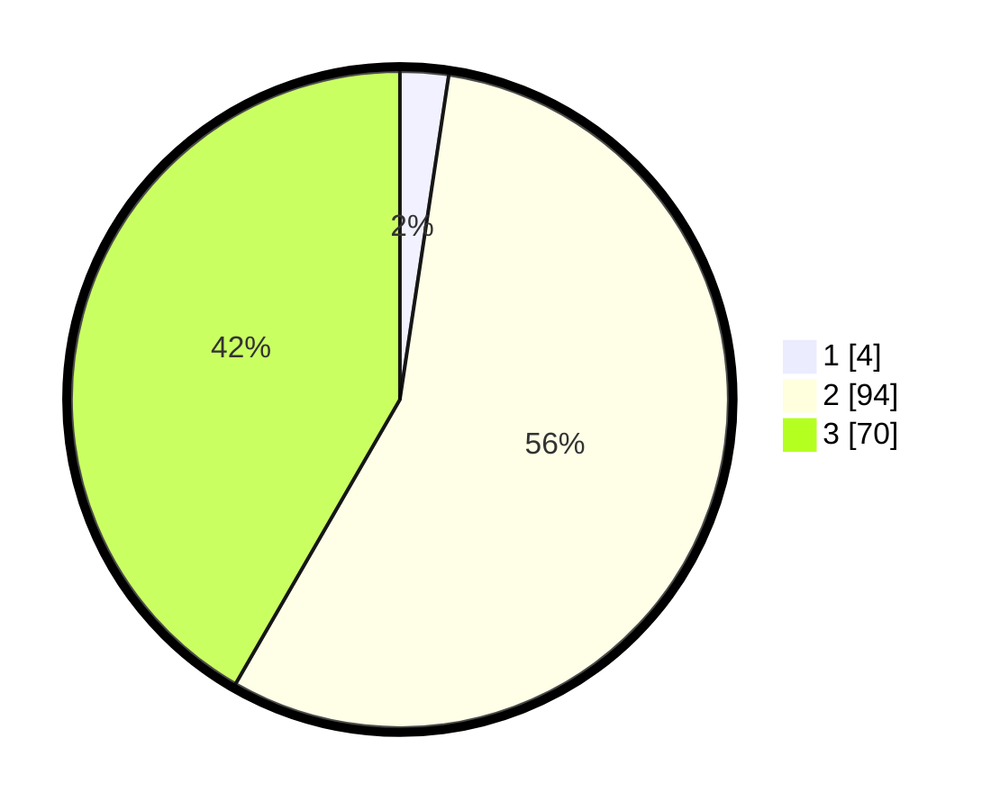

# Hasil

## Grafik

## Tabel

| No. | Nama Paslon    | Suara | Suara (raw) | Persentase |
|:--- |:-------------- | -----:| -----------:| ----------:|
| 1   | ANIES MUHAIMIN | 4     | [4][p-1]    | 2,38       |
| 2   | PRABOWO GIBRAN | 94    | [94][p-2]   | 55,95      |
| 3   | GANJAR MAHFUD  | 70    | [70][p-3]   | 41,67      |

[p-1]: https://github.com/gigit-pemilu/pemilu-2024-35-jawa-timur/blob/main/pilpres/hitung-suara/sub/35-jawa-timur/sub/21-ngawi/sub/05-geneng/sub/2009-tepas/sub/013-tps/sub/paslon-1.txt
[p-2]: https://github.com/gigit-pemilu/pemilu-2024-35-jawa-timur/blob/main/pilpres/hitung-suara/sub/35-jawa-timur/sub/21-ngawi/sub/05-geneng/sub/2009-tepas/sub/013-tps/sub/paslon-2.txt
[p-3]: https://github.com/gigit-pemilu/pemilu-2024-35-jawa-timur/blob/main/pilpres/hitung-suara/sub/35-jawa-timur/sub/21-ngawi/sub/05-geneng/sub/2009-tepas/sub/013-tps/sub/paslon-3.txt

## Foto C Plano

https://sirekap-obj-formc.kpu.go.id/ff35/pemilu/ppwp/35/21/05/20/09/3521052009013-20240217-061719--c3e6d60d-61fb-4564-a4d6-f30c903fa446.jpg

https://sirekap-obj-formc.kpu.go.id/ff35/pemilu/ppwp/35/21/05/20/09/3521052009013-20240216-163158--8afab37a-46b8-474c-97e4-5f0f1520e859.jpg

https://sirekap-obj-formc.kpu.go.id/ff35/pemilu/ppwp/35/21/05/20/09/3521052009013-20240216-190609--2075b1e6-5b40-4616-ab94-02fef66221c7.jpg

## Metadata

| Key        | Value               |
| ---------- | ------------------- |
| Time Stamp | 2024-02-21 21:00:04 |

