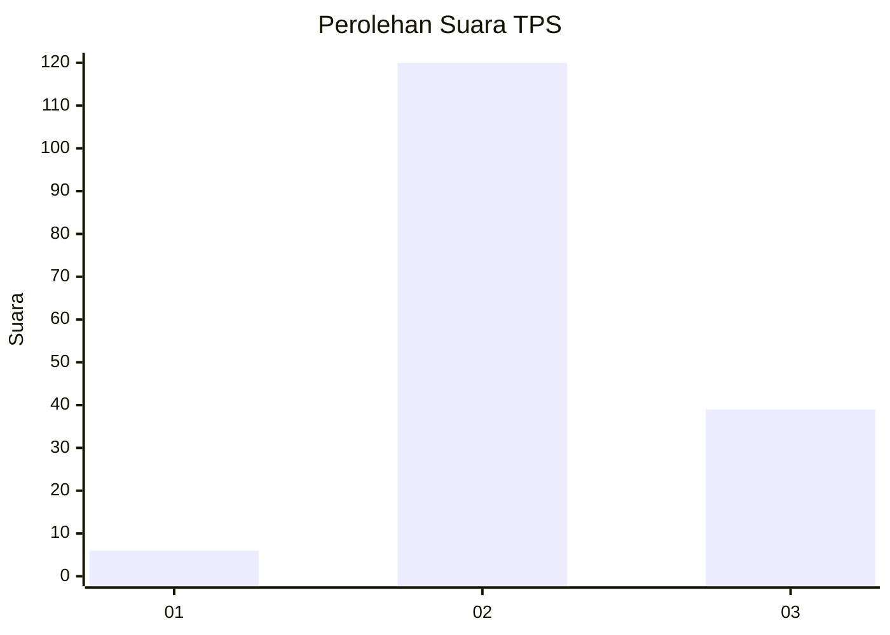
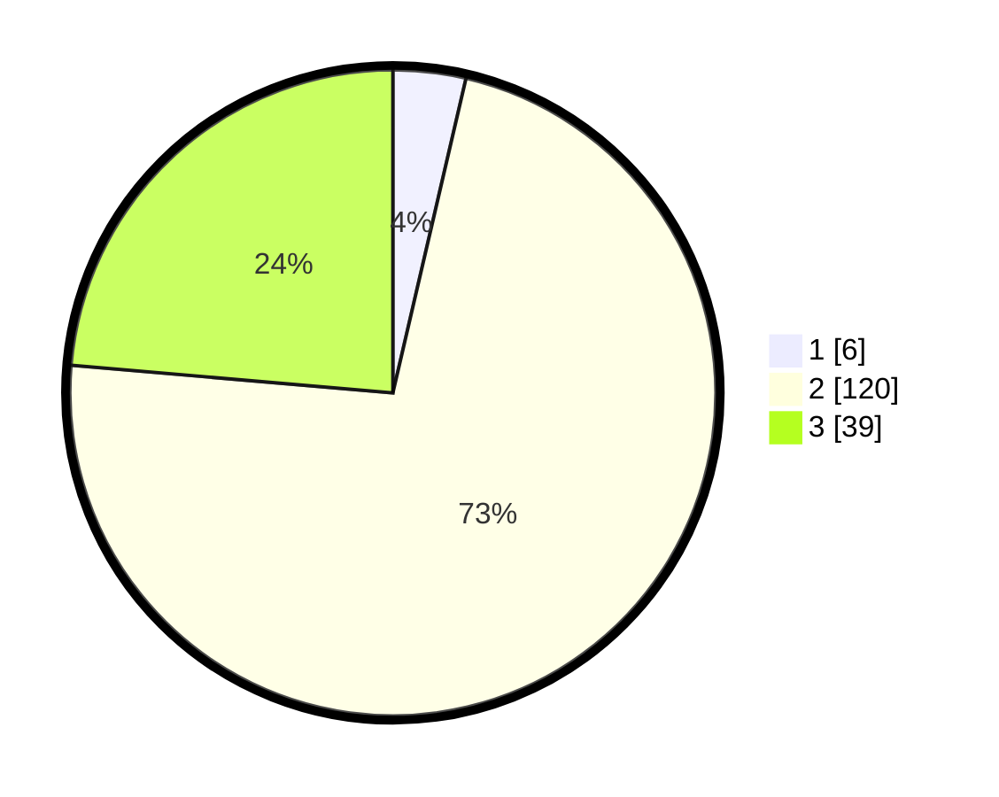

# Hasil

## Grafik

## Tabel

| No. | Nama Paslon    | Suara | Suara (raw) | Persentase |
|:--- |:-------------- | -----:| -----------:| ----------:|
| 1   | ANIES MUHAIMIN | 6     | [6][p-1]    | 3,64       |
| 2   | PRABOWO GIBRAN | 120   | [120][p-2]  | 72,73      |
| 3   | GANJAR MAHFUD  | 39    | [39][p-3]   | 23,64      |

[p-1]: https://github.com/gigit-pemilu/pemilu-2024-35-jawa-timur/blob/main/pilpres/hitung-suara/sub/35-jawa-timur/sub/21-ngawi/sub/09-ngawi/sub/1013-margomulyo/sub/902-tps/sub/paslon-1.txt
[p-2]: https://github.com/gigit-pemilu/pemilu-2024-35-jawa-timur/blob/main/pilpres/hitung-suara/sub/35-jawa-timur/sub/21-ngawi/sub/09-ngawi/sub/1013-margomulyo/sub/902-tps/sub/paslon-2.txt
[p-3]: https://github.com/gigit-pemilu/pemilu-2024-35-jawa-timur/blob/main/pilpres/hitung-suara/sub/35-jawa-timur/sub/21-ngawi/sub/09-ngawi/sub/1013-margomulyo/sub/902-tps/sub/paslon-3.txt

## Foto C Plano

https://sirekap-obj-formc.kpu.go.id/4622/pemilu/ppwp/35/21/09/10/13/3521091013902-20240216-153320--5d5dc96f-fab7-463d-8240-5f8ed5802079.jpg

https://sirekap-obj-formc.kpu.go.id/4622/pemilu/ppwp/35/21/09/10/13/3521091013902-20240216-153321--7712b576-7621-4245-b851-51c5647f6061.jpg

https://sirekap-obj-formc.kpu.go.id/4622/pemilu/ppwp/35/21/09/10/13/3521091013902-20240216-153320--8d0efbc4-1871-4a64-9c92-b8dd3ce44fe0.jpg

## Metadata

| Key        | Value               |
| ---------- | ------------------- |
| Time Stamp | 2024-02-17 16:00:02 |

## DATA PEMILIH TETAP

Jumlah pemilih dalam DPT: **174**.
 * L: **168**.
 * P: **6**.

## DATA PENGGUNA HAK PILIH

Jumlah pengguna hak pilih dalam DPT: **78**.
 * L: **77**.
 * P: **1**.

Jumlah pengguna hak pilih dalam DPTb: **89**.
 * L: **86**.
 * P: **3**.

Jumlah pengguna hak pilih dalam DPK: **0**.
 * L: **0**.
 * P: **0**.

Jumlah pengguna hak pilih: **167**.
 * L: **163**.
 * P: **4**.

## JUMLAH SUARA SAH DAN TIDAK SAH

JUMLAH SELURUH SUARA SAH: **165**.

JUMLAH SUARA TIDAK SAH: **2**.

JUMLAH SELURUH SUARA SAH DAN SUARA TIDAK SAH: **167**.

