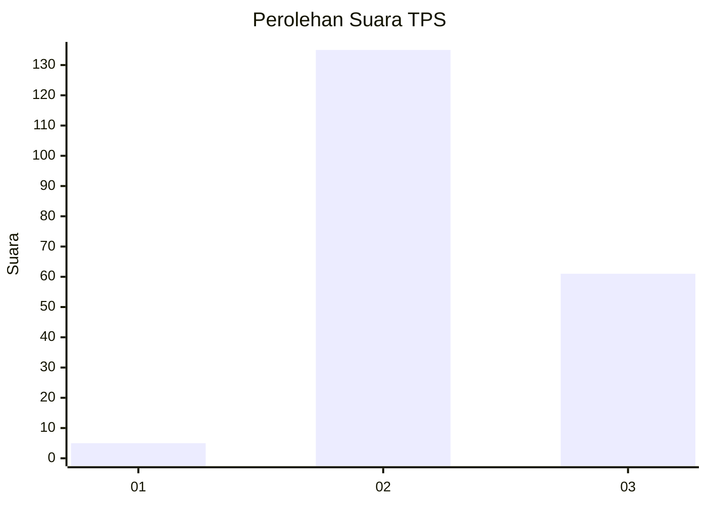

# Hasil

## Grafik

## Tabel

| No. | Nama Paslon    | Suara | Suara (raw) | Persentase |
|:--- |:-------------- | -----:| -----------:| ----------:|
| 1   | ANIES MUHAIMIN | 5     | [5][p-1]    | 2,49       |
| 2   | PRABOWO GIBRAN | 135   | [135][p-2]  | 67,16      |
| 3   | GANJAR MAHFUD  | 61    | [61][p-3]   | 30,35      |

[p-1]: https://github.com/gigit-pemilu/pemilu-2024/blob/main/pilpres/hitung-suara/sub/35-jawa-timur/sub/21-ngawi/sub/10-paron/sub/2003-semen/sub/020-tps/sub/paslon-1.txt
[p-2]: https://github.com/gigit-pemilu/pemilu-2024/blob/main/pilpres/hitung-suara/sub/35-jawa-timur/sub/21-ngawi/sub/10-paron/sub/2003-semen/sub/020-tps/sub/paslon-2.txt
[p-3]: https://github.com/gigit-pemilu/pemilu-2024/blob/main/pilpres/hitung-suara/sub/35-jawa-timur/sub/21-ngawi/sub/10-paron/sub/2003-semen/sub/020-tps/sub/paslon-3.txt

## Foto C Plano

https://sirekap-obj-formc.kpu.go.id/cae3/pemilu/ppwp/35/21/10/20/03/3521102003020-20240215-110040--c93f6c13-774a-47b8-ae5e-06cb079d9593.jpg

https://sirekap-obj-formc.kpu.go.id/cae3/pemilu/ppwp/35/21/10/20/03/3521102003020-20240216-175141--8b9cf99e-dc38-47bc-8e85-692a923a7987.jpg

https://sirekap-obj-formc.kpu.go.id/cae3/pemilu/ppwp/35/21/10/20/03/3521102003020-20240216-174137--3e82a60b-e8df-4056-805f-4417b0358264.jpg

## Metadata

| Key        | Value               |
| ---------- | ------------------- |
| Time Stamp | 2024-02-16 21:01:00 |

## DATA PEMILIH TETAP

Jumlah pemilih dalam DPT: **281**.
 * L: **273**.
 * P: **742**.

## DATA PENGGUNA HAK PILIH

Jumlah pengguna hak pilih dalam DPT: **337**.
 * L: **833**.
 * P: **713**.

Jumlah pengguna hak pilih dalam DPTb: **858**.
 * L: **884**.
 * P: **483**.

Jumlah pengguna hak pilih dalam DPK: **88**.
 * L: **858**.
 * P: **840**.

Jumlah pengguna hak pilih: **283**.
 * L: **897**.
 * P: **116**.

## JUMLAH SUARA SAH DAN TIDAK SAH

JUMLAH SELURUH SUARA SAH: **201**.

JUMLAH SUARA TIDAK SAH: **8**.

JUMLAH SELURUH SUARA SAH DAN SUARA TIDAK SAH: **209**.

