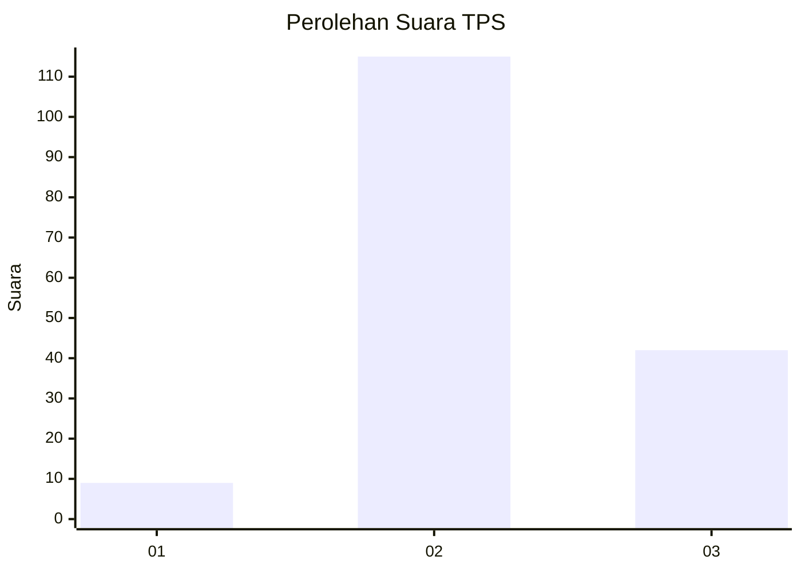
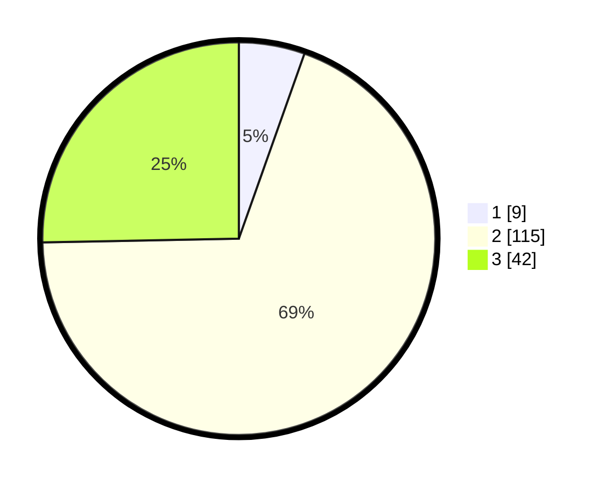

# Hasil

## Grafik

## Tabel

| No. | Nama Paslon    | Suara | Suara (raw) | Persentase |
|:--- |:-------------- | -----:| -----------:| ----------:|
| 1   | ANIES MUHAIMIN | 9     | [9][p-1]    | 5,42       |
| 2   | PRABOWO GIBRAN | 115   | [115][p-2]  | 69,28      |
| 3   | GANJAR MAHFUD  | 42    | [42][p-3]   | 25,30      |

[p-1]: https://github.com/gigit-pemilu/pemilu-2024-35-jawa-timur/blob/main/pilpres/hitung-suara/sub/35-jawa-timur/sub/21-ngawi/sub/10-paron/sub/2004-kedungputri/sub/002-tps/sub/paslon-1.txt
[p-2]: https://github.com/gigit-pemilu/pemilu-2024-35-jawa-timur/blob/main/pilpres/hitung-suara/sub/35-jawa-timur/sub/21-ngawi/sub/10-paron/sub/2004-kedungputri/sub/002-tps/sub/paslon-2.txt
[p-3]: https://github.com/gigit-pemilu/pemilu-2024-35-jawa-timur/blob/main/pilpres/hitung-suara/sub/35-jawa-timur/sub/21-ngawi/sub/10-paron/sub/2004-kedungputri/sub/002-tps/sub/paslon-3.txt

## Foto C Plano

https://sirekap-obj-formc.kpu.go.id/44e4/pemilu/ppwp/35/21/10/20/04/3521102004002-20240214-141536--be45346a-1502-4ab7-826f-85d88a1cbd29.jpg

https://sirekap-obj-formc.kpu.go.id/44e4/pemilu/ppwp/35/21/10/20/04/3521102004002-20240214-141650--0985e7fc-3d9e-462e-9a83-9c79bfd1691c.jpg

https://sirekap-obj-formc.kpu.go.id/44e4/pemilu/ppwp/35/21/10/20/04/3521102004002-20240214-141814--5d2d15de-bc08-4ac0-841a-0a365c7f2d56.jpg

## Metadata

| Key        | Value               |
| ---------- | ------------------- |
| Time Stamp | 2024-02-22 20:00:00 |

