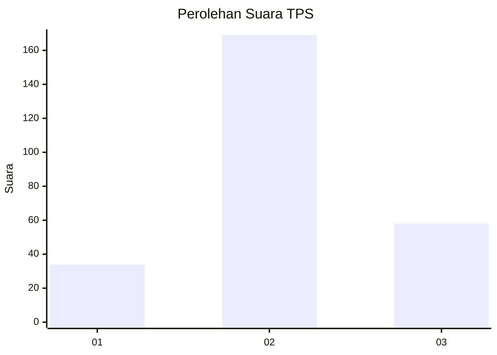
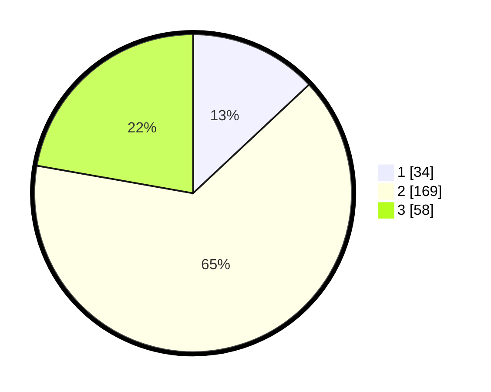

# Hasil

## Grafik

## Tabel

| No. | Nama Paslon    | Suara | Suara (raw) | Persentase |
|:--- |:-------------- | -----:| -----------:| ----------:|
| 1   | ANIES MUHAIMIN | 34    | [34][p-1]   | 13,03      |
| 2   | PRABOWO GIBRAN | 169   | [169][p-2]  | 64,75      |
| 3   | GANJAR MAHFUD  | 58    | [58][p-3]   | 22,22      |

[p-1]: https://github.com/gigit-pemilu/pemilu-2024/blob/main/pilpres/hitung-suara/sub/35-jawa-timur/sub/21-ngawi/sub/10-paron/sub/2012-ngale/sub/011-tps/sub/paslon-1.txt
[p-2]: https://github.com/gigit-pemilu/pemilu-2024/blob/main/pilpres/hitung-suara/sub/35-jawa-timur/sub/21-ngawi/sub/10-paron/sub/2012-ngale/sub/011-tps/sub/paslon-2.txt
[p-3]: https://github.com/gigit-pemilu/pemilu-2024/blob/main/pilpres/hitung-suara/sub/35-jawa-timur/sub/21-ngawi/sub/10-paron/sub/2012-ngale/sub/011-tps/sub/paslon-3.txt

## Foto C Plano

https://sirekap-obj-formc.kpu.go.id/6814/pemilu/ppwp/35/21/10/20/12/3521102012011-20240214-155212--e82eed4b-e996-44b0-9de3-4802780aa122.jpg

https://sirekap-obj-formc.kpu.go.id/6814/pemilu/ppwp/35/21/10/20/12/3521102012011-20240214-155222--feab227d-9e58-4c6f-b63f-86f09560451f.jpg

https://sirekap-obj-formc.kpu.go.id/6814/pemilu/ppwp/35/21/10/20/12/3521102012011-20240214-155232--506c6638-36d5-451d-a588-a58ef8888713.jpg

## Metadata

| Key        | Value               |
| ---------- | ------------------- |
| Time Stamp | 2024-02-22 20:00:00 |

