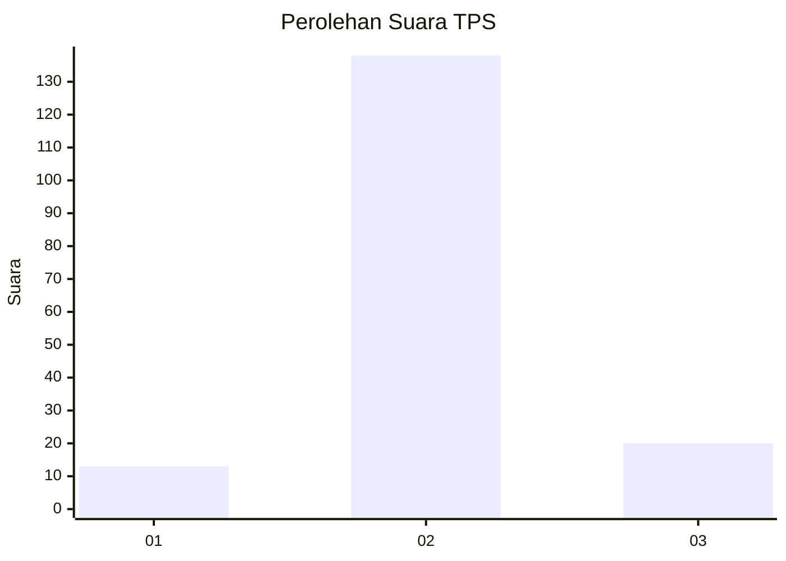
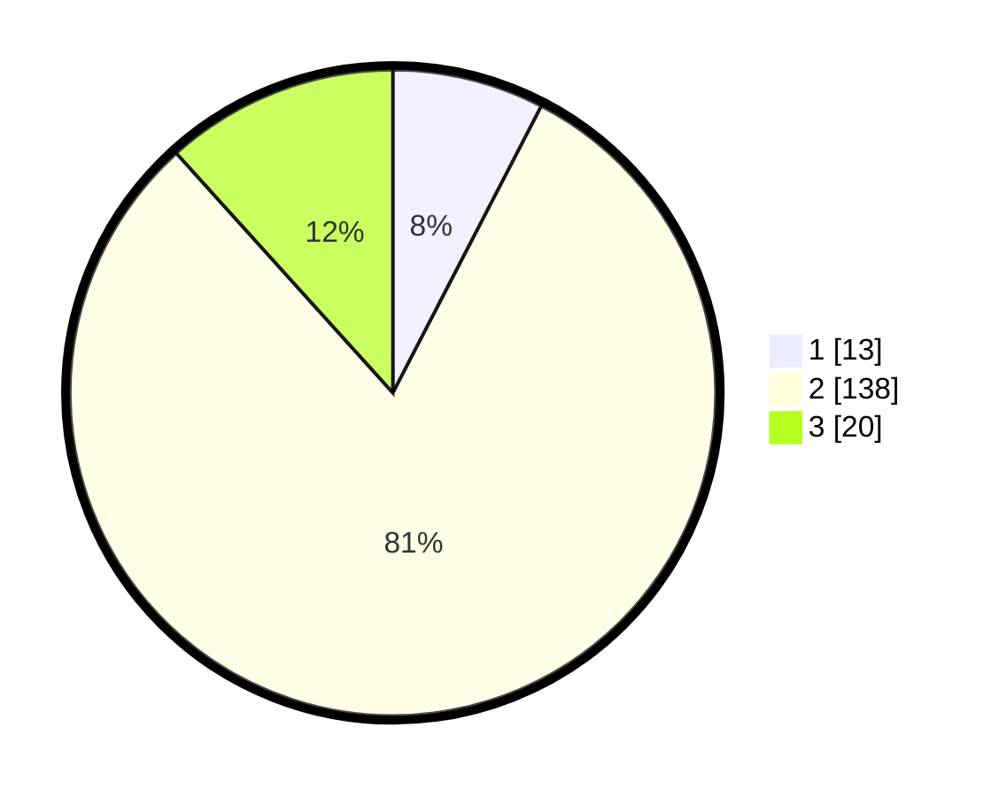

# Hasil

## Grafik

## Tabel

| No. | Nama Paslon    | Suara | Suara (raw) | Persentase |
|:--- |:-------------- | -----:| -----------:| ----------:|
| 1   | ANIES MUHAIMIN | 13    | [13][p-1]   | 7,60       |
| 2   | PRABOWO GIBRAN | 138   | [138][p-2]  | 80,70      |
| 3   | GANJAR MAHFUD  | 20    | [20][p-3]   | 11,70      |

[p-1]: https://github.com/gigit-pemilu/pemilu-2024-35-jawa-timur/blob/main/pilpres/hitung-suara/sub/35-jawa-timur/sub/21-ngawi/sub/10-paron/sub/2014-kebon/sub/005-tps/sub/paslon-1.txt
[p-2]: https://github.com/gigit-pemilu/pemilu-2024-35-jawa-timur/blob/main/pilpres/hitung-suara/sub/35-jawa-timur/sub/21-ngawi/sub/10-paron/sub/2014-kebon/sub/005-tps/sub/paslon-2.txt
[p-3]: https://github.com/gigit-pemilu/pemilu-2024-35-jawa-timur/blob/main/pilpres/hitung-suara/sub/35-jawa-timur/sub/21-ngawi/sub/10-paron/sub/2014-kebon/sub/005-tps/sub/paslon-3.txt

## Foto C Plano

https://sirekap-obj-formc.kpu.go.id/a962/pemilu/ppwp/35/21/10/20/14/3521102014005-20240216-115807--d15d601f-6e95-49eb-bdc9-3c79e5031abc.jpg

https://sirekap-obj-formc.kpu.go.id/a962/pemilu/ppwp/35/21/10/20/14/3521102014005-20240217-124632--0c4d8a03-4d25-4a47-87dc-165c585022ee.jpg

https://sirekap-obj-formc.kpu.go.id/a962/pemilu/ppwp/35/21/10/20/14/3521102014005-20240214-155452--d5a89053-0a3c-4f3d-9f4f-e05230a0e3bb.jpg

## Metadata

| Key        | Value               |
| ---------- | ------------------- |
| Time Stamp | 2024-02-17 13:37:34 |

