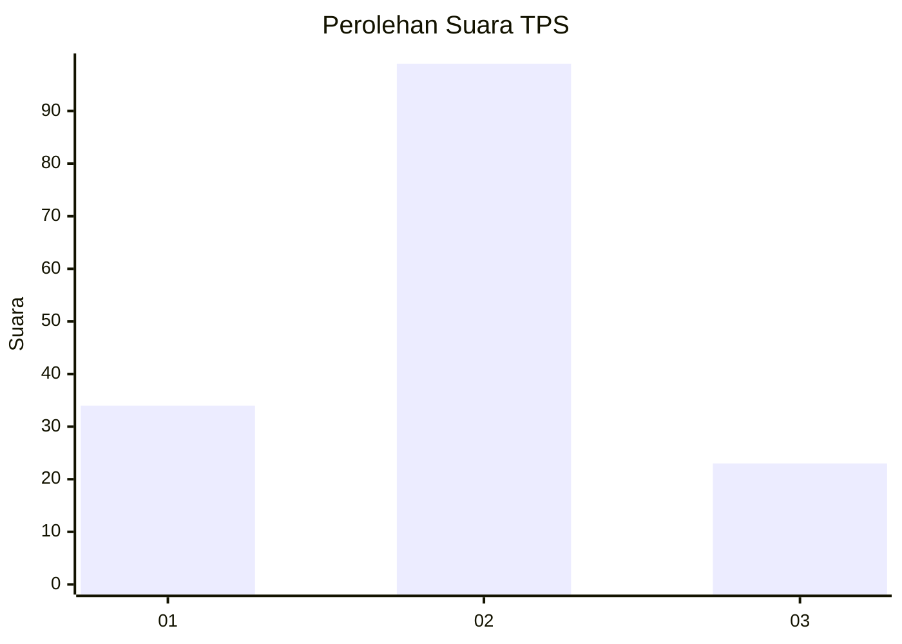
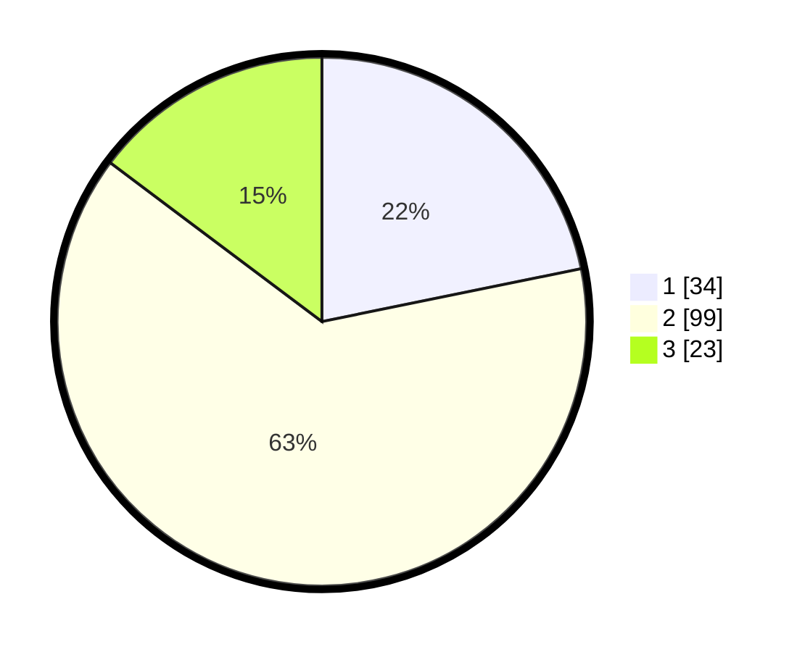

# Hasil

## Grafik

## Tabel

| No. | Nama Paslon    | Suara | Suara (raw) | Persentase |
|:--- |:-------------- | -----:| -----------:| ----------:|
| 1   | ANIES MUHAIMIN | 34    | [34][p-1]   | 21,79      |
| 2   | PRABOWO GIBRAN | 99    | [99][p-2]   | 63,46      |
| 3   | GANJAR MAHFUD  | 23    | [23][p-3]   | 14,74      |

[p-1]: https://github.com/gigit-pemilu/pemilu-2024-35-jawa-timur/blob/main/pilpres/hitung-suara/sub/35-jawa-timur/sub/21-ngawi/sub/12-widodaren/sub/2007-karangbanyu/sub/003-tps/sub/paslon-1.txt
[p-2]: https://github.com/gigit-pemilu/pemilu-2024-35-jawa-timur/blob/main/pilpres/hitung-suara/sub/35-jawa-timur/sub/21-ngawi/sub/12-widodaren/sub/2007-karangbanyu/sub/003-tps/sub/paslon-2.txt
[p-3]: https://github.com/gigit-pemilu/pemilu-2024-35-jawa-timur/blob/main/pilpres/hitung-suara/sub/35-jawa-timur/sub/21-ngawi/sub/12-widodaren/sub/2007-karangbanyu/sub/003-tps/sub/paslon-3.txt

## Foto C Plano

https://sirekap-obj-formc.kpu.go.id/0f4f/pemilu/ppwp/35/21/12/20/07/3521122007003-20240215-071317--8c4afea1-8fd8-4193-bcf6-87665d594cc7.jpg

https://sirekap-obj-formc.kpu.go.id/0f4f/pemilu/ppwp/35/21/12/20/07/3521122007003-20240215-071432--12b1b50c-5b01-4b42-8811-1a309cc46260.jpg

https://sirekap-obj-formc.kpu.go.id/0f4f/pemilu/ppwp/35/21/12/20/07/3521122007003-20240215-071542--8b4d6704-a32b-47b0-b308-6f10362c79b5.jpg

## Metadata

| Key        | Value               |
| ---------- | ------------------- |
| Time Stamp | 2024-02-22 20:00:00 |

