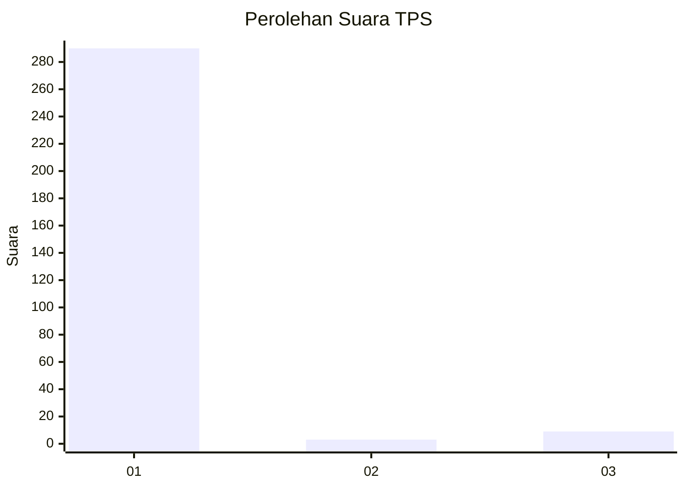
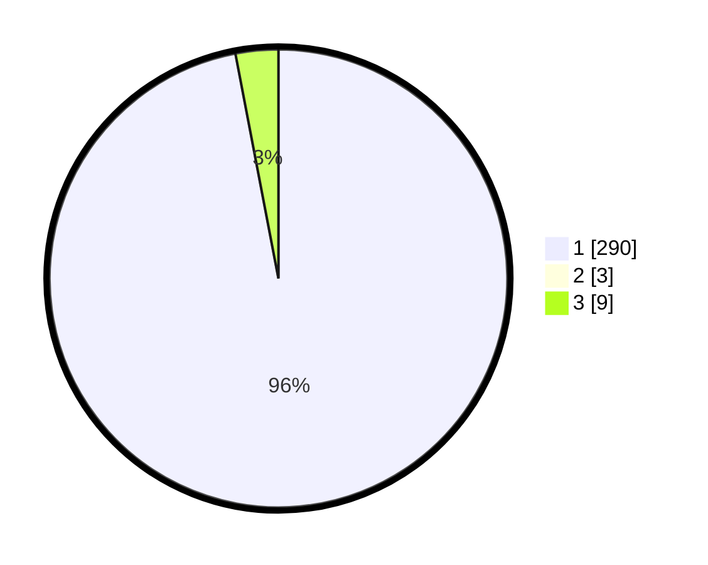

# Hasil

## Grafik

## Tabel

| No. | Nama Paslon    | Suara | Suara (raw) | Persentase |
|:--- |:-------------- | -----:| -----------:| ----------:|
| 1   | ANIES MUHAIMIN | 290   | [290][p-1]  | 96,03      |
| 2   | PRABOWO GIBRAN | 3     | [3][p-2]    | 0,99       |
| 3   | GANJAR MAHFUD  | 9     | [9][p-3]    | 2,98       |

[p-1]: https://github.com/gigit-pemilu/pemilu-2024-35-jawa-timur/blob/main/pilpres/hitung-suara/sub/35-jawa-timur/sub/21-ngawi/sub/12-widodaren/sub/2007-karangbanyu/sub/901-tps/sub/paslon-1.txt
[p-2]: https://github.com/gigit-pemilu/pemilu-2024-35-jawa-timur/blob/main/pilpres/hitung-suara/sub/35-jawa-timur/sub/21-ngawi/sub/12-widodaren/sub/2007-karangbanyu/sub/901-tps/sub/paslon-2.txt
[p-3]: https://github.com/gigit-pemilu/pemilu-2024-35-jawa-timur/blob/main/pilpres/hitung-suara/sub/35-jawa-timur/sub/21-ngawi/sub/12-widodaren/sub/2007-karangbanyu/sub/901-tps/sub/paslon-3.txt

## Foto C Plano

https://sirekap-obj-formc.kpu.go.id/6e07/pemilu/ppwp/35/21/12/20/07/3521122007901-20240214-193547--e9acb975-e0b6-4dda-aa4f-c92b08fa951b.jpg

https://sirekap-obj-formc.kpu.go.id/6e07/pemilu/ppwp/35/21/12/20/07/3521122007901-20240214-193716--8ed201a3-3126-4d6b-9349-d23a287dfa83.jpg

https://sirekap-obj-formc.kpu.go.id/6e07/pemilu/ppwp/35/21/12/20/07/3521122007901-20240214-193831--ea1ac771-ce6a-45c0-9f24-a2bd260f33d0.jpg

## Metadata

| Key        | Value               |
| ---------- | ------------------- |
| Time Stamp | 2024-02-15 00:56:54 |

## DATA PEMILIH TETAP

Jumlah pemilih dalam DPT: **300**.
 * L: **0**.
 * P: **300**.

## DATA PENGGUNA HAK PILIH

Jumlah pengguna hak pilih dalam DPT: **295**.
 * L: **0**.
 * P: **295**.

Jumlah pengguna hak pilih dalam DPTb: **8**.
 * L: **1**.
 * P: **7**.

Jumlah pengguna hak pilih dalam DPK: **0**.
 * L: **0**.
 * P: **0**.

Jumlah pengguna hak pilih: **303**.
 * L: **1**.
 * P: **302**.

## JUMLAH SUARA SAH DAN TIDAK SAH

JUMLAH SELURUH SUARA SAH: **302**.

JUMLAH SUARA TIDAK SAH: **1**.

JUMLAH SELURUH SUARA SAH DAN SUARA TIDAK SAH: **303**.

