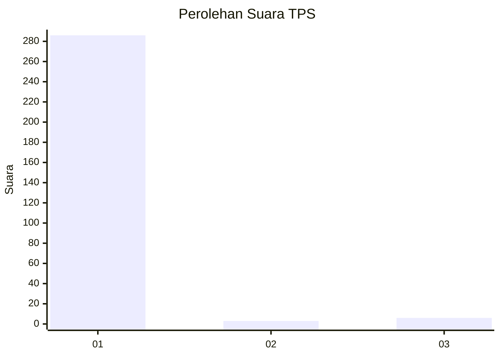
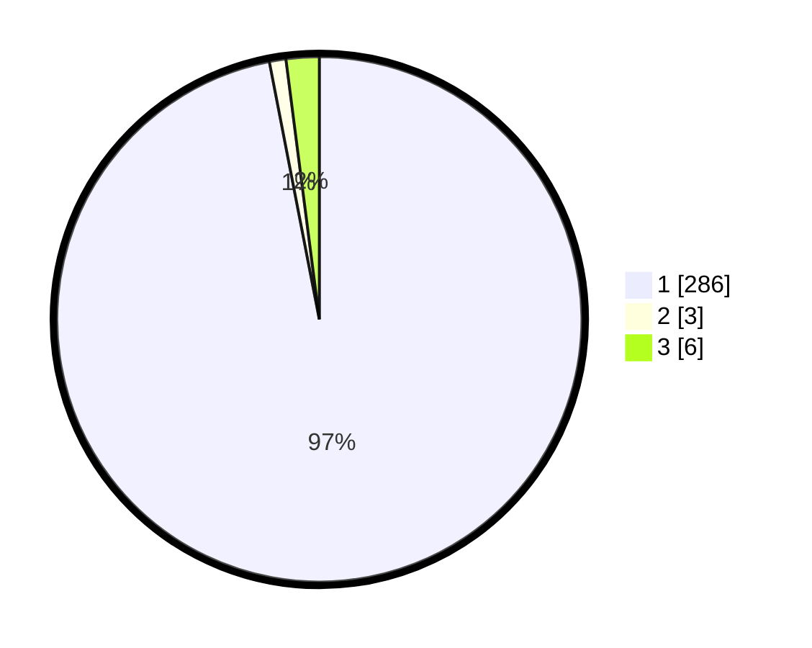

# Hasil

## Grafik

## Tabel

| No. | Nama Paslon    | Suara | Suara (raw) | Persentase |
|:--- |:-------------- | -----:| -----------:| ----------:|
| 1   | ANIES MUHAIMIN | 286   | [286][p-1]  | 96,95      |
| 2   | PRABOWO GIBRAN | 3     | [3][p-2]    | 1,02       |
| 3   | GANJAR MAHFUD  | 6     | [6][p-3]    | 2,03       |

[p-1]: https://github.com/gigit-pemilu/pemilu-2024/blob/main/pilpres/hitung-suara/sub/35-jawa-timur/sub/21-ngawi/sub/12-widodaren/sub/2007-karangbanyu/sub/902-tps/sub/paslon-1.txt
[p-2]: https://github.com/gigit-pemilu/pemilu-2024/blob/main/pilpres/hitung-suara/sub/35-jawa-timur/sub/21-ngawi/sub/12-widodaren/sub/2007-karangbanyu/sub/902-tps/sub/paslon-2.txt
[p-3]: https://github.com/gigit-pemilu/pemilu-2024/blob/main/pilpres/hitung-suara/sub/35-jawa-timur/sub/21-ngawi/sub/12-widodaren/sub/2007-karangbanyu/sub/902-tps/sub/paslon-3.txt

## Foto C Plano

https://sirekap-obj-formc.kpu.go.id/8635/pemilu/ppwp/35/21/12/20/07/3521122007902-20240216-111747--56dfb0c1-e3ef-47fe-81a8-8ad0764c8d93.jpg

https://sirekap-obj-formc.kpu.go.id/8635/pemilu/ppwp/35/21/12/20/07/3521122007902-20240214-210416--a92bfb52-223d-41b8-ab82-f4d01c781ae0.jpg

https://sirekap-obj-formc.kpu.go.id/8635/pemilu/ppwp/35/21/12/20/07/3521122007902-20240217-010403--79f58bef-7e42-42e4-a24f-7f381c0f3aa6.jpg

## Metadata

| Key        | Value               |
| ---------- | ------------------- |
| Time Stamp | 2024-02-21 16:00:00 |

## DATA PEMILIH TETAP

Jumlah pemilih dalam DPT: **298**.
 * L: **0**.
 * P: **298**.

## DATA PENGGUNA HAK PILIH

Jumlah pengguna hak pilih dalam DPT: **270**.
 * L: **0**.
 * P: **270**.

Jumlah pengguna hak pilih dalam DPTb: **27**.
 * L: **3**.
 * P: **24**.

Jumlah pengguna hak pilih dalam DPK: **0**.
 * L: **0**.
 * P: **0**.

Jumlah pengguna hak pilih: **297**.
 * L: **3**.
 * P: **294**.

## JUMLAH SUARA SAH DAN TIDAK SAH

JUMLAH SELURUH SUARA SAH: **295**.

JUMLAH SUARA TIDAK SAH: **2**.

JUMLAH SELURUH SUARA SAH DAN SUARA TIDAK SAH: **297**.

