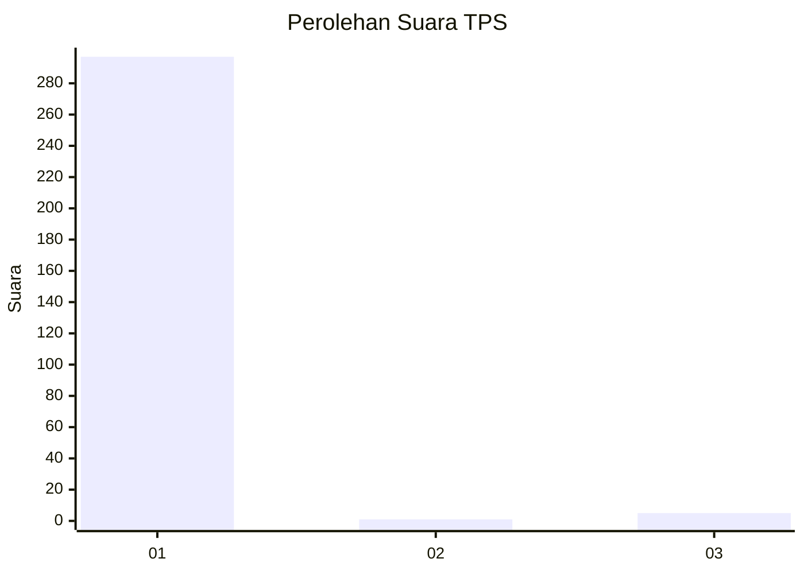
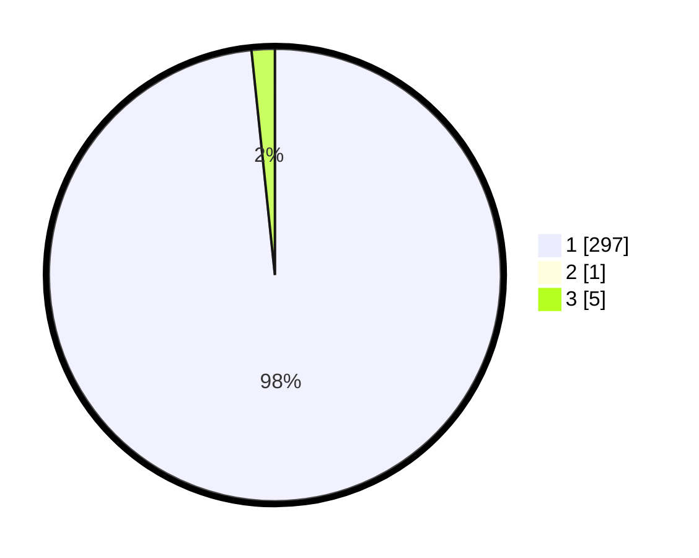

# Hasil

## Grafik

## Tabel

| No. | Nama Paslon    | Suara | Suara (raw) | Persentase |
|:--- |:-------------- | -----:| -----------:| ----------:|
| 1   | ANIES MUHAIMIN | 297   | [297][p-1]  | 98,02      |
| 2   | PRABOWO GIBRAN | 1     | [1][p-2]    | 0,33       |
| 3   | GANJAR MAHFUD  | 5     | [5][p-3]    | 1,65       |

[p-1]: https://github.com/gigit-pemilu/pemilu-2024/blob/main/pilpres/hitung-suara/sub/35-jawa-timur/sub/21-ngawi/sub/12-widodaren/sub/2007-karangbanyu/sub/903-tps/sub/paslon-1.txt
[p-2]: https://github.com/gigit-pemilu/pemilu-2024/blob/main/pilpres/hitung-suara/sub/35-jawa-timur/sub/21-ngawi/sub/12-widodaren/sub/2007-karangbanyu/sub/903-tps/sub/paslon-2.txt
[p-3]: https://github.com/gigit-pemilu/pemilu-2024/blob/main/pilpres/hitung-suara/sub/35-jawa-timur/sub/21-ngawi/sub/12-widodaren/sub/2007-karangbanyu/sub/903-tps/sub/paslon-3.txt

## Foto C Plano

https://sirekap-obj-formc.kpu.go.id/3ede/pemilu/ppwp/35/21/12/20/07/3521122007903-20240216-190024--0a8eae9a-5cdc-4993-8597-d6557554063a.jpg

https://sirekap-obj-formc.kpu.go.id/3ede/pemilu/ppwp/35/21/12/20/07/3521122007903-20240216-190025--cd4aa4cb-cc54-480c-8b2e-e29e9122bcdd.jpg

https://sirekap-obj-formc.kpu.go.id/3ede/pemilu/ppwp/35/21/12/20/07/3521122007903-20240216-190025--8a9bf2d2-4aae-4483-9c8b-217f091013c7.jpg

## Metadata

| Key        | Value               |
| ---------- | ------------------- |
| Time Stamp | 2024-02-22 22:00:00 |

## DATA PEMILIH TETAP

Jumlah pemilih dalam DPT: **299**.
 * L: **0**.
 * P: **299**.

## DATA PENGGUNA HAK PILIH

Jumlah pengguna hak pilih dalam DPT: **293**.
 * L: **0**.
 * P: **293**.

Jumlah pengguna hak pilih dalam DPTb: **12**.
 * L: **0**.
 * P: **12**.

Jumlah pengguna hak pilih dalam DPK: **0**.
 * L: **0**.
 * P: **0**.

Jumlah pengguna hak pilih: **305**.
 * L: **0**.
 * P: **305**.

## JUMLAH SUARA SAH DAN TIDAK SAH

JUMLAH SELURUH SUARA SAH: **303**.

JUMLAH SUARA TIDAK SAH: **2**.

JUMLAH SELURUH SUARA SAH DAN SUARA TIDAK SAH: **305**.

