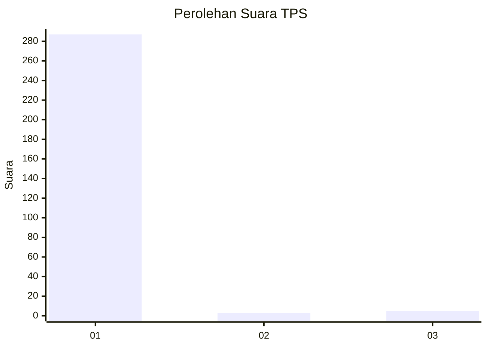
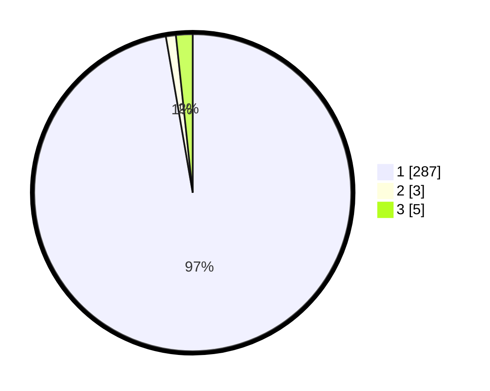

# Hasil

## Grafik

## Tabel

| No. | Nama Paslon    | Suara | Suara (raw) | Persentase |
|:--- |:-------------- | -----:| -----------:| ----------:|
| 1   | ANIES MUHAIMIN | 287   | [287][p-1]  | 97,29      |
| 2   | PRABOWO GIBRAN | 3     | [3][p-2]    | 1,02       |
| 3   | GANJAR MAHFUD  | 5     | [5][p-3]    | 1,69       |

[p-1]: https://github.com/gigit-pemilu/pemilu-2024/blob/main/pilpres/hitung-suara/sub/35-jawa-timur/sub/21-ngawi/sub/13-mantingan/sub/2001-sambirejo/sub/905-tps/sub/paslon-1.txt
[p-2]: https://github.com/gigit-pemilu/pemilu-2024/blob/main/pilpres/hitung-suara/sub/35-jawa-timur/sub/21-ngawi/sub/13-mantingan/sub/2001-sambirejo/sub/905-tps/sub/paslon-2.txt
[p-3]: https://github.com/gigit-pemilu/pemilu-2024/blob/main/pilpres/hitung-suara/sub/35-jawa-timur/sub/21-ngawi/sub/13-mantingan/sub/2001-sambirejo/sub/905-tps/sub/paslon-3.txt

## Foto C Plano

https://sirekap-obj-formc.kpu.go.id/4c5e/pemilu/ppwp/35/21/13/20/01/3521132001905-20240216-131337--0f7d2e64-cf30-4c28-ab92-d9f4894dfe2c.jpg

https://sirekap-obj-formc.kpu.go.id/4c5e/pemilu/ppwp/35/21/13/20/01/3521132001905-20240216-143306--b380f8b5-9fe9-4b1b-9e62-391248598d3f.jpg

https://sirekap-obj-formc.kpu.go.id/4c5e/pemilu/ppwp/35/21/13/20/01/3521132001905-20240216-151352--5b4a27f0-5868-44f5-b7bf-94791426f7a9.jpg

## Metadata

| Key        | Value               |
| ---------- | ------------------- |
| Time Stamp | 2024-02-22 23:00:00 |

## DATA PEMILIH TETAP

Jumlah pemilih dalam DPT: **298**.
 * L: **8**.
 * P: **290**.

## DATA PENGGUNA HAK PILIH

Jumlah pengguna hak pilih dalam DPT: **298**.
 * L: **8**.
 * P: **290**.

Jumlah pengguna hak pilih dalam DPTb: **15**.
 * L: **0**.
 * P: **15**.

Jumlah pengguna hak pilih dalam DPK: **0**.
 * L: **0**.
 * P: **0**.

Jumlah pengguna hak pilih: **313**.
 * L: **8**.
 * P: **305**.

## JUMLAH SUARA SAH DAN TIDAK SAH

JUMLAH SELURUH SUARA SAH: **295**.

JUMLAH SUARA TIDAK SAH: **1**.

JUMLAH SELURUH SUARA SAH DAN SUARA TIDAK SAH: **296**.

