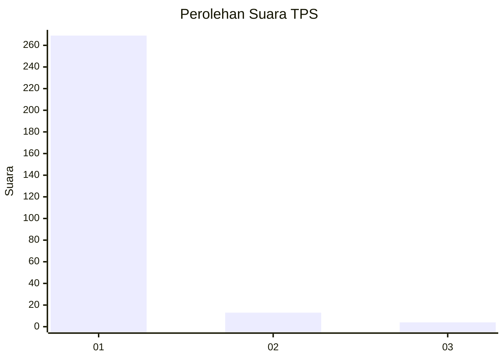
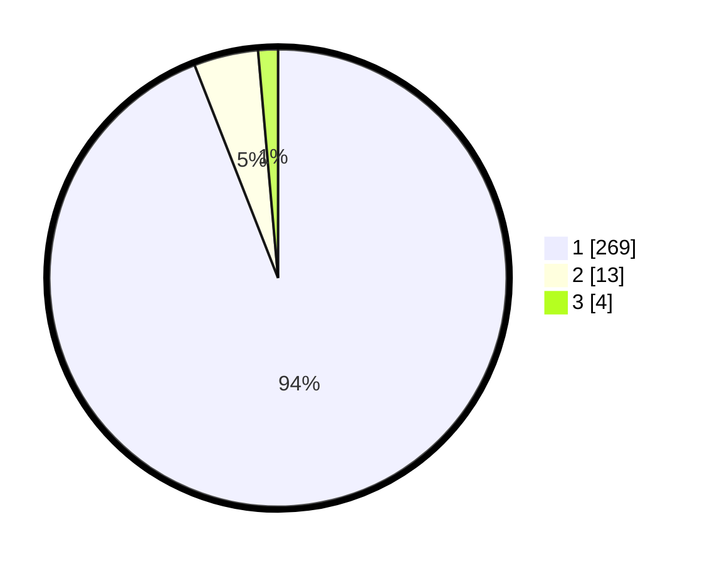

# Hasil

## Grafik

## Tabel

| No. | Nama Paslon    | Suara | Suara (raw) | Persentase |
|:--- |:-------------- | -----:| -----------:| ----------:|
| 1   | ANIES MUHAIMIN | 269   | [269][p-1]  | 94,06      |
| 2   | PRABOWO GIBRAN | 13    | [13][p-2]   | 4,55       |
| 3   | GANJAR MAHFUD  | 4     | [4][p-3]    | 1,40       |

[p-1]: https://github.com/gigit-pemilu/pemilu-2024/blob/main/pilpres/hitung-suara/sub/35-jawa-timur/sub/21-ngawi/sub/13-mantingan/sub/2001-sambirejo/sub/911-tps/sub/paslon-1.txt
[p-2]: https://github.com/gigit-pemilu/pemilu-2024/blob/main/pilpres/hitung-suara/sub/35-jawa-timur/sub/21-ngawi/sub/13-mantingan/sub/2001-sambirejo/sub/911-tps/sub/paslon-2.txt
[p-3]: https://github.com/gigit-pemilu/pemilu-2024/blob/main/pilpres/hitung-suara/sub/35-jawa-timur/sub/21-ngawi/sub/13-mantingan/sub/2001-sambirejo/sub/911-tps/sub/paslon-3.txt

## Foto C Plano

https://sirekap-obj-formc.kpu.go.id/f965/pemilu/ppwp/35/21/13/20/01/3521132001911-20240214-211529--5966c997-e104-42e8-bd6b-726c98315771.jpg

https://sirekap-obj-formc.kpu.go.id/f965/pemilu/ppwp/35/21/13/20/01/3521132001911-20240214-211643--c7e66882-4aa0-43e3-a51a-be5866069aee.jpg

https://sirekap-obj-formc.kpu.go.id/f965/pemilu/ppwp/35/21/13/20/01/3521132001911-20240214-211736--cdf3176b-1056-46ad-8935-b8ba7cebc4c1.jpg

## Metadata

| Key        | Value               |
| ---------- | ------------------- |
| Time Stamp | 2024-02-15 06:00:23 |

## DATA PEMILIH TETAP

Jumlah pemilih dalam DPT: **299**.
 * L: **5**.
 * P: **294**.

## DATA PENGGUNA HAK PILIH

Jumlah pengguna hak pilih dalam DPT: **258**.
 * L: **5**.
 * P: **253**.

Jumlah pengguna hak pilih dalam DPTb: **29**.
 * L: **5**.
 * P: **24**.

Jumlah pengguna hak pilih dalam DPK: **0**.
 * L: **0**.
 * P: **0**.

Jumlah pengguna hak pilih: **287**.
 * L: **10**.
 * P: **277**.

## JUMLAH SUARA SAH DAN TIDAK SAH

JUMLAH SELURUH SUARA SAH: **286**.

JUMLAH SUARA TIDAK SAH: **1**.

JUMLAH SELURUH SUARA SAH DAN SUARA TIDAK SAH: **287**.

