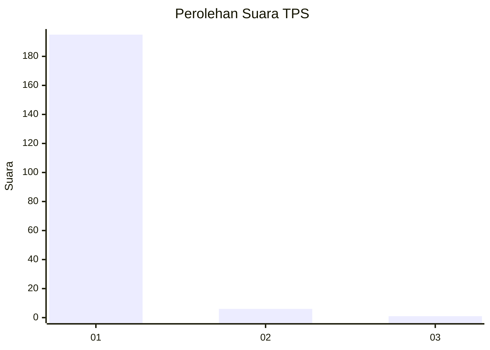
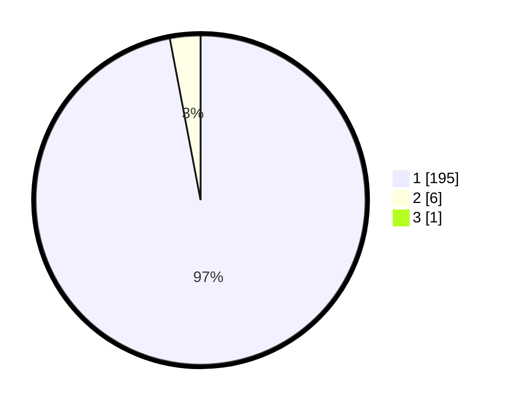

# Hasil

## Grafik

## Tabel

| No. | Nama Paslon    | Suara | Suara (raw) | Persentase |
|:--- |:-------------- | -----:| -----------:| ----------:|
| 1   | ANIES MUHAIMIN | 195   | [195][p-1]  | 96,53      |
| 2   | PRABOWO GIBRAN | 6     | [6][p-2]    | 2,97       |
| 3   | GANJAR MAHFUD  | 1     | [1][p-3]    | 0,50       |

[p-1]: https://github.com/gigit-pemilu/pemilu-2024-35-jawa-timur/blob/main/pilpres/hitung-suara/sub/35-jawa-timur/sub/21-ngawi/sub/13-mantingan/sub/2001-sambirejo/sub/916-tps/sub/paslon-1.txt
[p-2]: https://github.com/gigit-pemilu/pemilu-2024-35-jawa-timur/blob/main/pilpres/hitung-suara/sub/35-jawa-timur/sub/21-ngawi/sub/13-mantingan/sub/2001-sambirejo/sub/916-tps/sub/paslon-2.txt
[p-3]: https://github.com/gigit-pemilu/pemilu-2024-35-jawa-timur/blob/main/pilpres/hitung-suara/sub/35-jawa-timur/sub/21-ngawi/sub/13-mantingan/sub/2001-sambirejo/sub/916-tps/sub/paslon-3.txt

## Foto C Plano

https://sirekap-obj-formc.kpu.go.id/30ef/pemilu/ppwp/35/21/13/20/01/3521132001916-20240216-172529--44388110-4d8e-4ff1-858c-17e63beba011.jpg

https://sirekap-obj-formc.kpu.go.id/30ef/pemilu/ppwp/35/21/13/20/01/3521132001916-20240215-004944--a8e57fcb-2076-449b-b41d-d91b6f5ba373.jpg

https://sirekap-obj-formc.kpu.go.id/30ef/pemilu/ppwp/35/21/13/20/01/3521132001916-20240216-211302--ac58c31b-afc9-4e6d-b9a5-b82b3c6619f6.jpg

## Metadata

| Key        | Value               |
| ---------- | ------------------- |
| Time Stamp | 2024-02-24 22:31:28 |

