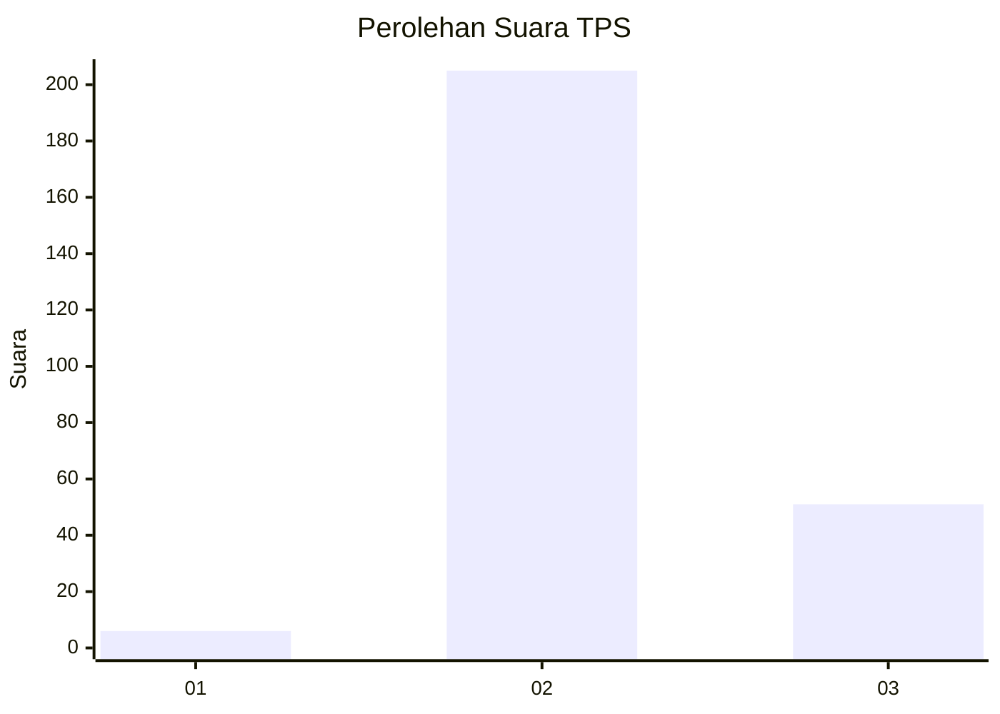
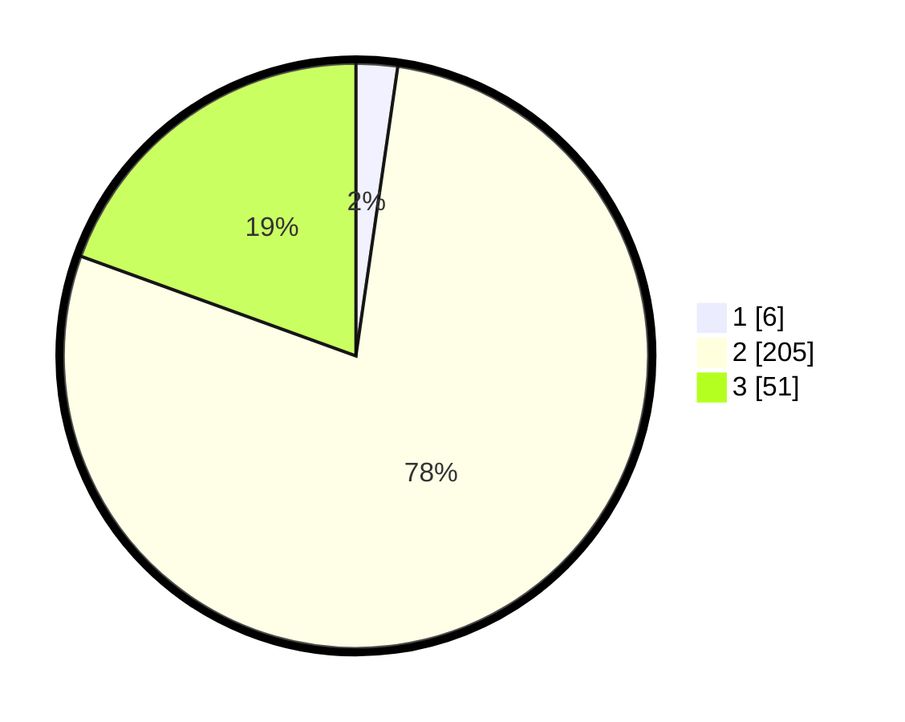

# Hasil

## Grafik

## Tabel

| No. | Nama Paslon    | Suara | Suara (raw) | Persentase |
|:--- |:-------------- | -----:| -----------:| ----------:|
| 1   | ANIES MUHAIMIN | 6     | [6][p-1]    | 2,29       |
| 2   | PRABOWO GIBRAN | 205   | [205][p-2]  | 78,24      |
| 3   | GANJAR MAHFUD  | 51    | [51][p-3]   | 19,47      |

[p-1]: https://github.com/gigit-pemilu/pemilu-2024-35-jawa-timur/blob/main/pilpres/hitung-suara/sub/35-jawa-timur/sub/21-ngawi/sub/16-pitu/sub/2002-pitu/sub/003-tps/sub/paslon-1.txt
[p-2]: https://github.com/gigit-pemilu/pemilu-2024-35-jawa-timur/blob/main/pilpres/hitung-suara/sub/35-jawa-timur/sub/21-ngawi/sub/16-pitu/sub/2002-pitu/sub/003-tps/sub/paslon-2.txt
[p-3]: https://github.com/gigit-pemilu/pemilu-2024-35-jawa-timur/blob/main/pilpres/hitung-suara/sub/35-jawa-timur/sub/21-ngawi/sub/16-pitu/sub/2002-pitu/sub/003-tps/sub/paslon-3.txt

## Foto C Plano

https://sirekap-obj-formc.kpu.go.id/46fd/pemilu/ppwp/35/21/16/20/02/3521162002003-20240214-160116--4df2d25e-c293-418b-bb1a-830bd4023340.jpg

https://sirekap-obj-formc.kpu.go.id/46fd/pemilu/ppwp/35/21/16/20/02/3521162002003-20240214-155142--5f074619-6982-4763-ad3a-647fb454ea6a.jpg

https://sirekap-obj-formc.kpu.go.id/46fd/pemilu/ppwp/35/21/16/20/02/3521162002003-20240214-155208--565cc65e-c364-4835-b69b-1bb1328378fb.jpg

## Metadata

| Key        | Value               |
| ---------- | ------------------- |
| Time Stamp | 2024-02-22 20:00:00 |

