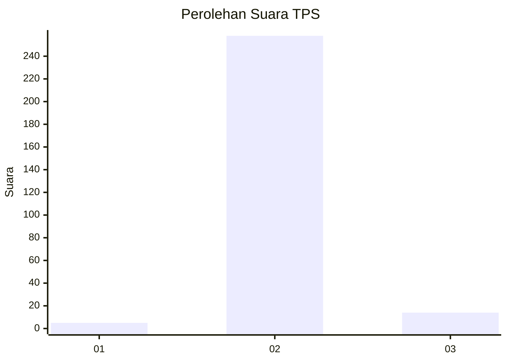
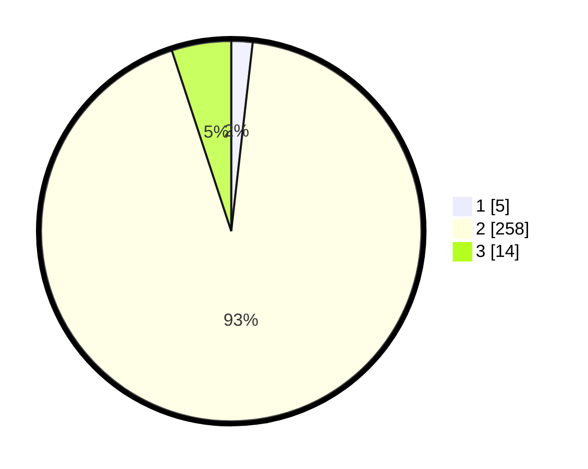

# Hasil

## Grafik

## Tabel

| No. | Nama Paslon    | Suara | Suara (raw) | Persentase |
|:--- |:-------------- | -----:| -----------:| ----------:|
| 1   | ANIES MUHAIMIN | 5     | [5][p-1]    | 1,81       |
| 2   | PRABOWO GIBRAN | 258   | [258][p-2]  | 93,14      |
| 3   | GANJAR MAHFUD  | 14    | [14][p-3]   | 5,05       |

[p-1]: https://github.com/gigit-pemilu/pemilu-2024-35-jawa-timur/blob/main/pilpres/hitung-suara/sub/35-jawa-timur/sub/21-ngawi/sub/16-pitu/sub/2002-pitu/sub/014-tps/sub/paslon-1.txt
[p-2]: https://github.com/gigit-pemilu/pemilu-2024-35-jawa-timur/blob/main/pilpres/hitung-suara/sub/35-jawa-timur/sub/21-ngawi/sub/16-pitu/sub/2002-pitu/sub/014-tps/sub/paslon-2.txt
[p-3]: https://github.com/gigit-pemilu/pemilu-2024-35-jawa-timur/blob/main/pilpres/hitung-suara/sub/35-jawa-timur/sub/21-ngawi/sub/16-pitu/sub/2002-pitu/sub/014-tps/sub/paslon-3.txt

## Foto C Plano

https://sirekap-obj-formc.kpu.go.id/d79a/pemilu/ppwp/35/21/16/20/02/3521162002014-20240214-185254--82e83963-09c5-430e-baac-fc1672dfb0e2.jpg

https://sirekap-obj-formc.kpu.go.id/d79a/pemilu/ppwp/35/21/16/20/02/3521162002014-20240214-175444--d5b21344-c4a8-4608-9688-6838195c7d9d.jpg

https://sirekap-obj-formc.kpu.go.id/d79a/pemilu/ppwp/35/21/16/20/02/3521162002014-20240214-175448--fc2520ce-0aae-4052-9203-8cd7615792fc.jpg

## Metadata

| Key        | Value               |
| ---------- | ------------------- |
| Time Stamp | 2024-02-22 20:00:00 |

