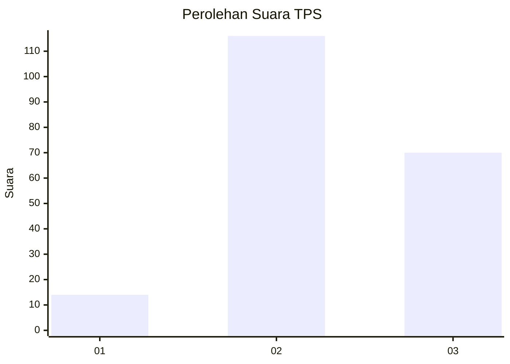
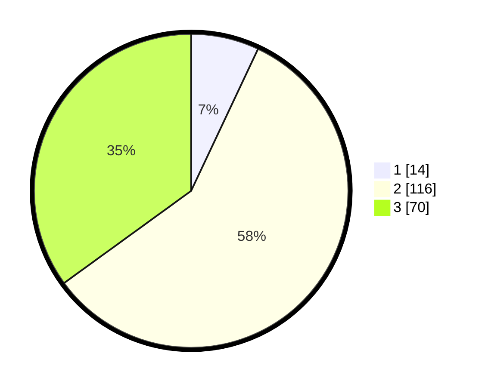

# Hasil

## Grafik

## Tabel

| No. | Nama Paslon    | Suara | Suara (raw) | Persentase |
|:--- |:-------------- | -----:| -----------:| ----------:|
| 1   | ANIES MUHAIMIN | 14    | [14][p-1]   | 7,00       |
| 2   | PRABOWO GIBRAN | 116   | [116][p-2]  | 58,00      |
| 3   | GANJAR MAHFUD  | 70    | [70][p-3]   | 35,00      |

[p-1]: https://github.com/gigit-pemilu/pemilu-2024/blob/main/pilpres/hitung-suara/sub/35-jawa-timur/sub/21-ngawi/sub/17-karanganyar/sub/2001-karanganyar/sub/005-tps/sub/paslon-1.txt
[p-2]: https://github.com/gigit-pemilu/pemilu-2024/blob/main/pilpres/hitung-suara/sub/35-jawa-timur/sub/21-ngawi/sub/17-karanganyar/sub/2001-karanganyar/sub/005-tps/sub/paslon-2.txt
[p-3]: https://github.com/gigit-pemilu/pemilu-2024/blob/main/pilpres/hitung-suara/sub/35-jawa-timur/sub/21-ngawi/sub/17-karanganyar/sub/2001-karanganyar/sub/005-tps/sub/paslon-3.txt

## Foto C Plano

https://sirekap-obj-formc.kpu.go.id/b008/pemilu/ppwp/35/21/17/20/01/3521172001005-20240214-223814--683f6c4f-b3d9-4573-911b-ba6443ceca26.jpg

https://sirekap-obj-formc.kpu.go.id/b008/pemilu/ppwp/35/21/17/20/01/3521172001005-20240214-223942--9687631d-da6f-408a-9d40-4f143ec42cc6.jpg

https://sirekap-obj-formc.kpu.go.id/b008/pemilu/ppwp/35/21/17/20/01/3521172001005-20240214-224111--c2b27010-1e5c-4c4f-97e2-c825f5c1f056.jpg

## Metadata

| Key        | Value               |
| ---------- | ------------------- |
| Time Stamp | 2024-02-22 20:00:00 |

