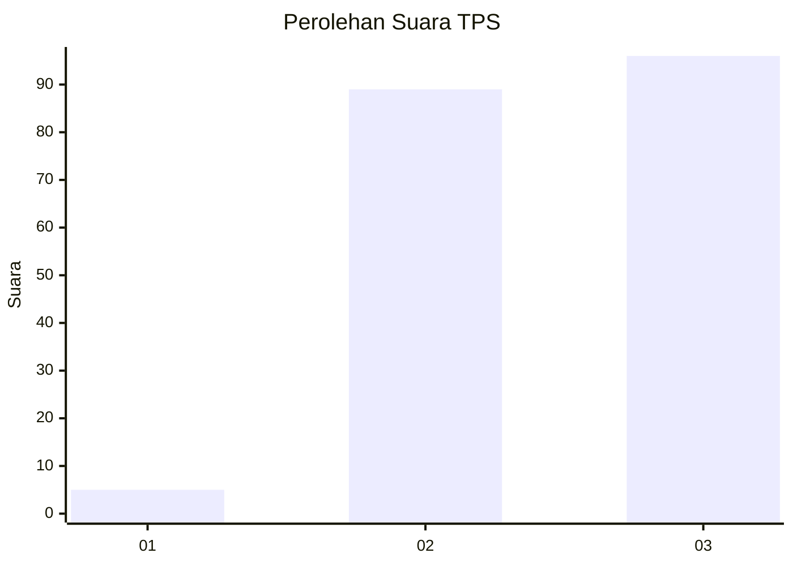
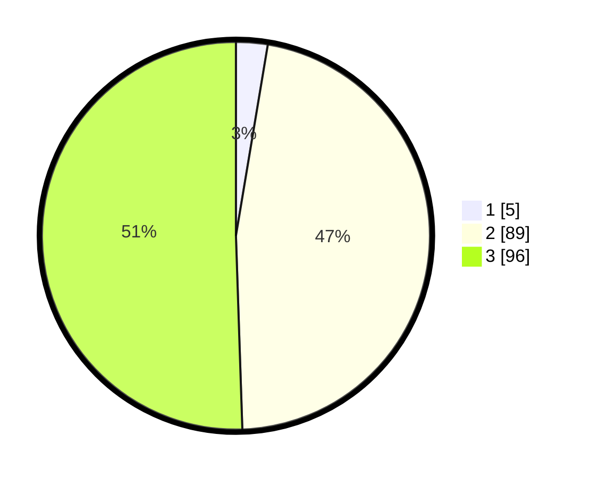

# Hasil

## Grafik

## Tabel

| No. | Nama Paslon    | Suara | Suara (raw) | Persentase |
|:--- |:-------------- | -----:| -----------:| ----------:|
| 1   | ANIES MUHAIMIN | 5     | [5][p-1]    | 2,63       |
| 2   | PRABOWO GIBRAN | 89    | [89][p-2]   | 46,84      |
| 3   | GANJAR MAHFUD  | 96    | [96][p-3]   | 50,53      |

[p-1]: https://github.com/gigit-pemilu/pemilu-2024/blob/main/pilpres/hitung-suara/sub/35-jawa-timur/sub/21-ngawi/sub/17-karanganyar/sub/2005-bangunrejo/sub/006-tps/sub/paslon-1.txt
[p-2]: https://github.com/gigit-pemilu/pemilu-2024/blob/main/pilpres/hitung-suara/sub/35-jawa-timur/sub/21-ngawi/sub/17-karanganyar/sub/2005-bangunrejo/sub/006-tps/sub/paslon-2.txt
[p-3]: https://github.com/gigit-pemilu/pemilu-2024/blob/main/pilpres/hitung-suara/sub/35-jawa-timur/sub/21-ngawi/sub/17-karanganyar/sub/2005-bangunrejo/sub/006-tps/sub/paslon-3.txt

## Foto C Plano

https://sirekap-obj-formc.kpu.go.id/9df1/pemilu/ppwp/35/21/17/20/05/3521172005006-20240216-232200--d809dacb-a836-49c0-a510-6e3f551fab0c.jpg

https://sirekap-obj-formc.kpu.go.id/9df1/pemilu/ppwp/35/21/17/20/05/3521172005006-20240216-211159--bf54354f-9466-43e6-8afc-ed1199e8354b.jpg

https://sirekap-obj-formc.kpu.go.id/9df1/pemilu/ppwp/35/21/17/20/05/3521172005006-20240216-231757--93df649e-9b00-45d4-8600-c581e895469e.jpg

## Metadata

| Key        | Value               |
| ---------- | ------------------- |
| Time Stamp | 2024-02-17 16:52:47 |

