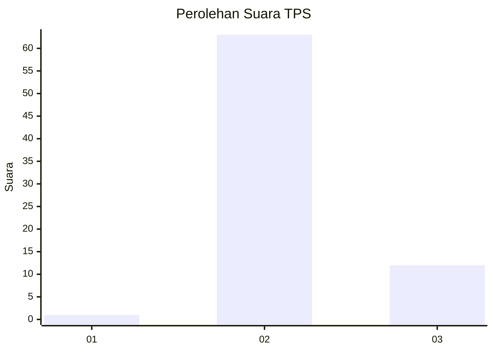
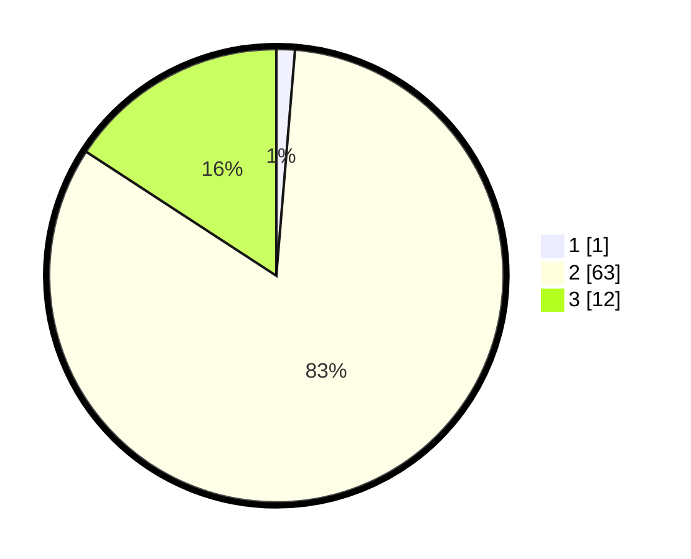

# Hasil

## Grafik

## Tabel

| No. | Nama Paslon    | Suara | Suara (raw) | Persentase |
|:--- |:-------------- | -----:| -----------:| ----------:|
| 1   | ANIES MUHAIMIN | 1     | [1][p-1]    | 1,32       |
| 2   | PRABOWO GIBRAN | 63    | [63][p-2]   | 82,89      |
| 3   | GANJAR MAHFUD  | 12    | [12][p-3]   | 15,79      |

[p-1]: https://github.com/gigit-pemilu/pemilu-2024/blob/main/pilpres/hitung-suara/sub/35-jawa-timur/sub/21-ngawi/sub/17-karanganyar/sub/2006-pandean/sub/014-tps/sub/paslon-1.txt
[p-2]: https://github.com/gigit-pemilu/pemilu-2024/blob/main/pilpres/hitung-suara/sub/35-jawa-timur/sub/21-ngawi/sub/17-karanganyar/sub/2006-pandean/sub/014-tps/sub/paslon-2.txt
[p-3]: https://github.com/gigit-pemilu/pemilu-2024/blob/main/pilpres/hitung-suara/sub/35-jawa-timur/sub/21-ngawi/sub/17-karanganyar/sub/2006-pandean/sub/014-tps/sub/paslon-3.txt

## Foto C Plano

https://sirekap-obj-formc.kpu.go.id/b798/pemilu/ppwp/35/21/17/20/06/3521172006014-20240216-201505--e9df390d-8972-40fa-8abb-8c6252bd6bf4.jpg

https://sirekap-obj-formc.kpu.go.id/b798/pemilu/ppwp/35/21/17/20/06/3521172006014-20240216-201634--dc5d1c42-171b-4edb-a236-ff48a06f58a3.jpg

https://sirekap-obj-formc.kpu.go.id/b798/pemilu/ppwp/35/21/17/20/06/3521172006014-20240216-201703--f79379a8-1690-405d-a4b9-975c88048bc0.jpg

## Metadata

| Key        | Value               |
| ---------- | ------------------- |
| Time Stamp | 2024-02-22 20:00:00 |

