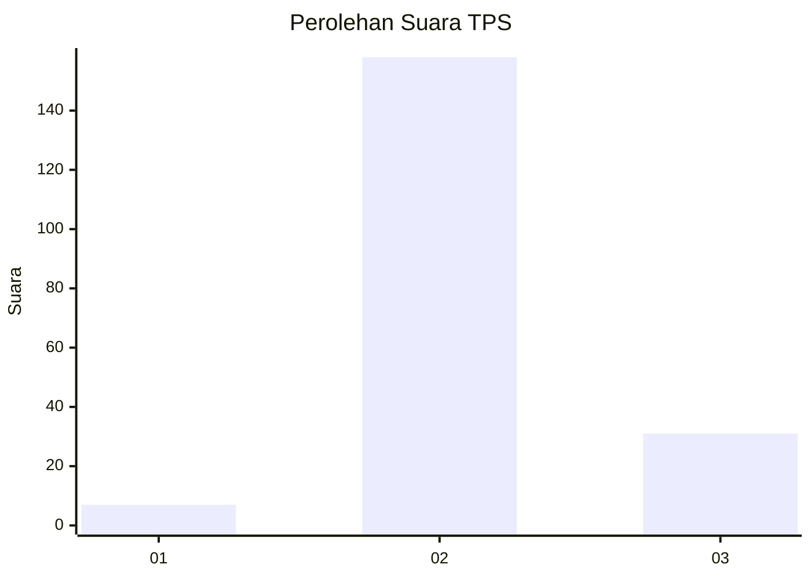
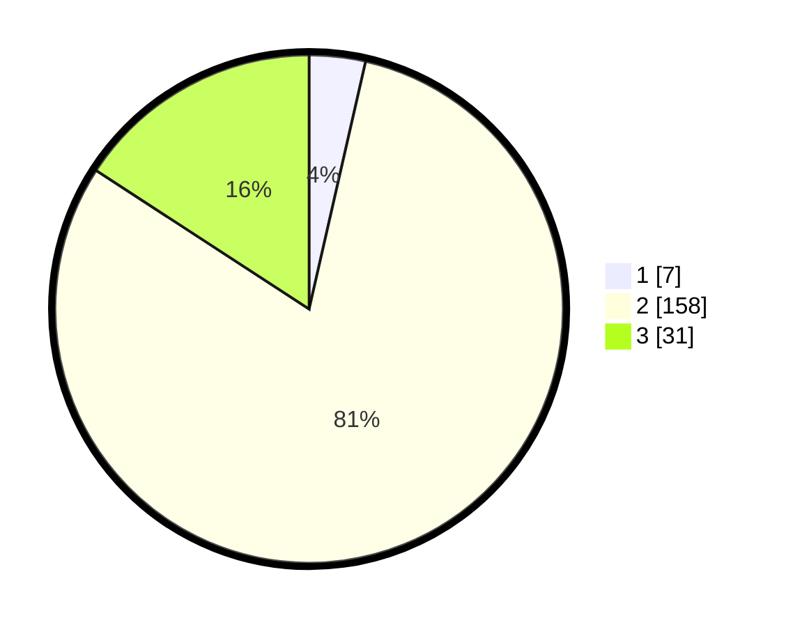

# Hasil

## Grafik

## Tabel

| No. | Nama Paslon    | Suara | Suara (raw) | Persentase |
|:--- |:-------------- | -----:| -----------:| ----------:|
| 1   | ANIES MUHAIMIN | 7     | [7][p-1]    | 3,57       |
| 2   | PRABOWO GIBRAN | 158   | [158][p-2]  | 80,61      |
| 3   | GANJAR MAHFUD  | 31    | [31][p-3]   | 15,82      |

[p-1]: https://github.com/gigit-pemilu/pemilu-2024/blob/main/pilpres/hitung-suara/sub/35-jawa-timur/sub/21-ngawi/sub/18-gerih/sub/2005-guyung/sub/013-tps/sub/paslon-1.txt
[p-2]: https://github.com/gigit-pemilu/pemilu-2024/blob/main/pilpres/hitung-suara/sub/35-jawa-timur/sub/21-ngawi/sub/18-gerih/sub/2005-guyung/sub/013-tps/sub/paslon-2.txt
[p-3]: https://github.com/gigit-pemilu/pemilu-2024/blob/main/pilpres/hitung-suara/sub/35-jawa-timur/sub/21-ngawi/sub/18-gerih/sub/2005-guyung/sub/013-tps/sub/paslon-3.txt

## Foto C Plano

https://sirekap-obj-formc.kpu.go.id/6c60/pemilu/ppwp/35/21/18/20/05/3521182005013-20240216-214058--bb164c89-8f53-4fbc-8c98-a8f16ac2c162.jpg

https://sirekap-obj-formc.kpu.go.id/6c60/pemilu/ppwp/35/21/18/20/05/3521182005013-20240216-214259--38be8bd0-a77a-43a5-8018-31138f6766ea.jpg

https://sirekap-obj-formc.kpu.go.id/6c60/pemilu/ppwp/35/21/18/20/05/3521182005013-20240216-214412--ebcb963e-e48b-4bca-8a02-ff61bc395ec9.jpg

## Metadata

| Key        | Value               |
| ---------- | ------------------- |
| Time Stamp | 2024-02-22 20:00:00 |

