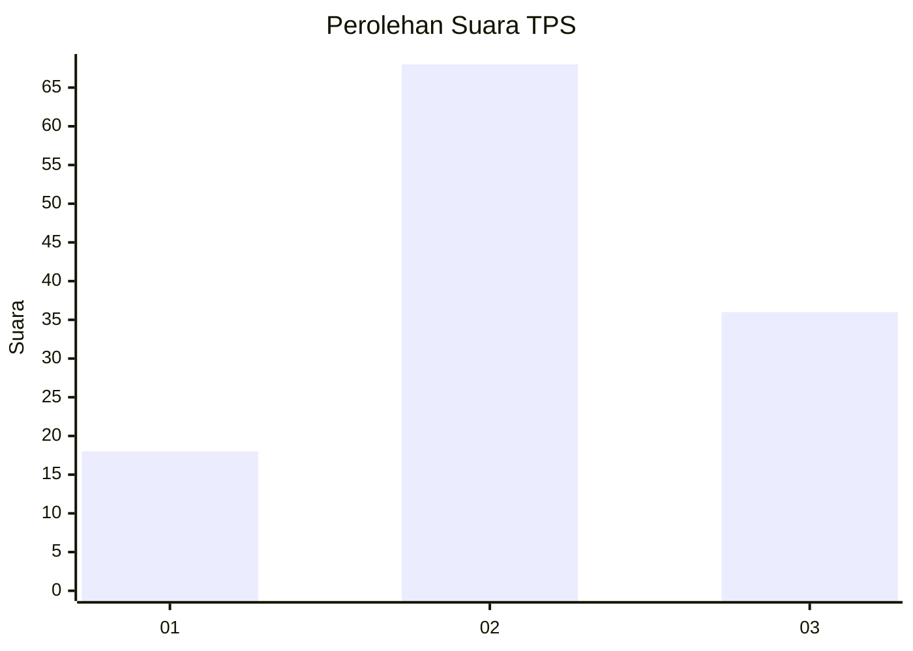
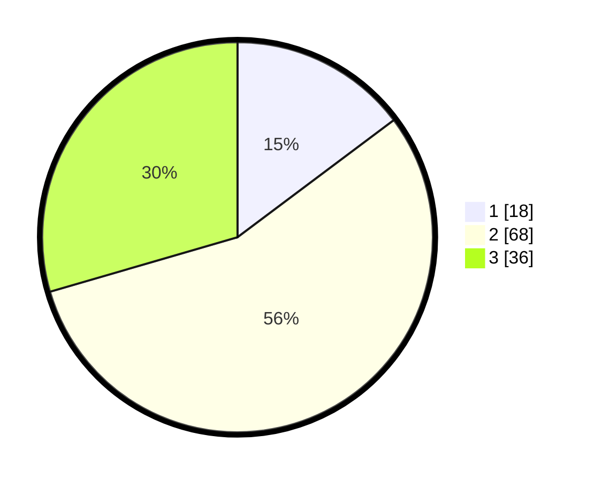

# Hasil

## Grafik

## Tabel

| No. | Nama Paslon    | Suara | Suara (raw) | Persentase |
|:--- |:-------------- | -----:| -----------:| ----------:|
| 1   | ANIES MUHAIMIN | 18    | [18][p-1]   | 14,75      |
| 2   | PRABOWO GIBRAN | 68    | [68][p-2]   | 55,74      |
| 3   | GANJAR MAHFUD  | 36    | [36][p-3]   | 29,51      |

[p-1]: https://github.com/gigit-pemilu/pemilu-2024-35-jawa-timur/blob/main/pilpres/hitung-suara/sub/35-jawa-timur/sub/22-bojonegoro/sub/01-ngraho/sub/2003-nganti/sub/018-tps/sub/paslon-1.txt
[p-2]: https://github.com/gigit-pemilu/pemilu-2024-35-jawa-timur/blob/main/pilpres/hitung-suara/sub/35-jawa-timur/sub/22-bojonegoro/sub/01-ngraho/sub/2003-nganti/sub/018-tps/sub/paslon-2.txt
[p-3]: https://github.com/gigit-pemilu/pemilu-2024-35-jawa-timur/blob/main/pilpres/hitung-suara/sub/35-jawa-timur/sub/22-bojonegoro/sub/01-ngraho/sub/2003-nganti/sub/018-tps/sub/paslon-3.txt

## Foto C Plano

https://sirekap-obj-formc.kpu.go.id/faa8/pemilu/ppwp/35/22/01/20/03/3522012003018-20240215-005608--004596c9-cb34-4dae-84d9-2a5c0cb52c85.jpg

https://sirekap-obj-formc.kpu.go.id/faa8/pemilu/ppwp/35/22/01/20/03/3522012003018-20240215-005626--5e77c3b9-0473-4e44-84f3-6ea16ec89c9a.jpg

https://sirekap-obj-formc.kpu.go.id/faa8/pemilu/ppwp/35/22/01/20/03/3522012003018-20240215-005643--04404a7a-7423-4f35-b2cf-d286b0a1c700.jpg

## Metadata

| Key        | Value               |
| ---------- | ------------------- |
| Time Stamp | 2024-02-21 16:00:00 |

