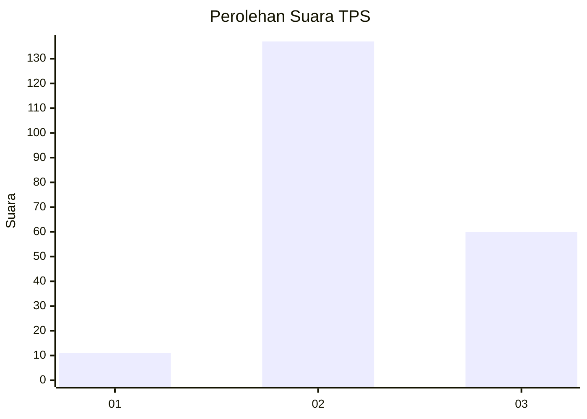
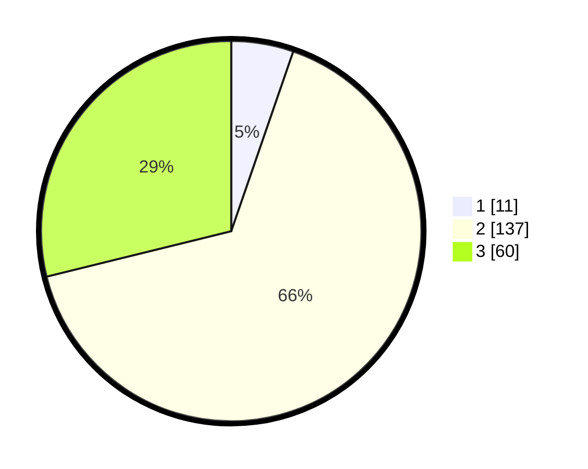

# Hasil

## Grafik

## Tabel

| No. | Nama Paslon    | Suara | Suara (raw) | Persentase |
|:--- |:-------------- | -----:| -----------:| ----------:|
| 1   | ANIES MUHAIMIN | 11    | [11][p-1]   | 5,29       |
| 2   | PRABOWO GIBRAN | 137   | [137][p-2]  | 65,87      |
| 3   | GANJAR MAHFUD  | 60    | [60][p-3]   | 28,85      |

[p-1]: https://github.com/gigit-pemilu/pemilu-2024/blob/main/pilpres/hitung-suara/sub/35-jawa-timur/sub/22-bojonegoro/sub/01-ngraho/sub/2008-blimbinggede/sub/005-tps/sub/paslon-1.txt
[p-2]: https://github.com/gigit-pemilu/pemilu-2024/blob/main/pilpres/hitung-suara/sub/35-jawa-timur/sub/22-bojonegoro/sub/01-ngraho/sub/2008-blimbinggede/sub/005-tps/sub/paslon-2.txt
[p-3]: https://github.com/gigit-pemilu/pemilu-2024/blob/main/pilpres/hitung-suara/sub/35-jawa-timur/sub/22-bojonegoro/sub/01-ngraho/sub/2008-blimbinggede/sub/005-tps/sub/paslon-3.txt

## Foto C Plano

https://sirekap-obj-formc.kpu.go.id/e8f5/pemilu/ppwp/35/22/01/20/08/3522012008005-20240214-220102--eecc4cbf-8f81-4dca-96f8-9bda000e0759.jpg

https://sirekap-obj-formc.kpu.go.id/e8f5/pemilu/ppwp/35/22/01/20/08/3522012008005-20240217-144214--89cfc913-0b88-4296-b411-9151e608c4cb.jpg

https://sirekap-obj-formc.kpu.go.id/e8f5/pemilu/ppwp/35/22/01/20/08/3522012008005-20240217-144306--5edc79e4-adb7-4619-ae5c-c4316bf1351a.jpg

## Metadata

| Key        | Value               |
| ---------- | ------------------- |
| Time Stamp | 2024-02-17 14:45:18 |

