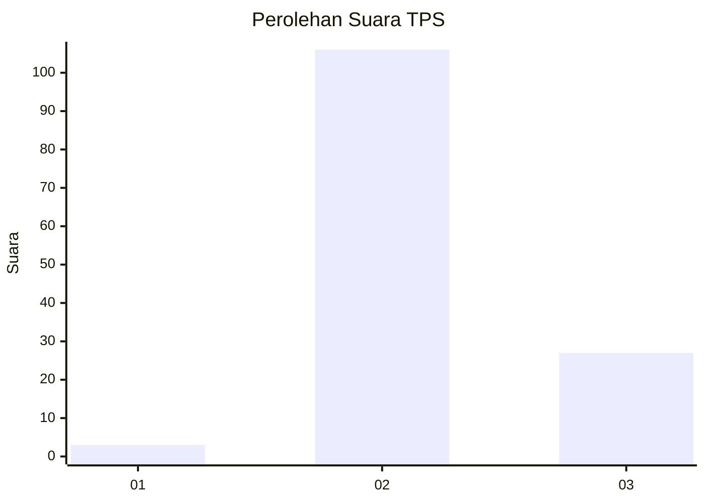

# Hasil

## Grafik

## Tabel

| No. | Nama Paslon    | Suara | Suara (raw) | Persentase |
|:--- |:-------------- | -----:| -----------:| ----------:|
| 1   | ANIES MUHAIMIN | 3     | [3][p-1]    | 2,21       |
| 2   | PRABOWO GIBRAN | 106   | [106][p-2]  | 77,94      |
| 3   | GANJAR MAHFUD  | 27    | [27][p-3]   | 19,85      |

[p-1]: https://github.com/gigit-pemilu/pemilu-2024-35-jawa-timur/blob/main/pilpres/hitung-suara/sub/35-jawa-timur/sub/22-bojonegoro/sub/02-tambakrejo/sub/2001-napis/sub/001-tps/sub/paslon-1.txt
[p-2]: https://github.com/gigit-pemilu/pemilu-2024-35-jawa-timur/blob/main/pilpres/hitung-suara/sub/35-jawa-timur/sub/22-bojonegoro/sub/02-tambakrejo/sub/2001-napis/sub/001-tps/sub/paslon-2.txt
[p-3]: https://github.com/gigit-pemilu/pemilu-2024-35-jawa-timur/blob/main/pilpres/hitung-suara/sub/35-jawa-timur/sub/22-bojonegoro/sub/02-tambakrejo/sub/2001-napis/sub/001-tps/sub/paslon-3.txt

## Foto C Plano

https://sirekap-obj-formc.kpu.go.id/9c62/pemilu/ppwp/35/22/02/20/01/3522022001001-20240220-094743--410aca7a-2fdc-458e-b9a2-6b87204e9117.jpg

https://sirekap-obj-formc.kpu.go.id/9c62/pemilu/ppwp/35/22/02/20/01/3522022001001-20240220-095042--5f88cbda-4c33-4c36-bbb6-a08ae8d7913e.jpg

https://sirekap-obj-formc.kpu.go.id/9c62/pemilu/ppwp/35/22/02/20/01/3522022001001-20240220-095522--92f75929-670b-48f9-8825-a7060ef708d2.jpg

## Metadata

| Key        | Value               |
| ---------- | ------------------- |
| Time Stamp | 2024-02-25 10:00:00 |

