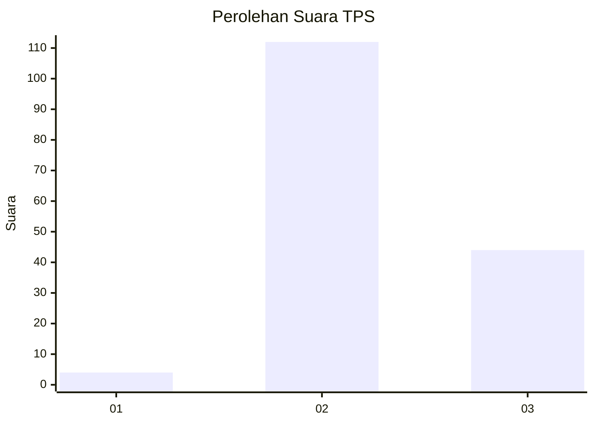
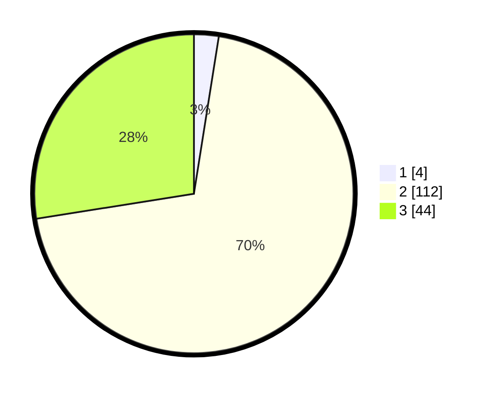

# Hasil

## Grafik

## Tabel

| No. | Nama Paslon    | Suara | Suara (raw) | Persentase |
|:--- |:-------------- | -----:| -----------:| ----------:|
| 1   | ANIES MUHAIMIN | 4     | [4][p-1]    | 2,50       |
| 2   | PRABOWO GIBRAN | 112   | [112][p-2]  | 70,00      |
| 3   | GANJAR MAHFUD  | 44    | [44][p-3]   | 27,50      |

[p-1]: https://github.com/gigit-pemilu/pemilu-2024/blob/main/pilpres/hitung-suara/sub/35-jawa-timur/sub/22-bojonegoro/sub/02-tambakrejo/sub/2001-napis/sub/002-tps/sub/paslon-1.txt
[p-2]: https://github.com/gigit-pemilu/pemilu-2024/blob/main/pilpres/hitung-suara/sub/35-jawa-timur/sub/22-bojonegoro/sub/02-tambakrejo/sub/2001-napis/sub/002-tps/sub/paslon-2.txt
[p-3]: https://github.com/gigit-pemilu/pemilu-2024/blob/main/pilpres/hitung-suara/sub/35-jawa-timur/sub/22-bojonegoro/sub/02-tambakrejo/sub/2001-napis/sub/002-tps/sub/paslon-3.txt

## Foto C Plano

https://sirekap-obj-formc.kpu.go.id/46ea/pemilu/ppwp/35/22/02/20/01/3522022001002-20240220-101124--a4d06870-ec5f-46ab-8806-575b17977bc4.jpg

https://sirekap-obj-formc.kpu.go.id/46ea/pemilu/ppwp/35/22/02/20/01/3522022001002-20240220-100532--a3390304-7050-4e18-9b8e-52ace3a430a5.jpg

https://sirekap-obj-formc.kpu.go.id/46ea/pemilu/ppwp/35/22/02/20/01/3522022001002-20240220-101401--b4a25899-7e15-4b1d-90e4-a7e441fc2a78.jpg

## Metadata

| Key        | Value               |
| ---------- | ------------------- |
| Time Stamp | 2024-02-25 16:00:00 |

