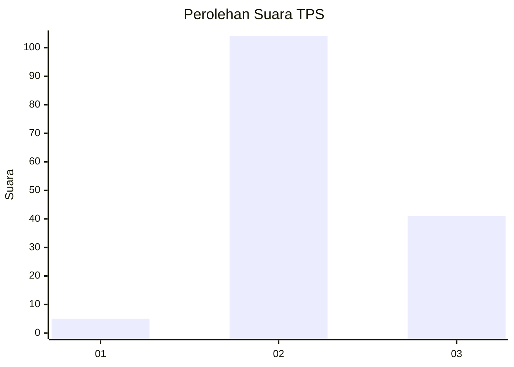
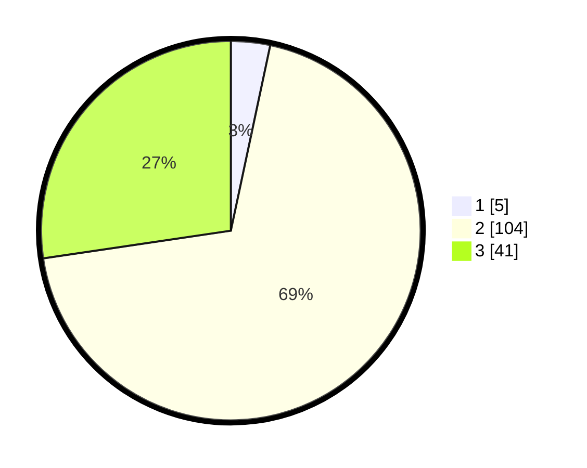

# Hasil

## Grafik

## Tabel

| No. | Nama Paslon    | Suara | Suara (raw) | Persentase |
|:--- |:-------------- | -----:| -----------:| ----------:|
| 1   | ANIES MUHAIMIN | 5     | [5][p-1]    | 3,33       |
| 2   | PRABOWO GIBRAN | 104   | [104][p-2]  | 69,33      |
| 3   | GANJAR MAHFUD  | 41    | [41][p-3]   | 27,33      |

[p-1]: https://github.com/gigit-pemilu/pemilu-2024-35-jawa-timur/blob/main/pilpres/hitung-suara/sub/35-jawa-timur/sub/22-bojonegoro/sub/02-tambakrejo/sub/2001-napis/sub/006-tps/sub/paslon-1.txt
[p-2]: https://github.com/gigit-pemilu/pemilu-2024-35-jawa-timur/blob/main/pilpres/hitung-suara/sub/35-jawa-timur/sub/22-bojonegoro/sub/02-tambakrejo/sub/2001-napis/sub/006-tps/sub/paslon-2.txt
[p-3]: https://github.com/gigit-pemilu/pemilu-2024-35-jawa-timur/blob/main/pilpres/hitung-suara/sub/35-jawa-timur/sub/22-bojonegoro/sub/02-tambakrejo/sub/2001-napis/sub/006-tps/sub/paslon-3.txt

## Foto C Plano

https://sirekap-obj-formc.kpu.go.id/7815/pemilu/ppwp/35/22/02/20/01/3522022001006-20240220-175047--d8cec652-61d4-4957-a53e-9f4a858aa2c2.jpg

https://sirekap-obj-formc.kpu.go.id/7815/pemilu/ppwp/35/22/02/20/01/3522022001006-20240220-175151--319222a2-59fc-485a-8ff7-01fb02ecbbfb.jpg

https://sirekap-obj-formc.kpu.go.id/7815/pemilu/ppwp/35/22/02/20/01/3522022001006-20240220-175317--bd958492-0c5d-42f6-b658-299c8a07a087.jpg

## Metadata

| Key        | Value               |
| ---------- | ------------------- |
| Time Stamp | 2024-02-25 13:00:00 |

