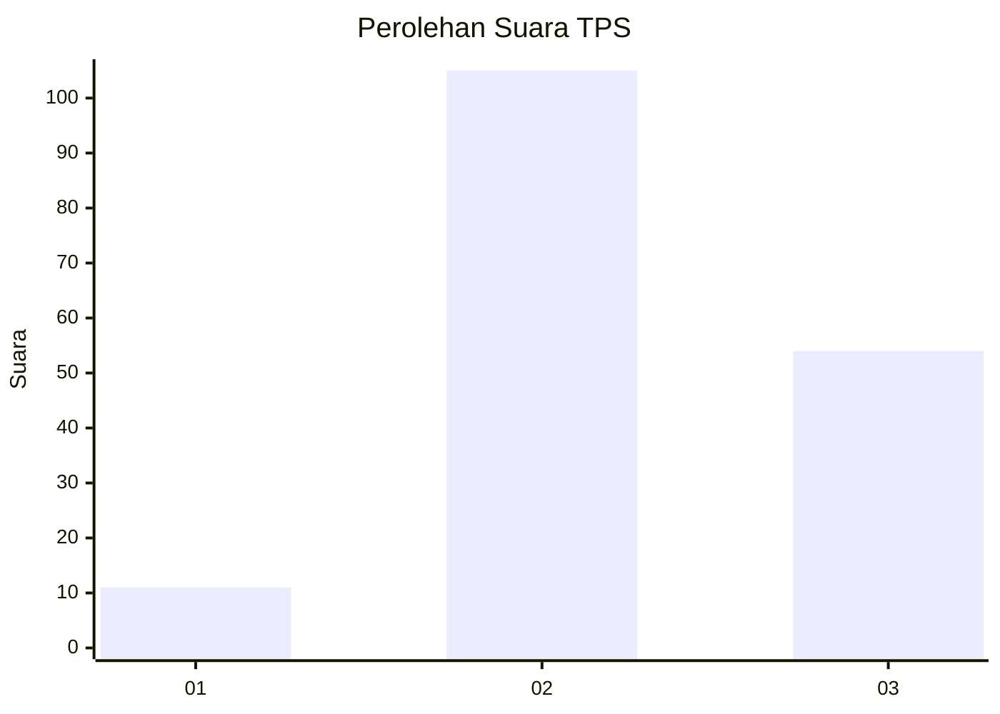
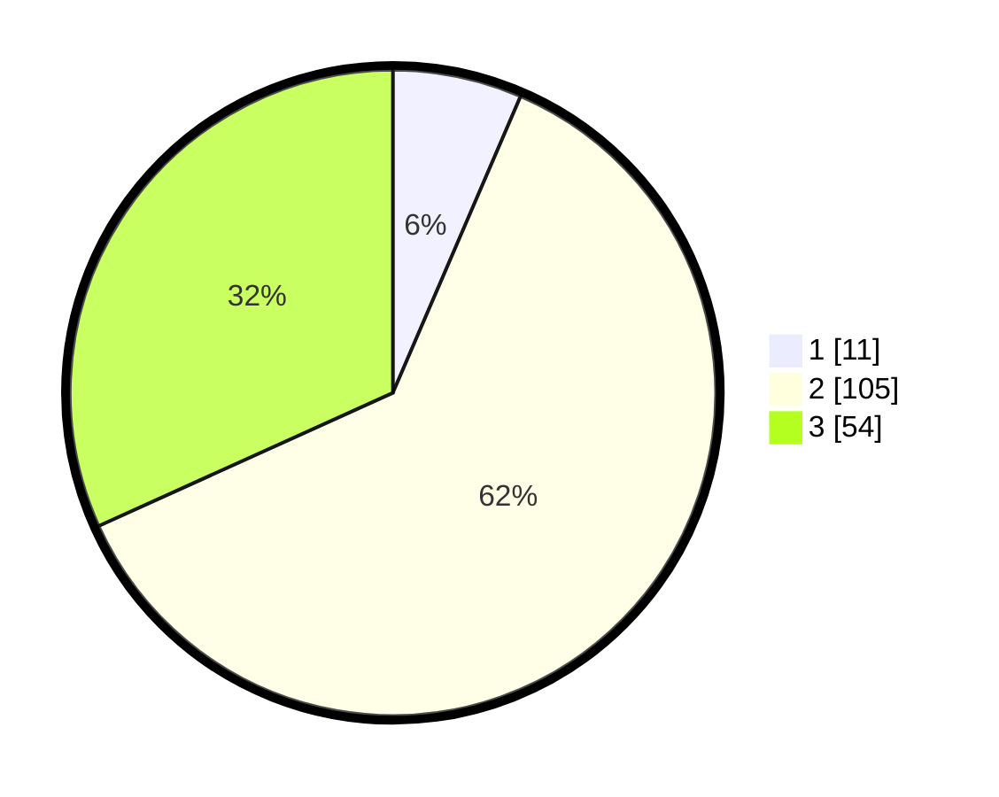

# Hasil

## Grafik

## Tabel

| No. | Nama Paslon    | Suara | Suara (raw) | Persentase |
|:--- |:-------------- | -----:| -----------:| ----------:|
| 1   | ANIES MUHAIMIN | 11    | [11][p-1]   | 6,47       |
| 2   | PRABOWO GIBRAN | 105   | [105][p-2]  | 61,76      |
| 3   | GANJAR MAHFUD  | 54    | [54][p-3]   | 31,76      |

[p-1]: https://github.com/gigit-pemilu/pemilu-2024/blob/main/pilpres/hitung-suara/sub/35-jawa-timur/sub/22-bojonegoro/sub/02-tambakrejo/sub/2001-napis/sub/007-tps/sub/paslon-1.txt
[p-2]: https://github.com/gigit-pemilu/pemilu-2024/blob/main/pilpres/hitung-suara/sub/35-jawa-timur/sub/22-bojonegoro/sub/02-tambakrejo/sub/2001-napis/sub/007-tps/sub/paslon-2.txt
[p-3]: https://github.com/gigit-pemilu/pemilu-2024/blob/main/pilpres/hitung-suara/sub/35-jawa-timur/sub/22-bojonegoro/sub/02-tambakrejo/sub/2001-napis/sub/007-tps/sub/paslon-3.txt

## Foto C Plano

https://sirekap-obj-formc.kpu.go.id/6560/pemilu/ppwp/35/22/02/20/01/3522022001007-20240216-145945--da69cf33-f703-449b-8454-39247249f181.jpg

https://sirekap-obj-formc.kpu.go.id/6560/pemilu/ppwp/35/22/02/20/01/3522022001007-20240216-151759--a616f6fb-59d7-4f9b-ad23-ca725391b20e.jpg

https://sirekap-obj-formc.kpu.go.id/6560/pemilu/ppwp/35/22/02/20/01/3522022001007-20240216-150246--c963eec1-6804-4de5-afcf-12db0603d979.jpg

## Metadata

| Key        | Value               |
| ---------- | ------------------- |
| Time Stamp | 2024-02-16 22:01:00 |

