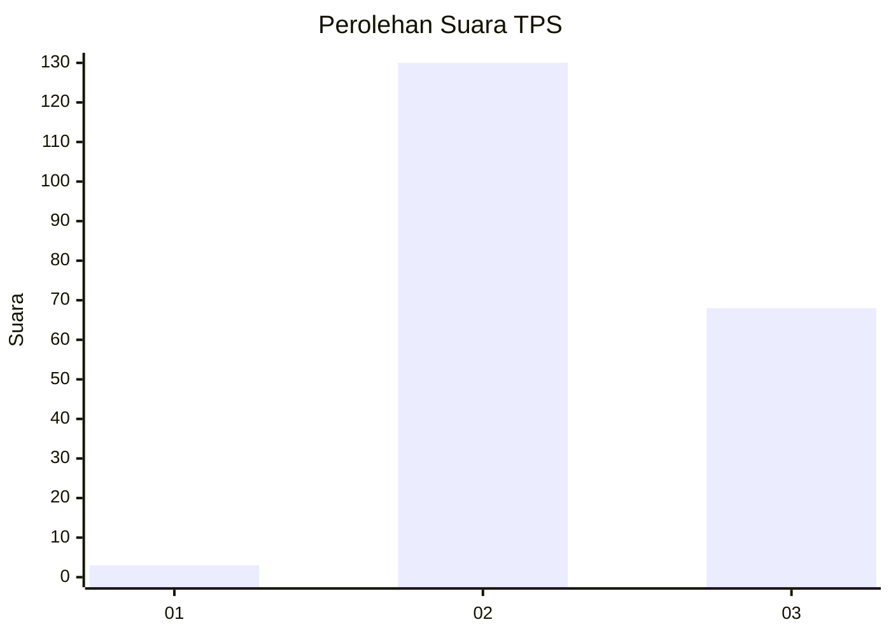
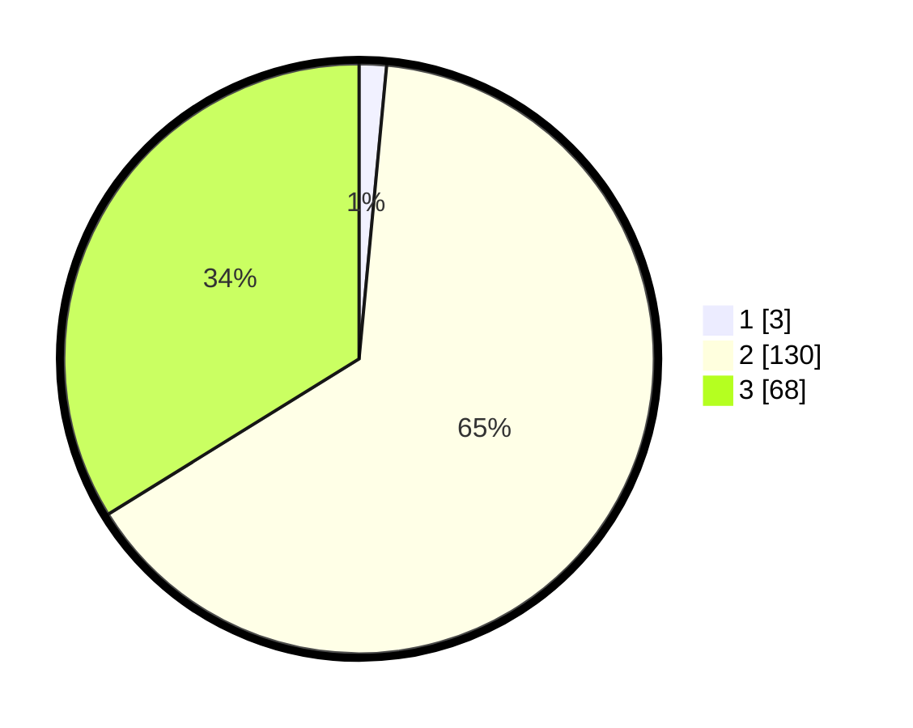

# Hasil

## Grafik

## Tabel

| No. | Nama Paslon    | Suara | Suara (raw) | Persentase |
|:--- |:-------------- | -----:| -----------:| ----------:|
| 1   | ANIES MUHAIMIN | 3     | [3][p-1]    | 1,49       |
| 2   | PRABOWO GIBRAN | 130   | [130][p-2]  | 64,68      |
| 3   | GANJAR MAHFUD  | 68    | [68][p-3]   | 33,83      |

[p-1]: https://github.com/gigit-pemilu/pemilu-2024/blob/main/pilpres/hitung-suara/sub/35-jawa-timur/sub/22-bojonegoro/sub/02-tambakrejo/sub/2001-napis/sub/009-tps/sub/paslon-1.txt
[p-2]: https://github.com/gigit-pemilu/pemilu-2024/blob/main/pilpres/hitung-suara/sub/35-jawa-timur/sub/22-bojonegoro/sub/02-tambakrejo/sub/2001-napis/sub/009-tps/sub/paslon-2.txt
[p-3]: https://github.com/gigit-pemilu/pemilu-2024/blob/main/pilpres/hitung-suara/sub/35-jawa-timur/sub/22-bojonegoro/sub/02-tambakrejo/sub/2001-napis/sub/009-tps/sub/paslon-3.txt

## Foto C Plano

https://sirekap-obj-formc.kpu.go.id/13b5/pemilu/ppwp/35/22/02/20/01/3522022001009-20240215-010426--017e9e7e-ea0e-4ea2-9f83-59c4325e698d.jpg

https://sirekap-obj-formc.kpu.go.id/13b5/pemilu/ppwp/35/22/02/20/01/3522022001009-20240215-010436--127f309d-9945-4716-b611-a7791805dd19.jpg

https://sirekap-obj-formc.kpu.go.id/13b5/pemilu/ppwp/35/22/02/20/01/3522022001009-20240215-010441--2bfa9b99-8f75-43f5-ba2a-48fde434d873.jpg

## Metadata

| Key        | Value               |
| ---------- | ------------------- |
| Time Stamp | 2024-02-25 15:00:00 |

