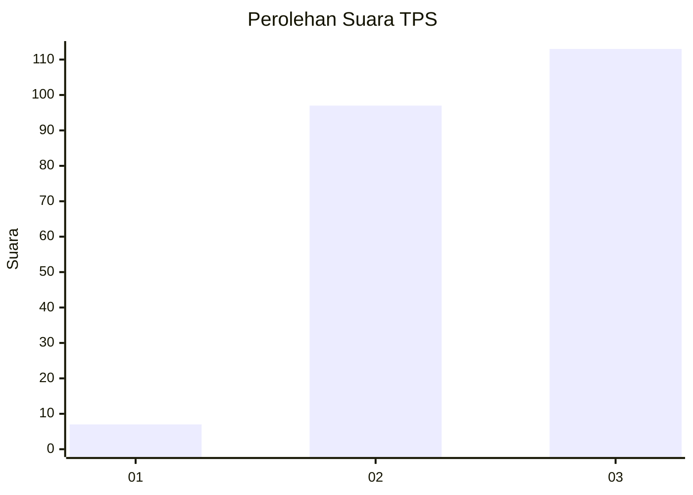
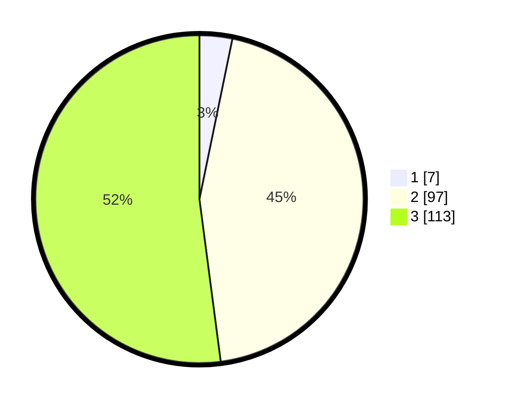

# Hasil

## Grafik

## Tabel

| No. | Nama Paslon    | Suara | Suara (raw) | Persentase |
|:--- |:-------------- | -----:| -----------:| ----------:|
| 1   | ANIES MUHAIMIN | 7     | [7][p-1]    | 3,23       |
| 2   | PRABOWO GIBRAN | 97    | [97][p-2]   | 44,70      |
| 3   | GANJAR MAHFUD  | 113   | [113][p-3]  | 52,07      |

[p-1]: https://github.com/gigit-pemilu/pemilu-2024-35-jawa-timur/blob/main/pilpres/hitung-suara/sub/35-jawa-timur/sub/22-bojonegoro/sub/02-tambakrejo/sub/2001-napis/sub/025-tps/sub/paslon-1.txt
[p-2]: https://github.com/gigit-pemilu/pemilu-2024-35-jawa-timur/blob/main/pilpres/hitung-suara/sub/35-jawa-timur/sub/22-bojonegoro/sub/02-tambakrejo/sub/2001-napis/sub/025-tps/sub/paslon-2.txt
[p-3]: https://github.com/gigit-pemilu/pemilu-2024-35-jawa-timur/blob/main/pilpres/hitung-suara/sub/35-jawa-timur/sub/22-bojonegoro/sub/02-tambakrejo/sub/2001-napis/sub/025-tps/sub/paslon-3.txt

## Foto C Plano

https://sirekap-obj-formc.kpu.go.id/1ef9/pemilu/ppwp/35/22/02/20/01/3522022001025-20240215-035116--745d8d08-cb8d-47ba-979e-71174935e9cd.jpg

https://sirekap-obj-formc.kpu.go.id/1ef9/pemilu/ppwp/35/22/02/20/01/3522022001025-20240215-035321--623001e1-e877-4b3a-8f48-c25802b6df58.jpg

https://sirekap-obj-formc.kpu.go.id/1ef9/pemilu/ppwp/35/22/02/20/01/3522022001025-20240215-052508--71df6d8e-eca3-441b-9cd9-60077c8ec73a.jpg

## Metadata

| Key        | Value               |
| ---------- | ------------------- |
| Time Stamp | 2024-02-16 08:00:28 |

