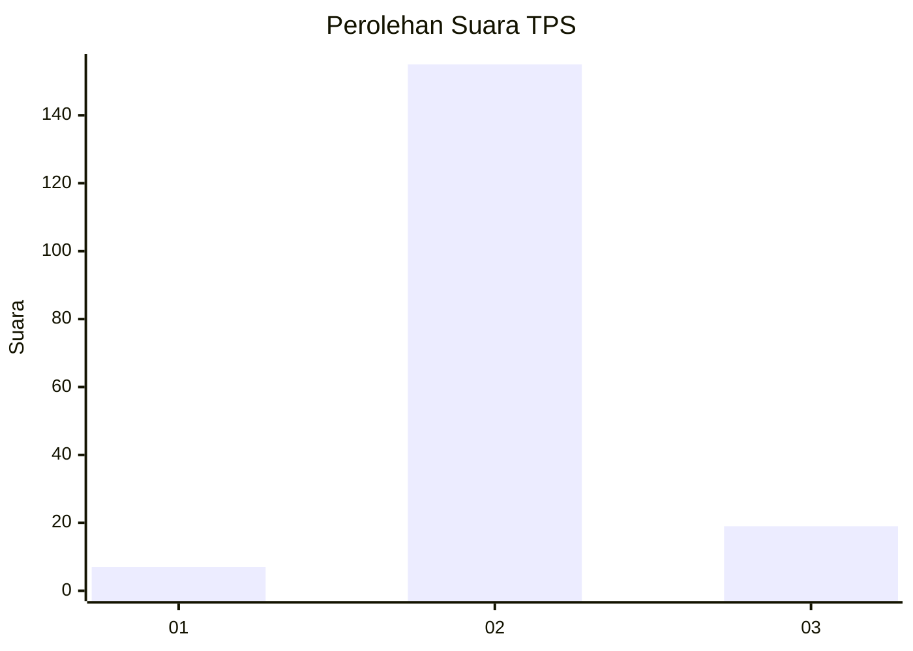
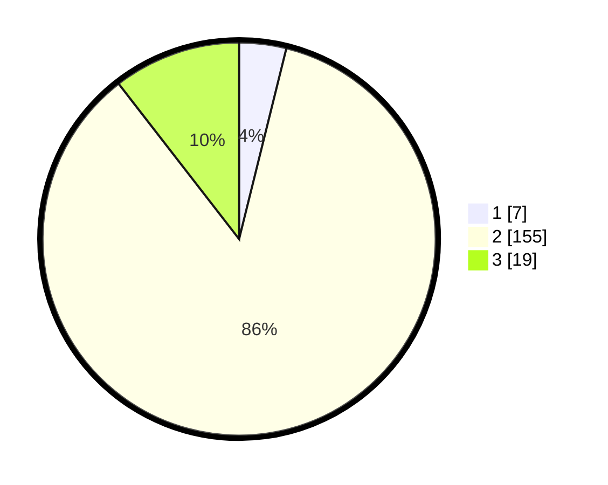

# Hasil

## Grafik

## Tabel

| No. | Nama Paslon    | Suara | Suara (raw) | Persentase |
|:--- |:-------------- | -----:| -----------:| ----------:|
| 1   | ANIES MUHAIMIN | 7     | [7][p-1]    | 3,87       |
| 2   | PRABOWO GIBRAN | 155   | [155][p-2]  | 85,64      |
| 3   | GANJAR MAHFUD  | 19    | [19][p-3]   | 10,50      |

[p-1]: https://github.com/gigit-pemilu/pemilu-2024-35-jawa-timur/blob/main/pilpres/hitung-suara/sub/35-jawa-timur/sub/22-bojonegoro/sub/02-tambakrejo/sub/2002-jatimulyo/sub/008-tps/sub/paslon-1.txt
[p-2]: https://github.com/gigit-pemilu/pemilu-2024-35-jawa-timur/blob/main/pilpres/hitung-suara/sub/35-jawa-timur/sub/22-bojonegoro/sub/02-tambakrejo/sub/2002-jatimulyo/sub/008-tps/sub/paslon-2.txt
[p-3]: https://github.com/gigit-pemilu/pemilu-2024-35-jawa-timur/blob/main/pilpres/hitung-suara/sub/35-jawa-timur/sub/22-bojonegoro/sub/02-tambakrejo/sub/2002-jatimulyo/sub/008-tps/sub/paslon-3.txt

## Foto C Plano

https://sirekap-obj-formc.kpu.go.id/0f43/pemilu/ppwp/35/22/02/20/02/3522022002008-20240214-215509--7c06ee8b-4b4f-4c12-ad98-48c8044d7c7a.jpg

https://sirekap-obj-formc.kpu.go.id/0f43/pemilu/ppwp/35/22/02/20/02/3522022002008-20240214-233304--3e2ee8b9-8538-4fab-bc62-9fb505167819.jpg

https://sirekap-obj-formc.kpu.go.id/0f43/pemilu/ppwp/35/22/02/20/02/3522022002008-20240214-233434--ef55b922-0a14-44fb-a878-0767c9326bcb.jpg

## Metadata

| Key        | Value               |
| ---------- | ------------------- |
| Time Stamp | 2024-02-24 22:31:28 |

