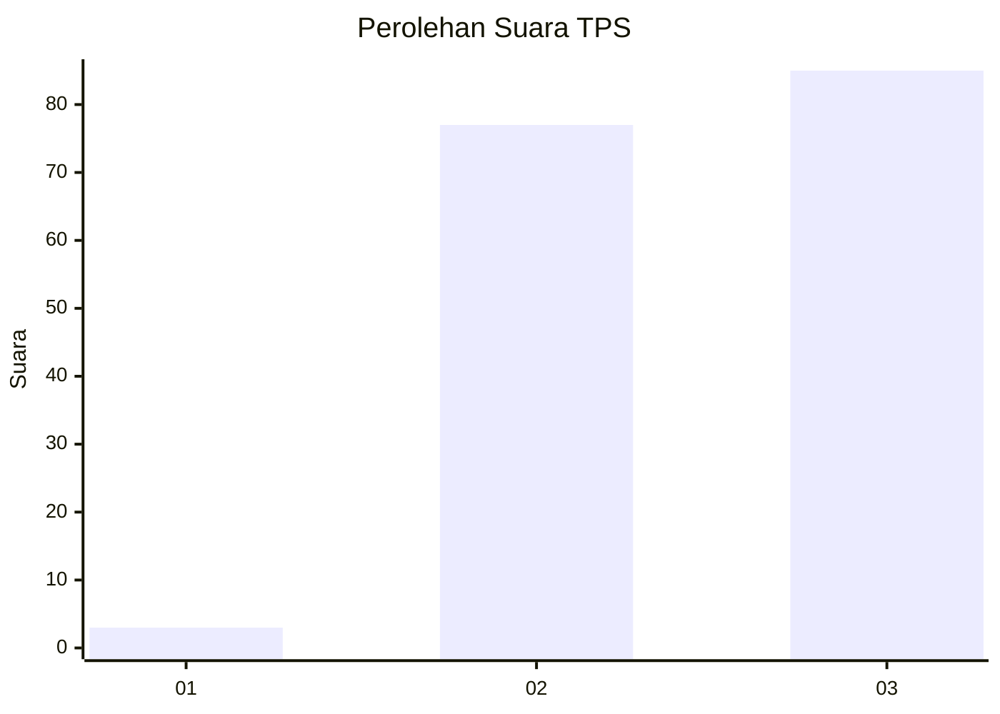
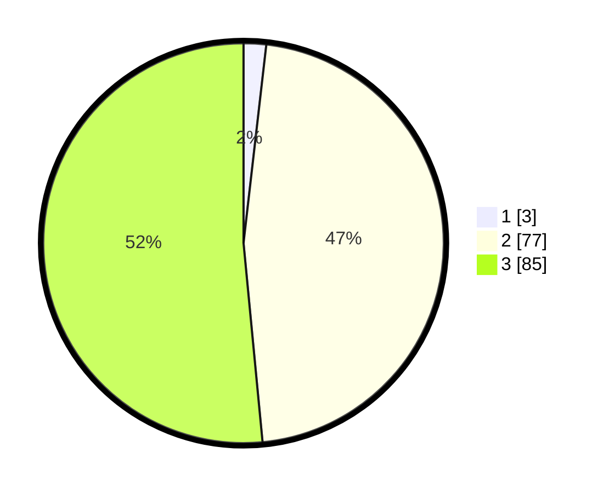

# Hasil

## Grafik

## Tabel

| No. | Nama Paslon    | Suara | Suara (raw) | Persentase |
|:--- |:-------------- | -----:| -----------:| ----------:|
| 1   | ANIES MUHAIMIN | 3     | [3][p-1]    | 1,82       |
| 2   | PRABOWO GIBRAN | 77    | [77][p-2]   | 46,67      |
| 3   | GANJAR MAHFUD  | 85    | [85][p-3]   | 51,52      |

[p-1]: https://github.com/gigit-pemilu/pemilu-2024-35-jawa-timur/blob/main/pilpres/hitung-suara/sub/35-jawa-timur/sub/22-bojonegoro/sub/02-tambakrejo/sub/2006-tambakrejo/sub/010-tps/sub/paslon-1.txt
[p-2]: https://github.com/gigit-pemilu/pemilu-2024-35-jawa-timur/blob/main/pilpres/hitung-suara/sub/35-jawa-timur/sub/22-bojonegoro/sub/02-tambakrejo/sub/2006-tambakrejo/sub/010-tps/sub/paslon-2.txt
[p-3]: https://github.com/gigit-pemilu/pemilu-2024-35-jawa-timur/blob/main/pilpres/hitung-suara/sub/35-jawa-timur/sub/22-bojonegoro/sub/02-tambakrejo/sub/2006-tambakrejo/sub/010-tps/sub/paslon-3.txt

## Foto C Plano

https://sirekap-obj-formc.kpu.go.id/3d4c/pemilu/ppwp/35/22/02/20/06/3522022006010-20240219-204737--2528cde8-23b3-484a-a476-3ca407d8d203.jpg

https://sirekap-obj-formc.kpu.go.id/3d4c/pemilu/ppwp/35/22/02/20/06/3522022006010-20240219-204928--d13195a4-c10f-4f11-a4a8-0ddee953a474.jpg

https://sirekap-obj-formc.kpu.go.id/3d4c/pemilu/ppwp/35/22/02/20/06/3522022006010-20240219-205054--ad12e88c-a1b5-4053-a7b0-b1a54d02e89e.jpg

## Metadata

| Key        | Value               |
| ---------- | ------------------- |
| Time Stamp | 2024-02-24 22:31:28 |

