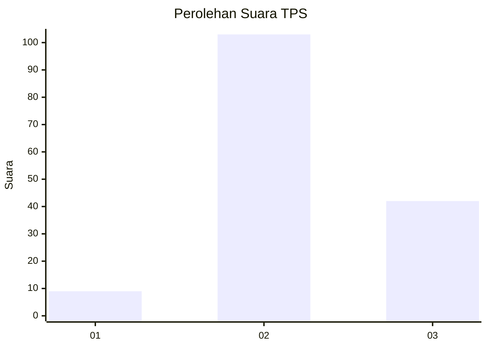

# Hasil

## Grafik

## Tabel

| No. | Nama Paslon    | Suara | Suara (raw) | Persentase |
|:--- |:-------------- | -----:| -----------:| ----------:|
| 1   | ANIES MUHAIMIN | 9     | [9][p-1]    | 5,84       |
| 2   | PRABOWO GIBRAN | 103   | [103][p-2]  | 66,88      |
| 3   | GANJAR MAHFUD  | 42    | [42][p-3]   | 27,27      |

[p-1]: https://github.com/gigit-pemilu/pemilu-2024/blob/main/pilpres/hitung-suara/sub/35-jawa-timur/sub/22-bojonegoro/sub/02-tambakrejo/sub/2009-sukorejo/sub/013-tps/sub/paslon-1.txt
[p-2]: https://github.com/gigit-pemilu/pemilu-2024/blob/main/pilpres/hitung-suara/sub/35-jawa-timur/sub/22-bojonegoro/sub/02-tambakrejo/sub/2009-sukorejo/sub/013-tps/sub/paslon-2.txt
[p-3]: https://github.com/gigit-pemilu/pemilu-2024/blob/main/pilpres/hitung-suara/sub/35-jawa-timur/sub/22-bojonegoro/sub/02-tambakrejo/sub/2009-sukorejo/sub/013-tps/sub/paslon-3.txt

## Foto C Plano

https://sirekap-obj-formc.kpu.go.id/b343/pemilu/ppwp/35/22/02/20/09/3522022009013-20240214-141045--1986143a-4bb6-454e-b9b0-affe341e4e9c.jpg

https://sirekap-obj-formc.kpu.go.id/b343/pemilu/ppwp/35/22/02/20/09/3522022009013-20240215-001719--fde7ce13-7939-4a8a-a89e-171512d933aa.jpg

https://sirekap-obj-formc.kpu.go.id/b343/pemilu/ppwp/35/22/02/20/09/3522022009013-20240214-141850--f445fb90-7db1-4a93-99b7-1822f6d44bc2.jpg

## Metadata

| Key        | Value               |
| ---------- | ------------------- |
| Time Stamp | 2024-02-15 09:00:24 |

