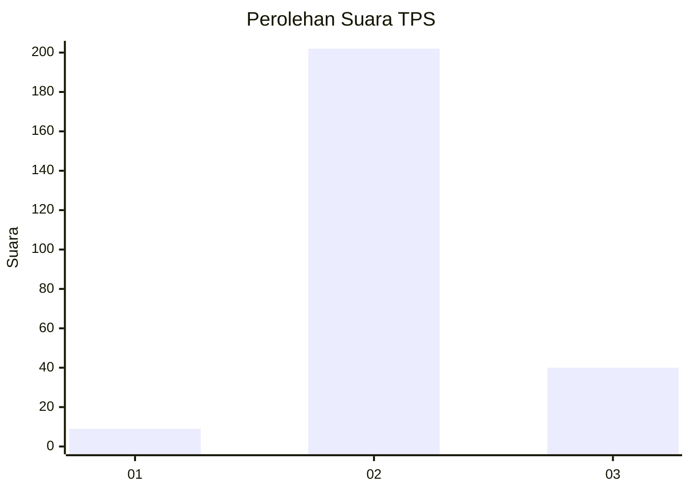
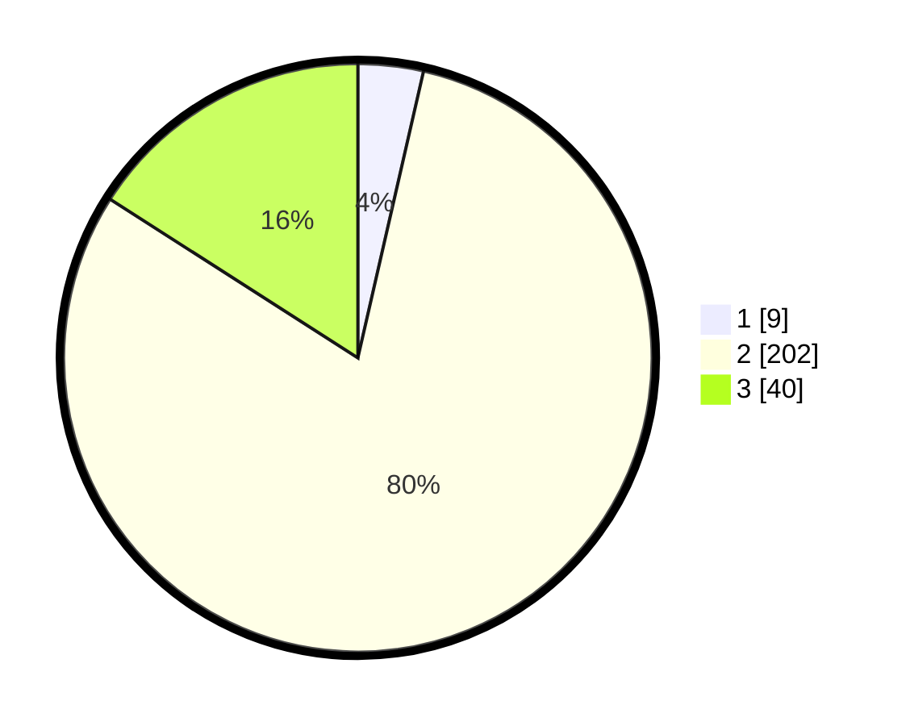

# Hasil

## Grafik

## Tabel

| No. | Nama Paslon    | Suara | Suara (raw) | Persentase |
|:--- |:-------------- | -----:| -----------:| ----------:|
| 1   | ANIES MUHAIMIN | 9     | [9][p-1]    | 3,59       |
| 2   | PRABOWO GIBRAN | 202   | [202][p-2]  | 80,48      |
| 3   | GANJAR MAHFUD  | 40    | [40][p-3]   | 15,94      |

[p-1]: https://github.com/gigit-pemilu/pemilu-2024-35-jawa-timur/blob/main/pilpres/hitung-suara/sub/35-jawa-timur/sub/22-bojonegoro/sub/02-tambakrejo/sub/2017-sendangrejo/sub/002-tps/sub/paslon-1.txt
[p-2]: https://github.com/gigit-pemilu/pemilu-2024-35-jawa-timur/blob/main/pilpres/hitung-suara/sub/35-jawa-timur/sub/22-bojonegoro/sub/02-tambakrejo/sub/2017-sendangrejo/sub/002-tps/sub/paslon-2.txt
[p-3]: https://github.com/gigit-pemilu/pemilu-2024-35-jawa-timur/blob/main/pilpres/hitung-suara/sub/35-jawa-timur/sub/22-bojonegoro/sub/02-tambakrejo/sub/2017-sendangrejo/sub/002-tps/sub/paslon-3.txt

## Foto C Plano

https://sirekap-obj-formc.kpu.go.id/c40f/pemilu/ppwp/35/22/02/20/17/3522022017002-20240215-161829--703262b7-25c4-4885-b0d7-a2039acfb233.jpg

https://sirekap-obj-formc.kpu.go.id/c40f/pemilu/ppwp/35/22/02/20/17/3522022017002-20240216-064614--4e2473df-0d86-4830-859a-82a59826c61d.jpg

https://sirekap-obj-formc.kpu.go.id/c40f/pemilu/ppwp/35/22/02/20/17/3522022017002-20240215-160523--8226f964-625e-4d62-b91d-d3ea8983ab38.jpg

## Metadata

| Key        | Value               |
| ---------- | ------------------- |
| Time Stamp | 2024-02-24 22:31:28 |

