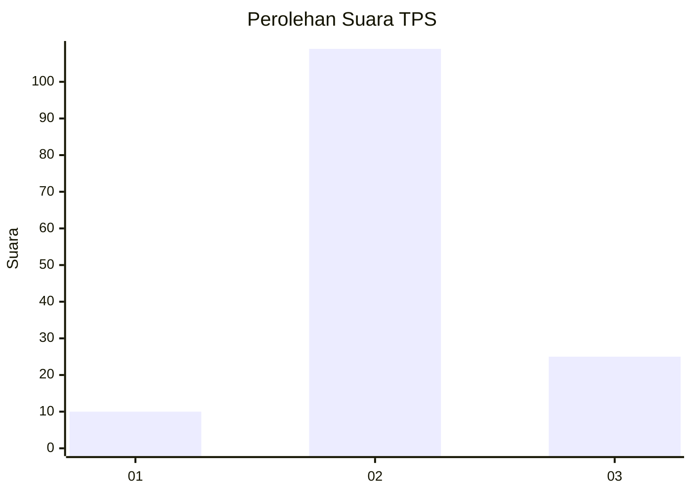

# Hasil

## Grafik

## Tabel

| No. | Nama Paslon    | Suara | Suara (raw) | Persentase |
|:--- |:-------------- | -----:| -----------:| ----------:|
| 1   | ANIES MUHAIMIN | 10    | [10][p-1]   | 6,94       |
| 2   | PRABOWO GIBRAN | 109   | [109][p-2]  | 75,69      |
| 3   | GANJAR MAHFUD  | 25    | [25][p-3]   | 17,36      |

[p-1]: https://github.com/gigit-pemilu/pemilu-2024/blob/main/pilpres/hitung-suara/sub/35-jawa-timur/sub/22-bojonegoro/sub/03-ngambon/sub/2001-nglampin/sub/004-tps/sub/paslon-1.txt
[p-2]: https://github.com/gigit-pemilu/pemilu-2024/blob/main/pilpres/hitung-suara/sub/35-jawa-timur/sub/22-bojonegoro/sub/03-ngambon/sub/2001-nglampin/sub/004-tps/sub/paslon-2.txt
[p-3]: https://github.com/gigit-pemilu/pemilu-2024/blob/main/pilpres/hitung-suara/sub/35-jawa-timur/sub/22-bojonegoro/sub/03-ngambon/sub/2001-nglampin/sub/004-tps/sub/paslon-3.txt

## Foto C Plano

https://sirekap-obj-formc.kpu.go.id/3e1a/pemilu/ppwp/35/22/03/20/01/3522032001004-20240214-193450--f8212892-0a05-43ab-b685-31b1ce12726b.jpg

https://sirekap-obj-formc.kpu.go.id/3e1a/pemilu/ppwp/35/22/03/20/01/3522032001004-20240214-193535--d5f5498d-978f-472e-8c12-b5a9ef6c668c.jpg

https://sirekap-obj-formc.kpu.go.id/3e1a/pemilu/ppwp/35/22/03/20/01/3522032001004-20240214-194819--012200fc-9d53-43fa-b2d0-d3c4a5a3afeb.jpg

## Metadata

| Key        | Value               |
| ---------- | ------------------- |
| Time Stamp | 2024-02-14 21:46:01 |

## DATA PEMILIH TETAP

Jumlah pemilih dalam DPT: **184**.
 * L: **91**.
 * P: **93**.

## DATA PENGGUNA HAK PILIH

Jumlah pengguna hak pilih dalam DPT: **152**.
 * L: **75**.
 * P: **77**.

Jumlah pengguna hak pilih dalam DPTb: **1**.
 * L: **0**.
 * P: **1**.

Jumlah pengguna hak pilih dalam DPK: **0**.
 * L: **0**.
 * P: **0**.

Jumlah pengguna hak pilih: **153**.
 * L: **0**.
 * P: **0**.

## JUMLAH SUARA SAH DAN TIDAK SAH

JUMLAH SELURUH SUARA SAH: **144**.

JUMLAH SUARA TIDAK SAH: **9**.

JUMLAH SELURUH SUARA SAH DAN SUARA TIDAK SAH: **153**.

