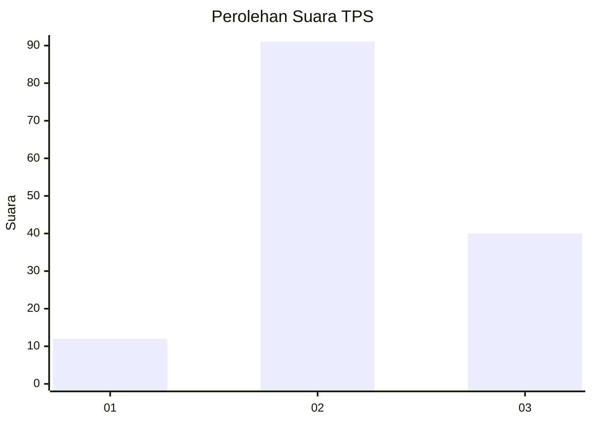
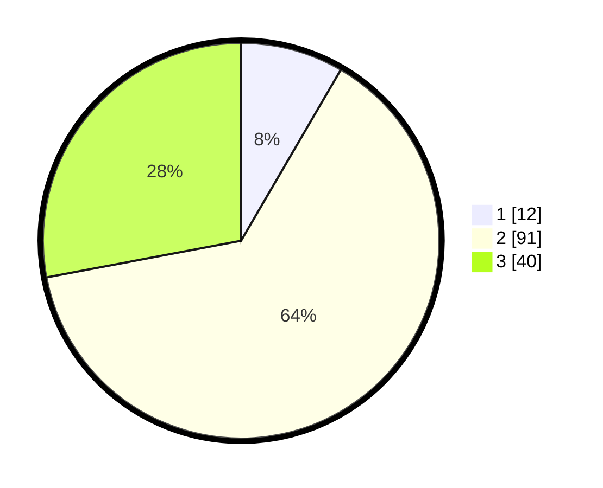

# Hasil

## Grafik

## Tabel

| No. | Nama Paslon    | Suara | Suara (raw) | Persentase |
|:--- |:-------------- | -----:| -----------:| ----------:|
| 1   | ANIES MUHAIMIN | 12    | [12][p-1]   | 8,39       |
| 2   | PRABOWO GIBRAN | 91    | [91][p-2]   | 63,64      |
| 3   | GANJAR MAHFUD  | 40    | [40][p-3]   | 27,97      |

[p-1]: https://github.com/gigit-pemilu/pemilu-2024-35-jawa-timur/blob/main/pilpres/hitung-suara/sub/35-jawa-timur/sub/22-bojonegoro/sub/04-ngasem/sub/2013-dukohkidul/sub/009-tps/sub/paslon-1.txt
[p-2]: https://github.com/gigit-pemilu/pemilu-2024-35-jawa-timur/blob/main/pilpres/hitung-suara/sub/35-jawa-timur/sub/22-bojonegoro/sub/04-ngasem/sub/2013-dukohkidul/sub/009-tps/sub/paslon-2.txt
[p-3]: https://github.com/gigit-pemilu/pemilu-2024-35-jawa-timur/blob/main/pilpres/hitung-suara/sub/35-jawa-timur/sub/22-bojonegoro/sub/04-ngasem/sub/2013-dukohkidul/sub/009-tps/sub/paslon-3.txt

## Foto C Plano

https://sirekap-obj-formc.kpu.go.id/c3a9/pemilu/ppwp/35/22/04/20/13/3522042013009-20240214-141116--24b99148-7d91-48b3-9660-d22918dc136c.jpg

https://sirekap-obj-formc.kpu.go.id/c3a9/pemilu/ppwp/35/22/04/20/13/3522042013009-20240214-230642--a3c93b18-79cb-4a28-b55f-00d2351ac491.jpg

https://sirekap-obj-formc.kpu.go.id/c3a9/pemilu/ppwp/35/22/04/20/13/3522042013009-20240214-231109--aa651b87-730e-4d20-9306-8f38a817504c.jpg

## Metadata

| Key        | Value               |
| ---------- | ------------------- |
| Time Stamp | 2024-02-15 15:00:29 |

