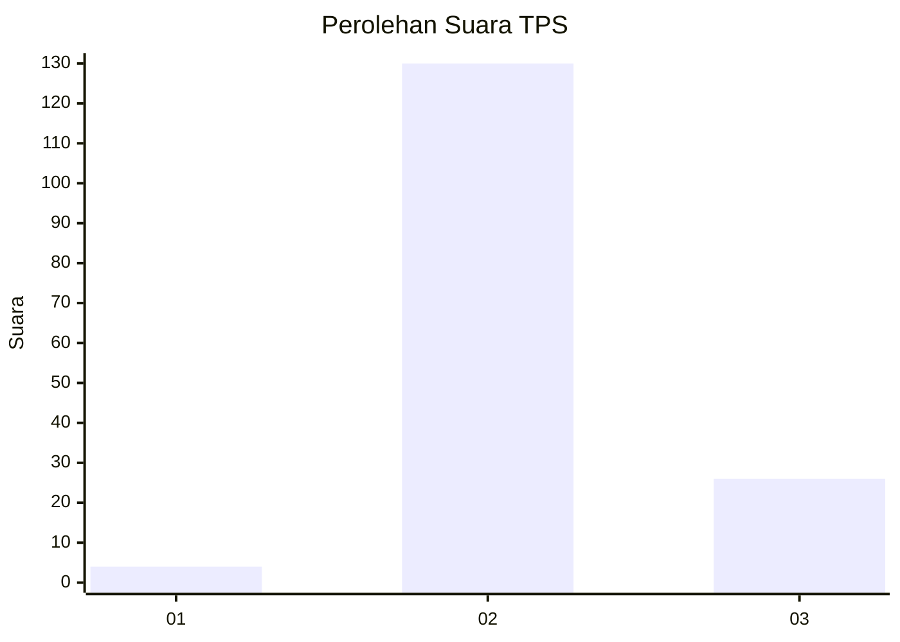
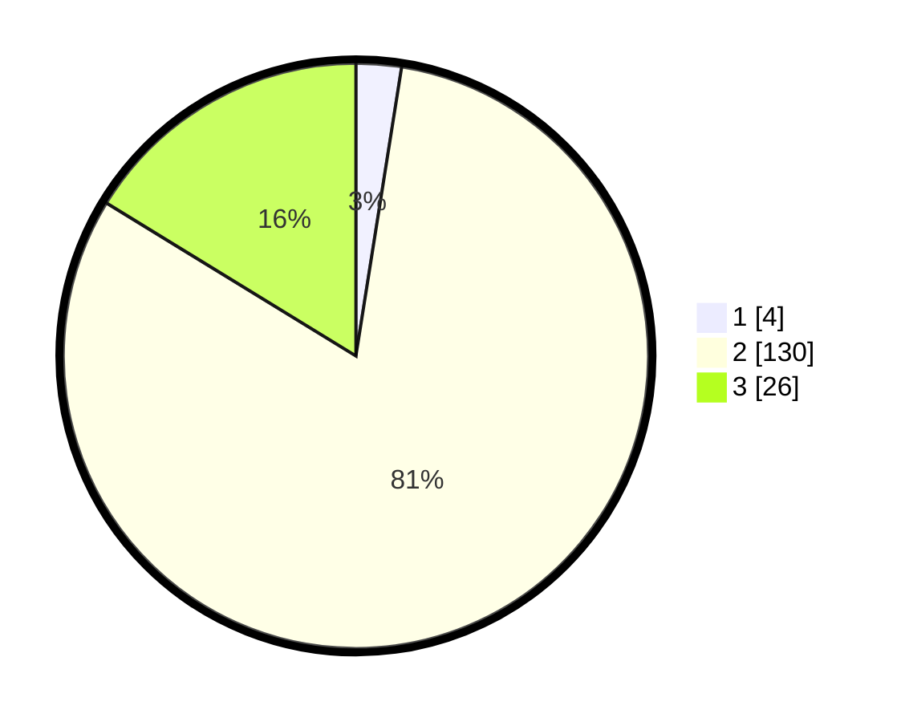

# Hasil

## Grafik

## Tabel

| No. | Nama Paslon    | Suara | Suara (raw) | Persentase |
|:--- |:-------------- | -----:| -----------:| ----------:|
| 1   | ANIES MUHAIMIN | 4     | [4][p-1]    | 2,50       |
| 2   | PRABOWO GIBRAN | 130   | [130][p-2]  | 81,25      |
| 3   | GANJAR MAHFUD  | 26    | [26][p-3]   | 16,25      |

[p-1]: https://github.com/gigit-pemilu/pemilu-2024/blob/main/pilpres/hitung-suara/sub/35-jawa-timur/sub/22-bojonegoro/sub/06-dander/sub/2001-ngunut/sub/012-tps/sub/paslon-1.txt
[p-2]: https://github.com/gigit-pemilu/pemilu-2024/blob/main/pilpres/hitung-suara/sub/35-jawa-timur/sub/22-bojonegoro/sub/06-dander/sub/2001-ngunut/sub/012-tps/sub/paslon-2.txt
[p-3]: https://github.com/gigit-pemilu/pemilu-2024/blob/main/pilpres/hitung-suara/sub/35-jawa-timur/sub/22-bojonegoro/sub/06-dander/sub/2001-ngunut/sub/012-tps/sub/paslon-3.txt

## Foto C Plano

https://sirekap-obj-formc.kpu.go.id/30e6/pemilu/ppwp/35/22/06/20/01/3522062001012-20240215-002203--e0d50712-112c-4268-a636-0c4d0546117c.jpg

https://sirekap-obj-formc.kpu.go.id/30e6/pemilu/ppwp/35/22/06/20/01/3522062001012-20240215-002355--db079ae6-9b6c-4970-bcdb-c56662c35db9.jpg

https://sirekap-obj-formc.kpu.go.id/30e6/pemilu/ppwp/35/22/06/20/01/3522062001012-20240215-002621--776f148f-41d1-401a-8c01-6b24b397a10e.jpg

## Metadata

| Key        | Value               |
| ---------- | ------------------- |
| Time Stamp | 2024-02-26 12:00:00 |

