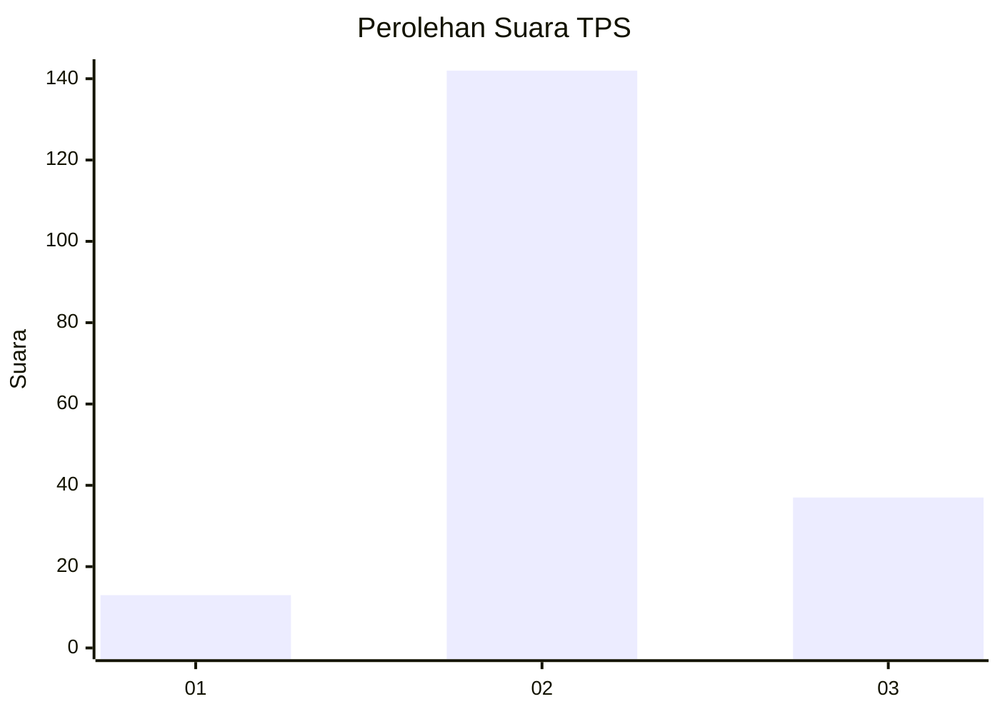
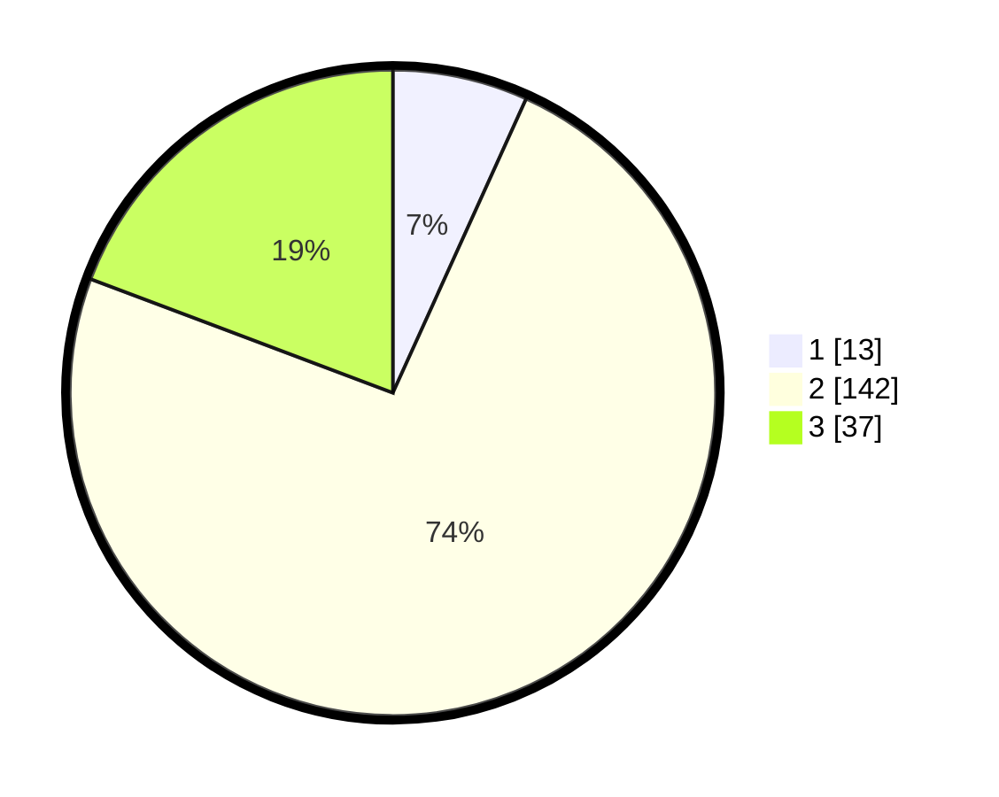

# Hasil

## Grafik

## Tabel

| No. | Nama Paslon    | Suara | Suara (raw) | Persentase |
|:--- |:-------------- | -----:| -----------:| ----------:|
| 1   | ANIES MUHAIMIN | 13    | [13][p-1]   | 6,77       |
| 2   | PRABOWO GIBRAN | 142   | [142][p-2]  | 73,96      |
| 3   | GANJAR MAHFUD  | 37    | [37][p-3]   | 19,27      |

[p-1]: https://github.com/gigit-pemilu/pemilu-2024/blob/main/pilpres/hitung-suara/sub/35-jawa-timur/sub/22-bojonegoro/sub/06-dander/sub/2005-kunci/sub/006-tps/sub/paslon-1.txt
[p-2]: https://github.com/gigit-pemilu/pemilu-2024/blob/main/pilpres/hitung-suara/sub/35-jawa-timur/sub/22-bojonegoro/sub/06-dander/sub/2005-kunci/sub/006-tps/sub/paslon-2.txt
[p-3]: https://github.com/gigit-pemilu/pemilu-2024/blob/main/pilpres/hitung-suara/sub/35-jawa-timur/sub/22-bojonegoro/sub/06-dander/sub/2005-kunci/sub/006-tps/sub/paslon-3.txt

## Foto C Plano

https://sirekap-obj-formc.kpu.go.id/34b5/pemilu/ppwp/35/22/06/20/05/3522062005006-20240214-220530--aa5fe5f1-e82e-4ec5-95ba-2decf94a0231.jpg

https://sirekap-obj-formc.kpu.go.id/34b5/pemilu/ppwp/35/22/06/20/05/3522062005006-20240214-220909--8dc9fdac-e066-4aa6-9262-cfa5550ce91c.jpg

https://sirekap-obj-formc.kpu.go.id/34b5/pemilu/ppwp/35/22/06/20/05/3522062005006-20240214-221109--6ee9a478-3e1a-4552-8124-742cc73396ce.jpg

## Metadata

| Key        | Value               |
| ---------- | ------------------- |
| Time Stamp | 2024-02-25 12:00:00 |

