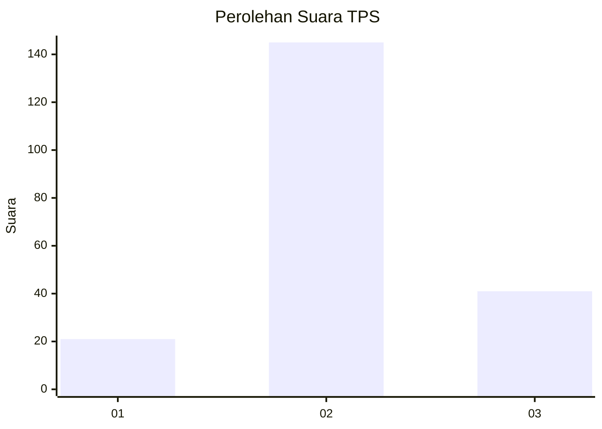
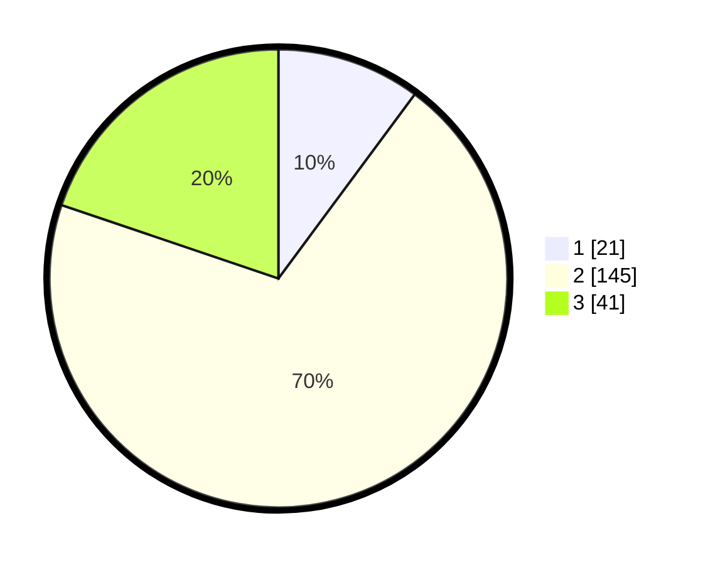

# Hasil

## Grafik

## Tabel

| No. | Nama Paslon    | Suara | Suara (raw) | Persentase |
|:--- |:-------------- | -----:| -----------:| ----------:|
| 1   | ANIES MUHAIMIN | 21    | [21][p-1]   | 10,14      |
| 2   | PRABOWO GIBRAN | 145   | [145][p-2]  | 70,05      |
| 3   | GANJAR MAHFUD  | 41    | [41][p-3]   | 19,81      |

[p-1]: https://github.com/gigit-pemilu/pemilu-2024/blob/main/pilpres/hitung-suara/sub/35-jawa-timur/sub/22-bojonegoro/sub/06-dander/sub/2007-ngraseh/sub/004-tps/sub/paslon-1.txt
[p-2]: https://github.com/gigit-pemilu/pemilu-2024/blob/main/pilpres/hitung-suara/sub/35-jawa-timur/sub/22-bojonegoro/sub/06-dander/sub/2007-ngraseh/sub/004-tps/sub/paslon-2.txt
[p-3]: https://github.com/gigit-pemilu/pemilu-2024/blob/main/pilpres/hitung-suara/sub/35-jawa-timur/sub/22-bojonegoro/sub/06-dander/sub/2007-ngraseh/sub/004-tps/sub/paslon-3.txt

## Foto C Plano

https://sirekap-obj-formc.kpu.go.id/f575/pemilu/ppwp/35/22/06/20/07/3522062007004-20240214-235347--d2287b80-7d1e-4a29-bbbb-d6112b7a4423.jpg

https://sirekap-obj-formc.kpu.go.id/f575/pemilu/ppwp/35/22/06/20/07/3522062007004-20240214-235255--53a0fff5-dc4b-41f7-ac85-961eaf8d63e4.jpg

https://sirekap-obj-formc.kpu.go.id/f575/pemilu/ppwp/35/22/06/20/07/3522062007004-20240214-235408--1fbfe1fc-3239-44da-931c-2cebc5459e09.jpg

## Metadata

| Key        | Value               |
| ---------- | ------------------- |
| Time Stamp | 2024-02-26 02:00:00 |

